# Lab 1.3 - Log Parsing

## Objectives

- Build and apply log parsers

- Identify and fix parsing issues

- Apply log enrichment to make logs more meaningful

- Understand the importance of field standardization

- Perform basic log correlation

## Exercise Preparation

Log into the Sec-555 VM

- Username: student

- Password: sec555


## Exercises

### Parse auth.log

Read and parse the contents of **/labs/1.3/auth.log**. Initially parse out fields for **syslog\_timestamp**, **syslog\_hostname**, **syslog\_program**, **syslog\_pid**, and **syslog\_message** using **grok**. Send the logs into Elasticsearch  

!!! note
    May be helpful to start with **/labs/lab1.2/files/4\_es.conf** or your previous log configuration file used in lab 1.2

??? tip "Solution"
    The initial parser should use grok to carve out these fields: **syslog\_timestamp**, **syslog\_hostname**, **syslog\_program**, **syslog\_pid**, and **syslog\_message**. This file conforms to syslog format.

    First, start by looking at the logs to come up with a game plan to parse the log.

    ```bash
    tail -n1 /labs/1.3/auth.log
    ```

    The entry in the file is this:  

    ```javascript
    Apr  4 21:11:40 patientportal sshd[27441]: PAM 1 more authentication failure; logname= uid=0 euid=0 tty=ssh ruser= rhost=198.8.93.14  user=fraynor
    ```

    The initial goal is to parse this type of log down into the below information.

    **syslog\_timestamp** = Apr 4 21:11:40  
    **syslog\_hostname** = patientportal  
    **syslog\_program** = sshd  
    **syslog\_pid** = 27441  
    **syslog\_message** = PAM 1 more authentication failure; logname= uid=0 euid=0 tty=ssh ruser= rhost=198.8.93.14 user=fraynor  

    To do this, start by copying over the configuration file from the previous lab.

    ```bash
    mkdir -p /labs/1.3/student
    cp /labs/1.2/files/4_es.conf /labs/1.3/student/grok.conf
    ```

    The file is named **grok.conf** as we will be using **grok** to parse **auth.log**. Now modify **grok.conf**.**  

    ```bash
    code /labs/1.3/student/grok.conf
    ```

    Update the configuration to set a **tag** of **step1** and an index of **lab1.3**. Also, set up the initial **grok** parser given.

    ```javascript
    input {
      tcp {
        port => 1056
        tags => "step1"
      }
    }

    filter {
      grok {
        match => { "message" => "%{SYSLOGTIMESTAMP:syslog_timestamp} %{SYSLOGHOST:syslog_hostname} %{DATA:syslog_program}\[%{POSINT:syslog_pid:int}\]: %{GREEDYDATA:syslog_message}" }
      }
    }

    output {
      elasticsearch { 
        hosts => "elasticsearch"
        index => "lab1.3"
     }
    }
    ```

    Save the file and close the **Visual Studio Code** editor.  

    The **tags** parameter is used to add a tag to each log. Its value will always be **step1** as that is what is specified in the configuration file above. This is used to search for logs dealing with step1 easily. Also, the **elasticsearch index** has been updated to reflect **lab1.3**. Outside of these changes, a **filter** section has been added. This section is used to parse or modify/augment logs. In this example, **grok** is used to parse incoming logs from **auth.log**. Notice that **syslog\_pid** has **":int"** tacked on to the end. This tells **Logstash** to make **syslog\_pid** an integer field.  

    !!! note
        Do not forget to add the **type** parameter and update the **elasticsearch index**\! Your file should look exactly like the one above.

    Now use **Logstash** to ingest the logs. Invoke Logstash with the **grok.conf** configuration file.  

    ```bash
    logstash -f /labs/1.3/student/grok.conf
    ```

    !!! note
        Just like previous labs, you will need to wait for **Logstash** to load up. You can tell **Logstash** is loaded when you see "Pipelines running." This **will not** be explicitly called at from this point on.  

    Open an **Agent Terminal** by clicking on the purple terminal icon.  

      

    In the **Agent Terminal**, use **netcat** to send the contents of **auth.log** to Logstash.

    ```bash
    nc 127.0.0.1 1056 -q 1 < /labs/1.3/auth.log
    ```

### Find parse failures

Search through logs and identify any logs that may not be parsed correctly

??? tip "Solution"
    Minimize your **Logstash** terminal so it can parse and send logs to **Elasticsearch** and open **Firefox**.  

      

    If **Kibana** is not loaded, **click** on the **Kibana** bookmark in **Firefox**.

    

    To see logs from a new index, you must tell **Kibana** about the index. To do this, **click** on **Management**.  

    

    Next, **click** on **Index Patterns**.  

      

    Then **click** on **Create Index Pattern**.  

      

    In the **Index pattern** field, enter the index name of **lab1.3**. Then **click** on **Next step**.  

    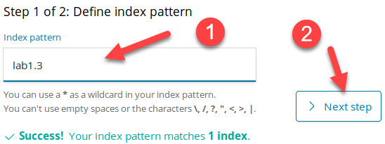  

    Then select the **Time Filter field name** and **click** or **@timestamp** and **click** **Create index pattern**.  

    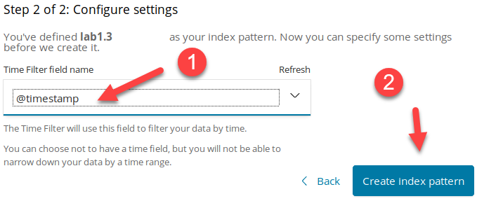  

    Now you can switch back to the **Discover** tab by **clicking** on **Discover**.

      

    Then select **lab1.3** as your index to view the logs.  

    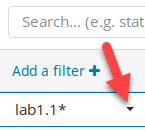  

    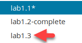  

    You should now see the logs you have collected. You should have **3,251** logs.

    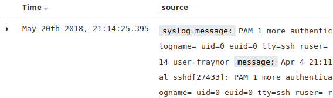  

    Set the time to the **Last 24 hours** by clicking on the time field in the top right corner and selecting **Last 24 hours**.

      

    You should now be able to see the contents of **auth.log**. However, this time you should have the five additional fields created by **grok**. You can now search contents of these fields. For example, type **syslog\_program:sshd** and then click on the search button.

    ```bash
    syslog_program:sshd
    ```

    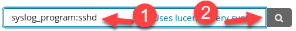

    This will return any logs in **auth.log** that are related to sshd. You should show **3,239** hits. Looking at the first log shows everything parsed out nicely. **Click** the **down arrow** on the first log to view all fields.

    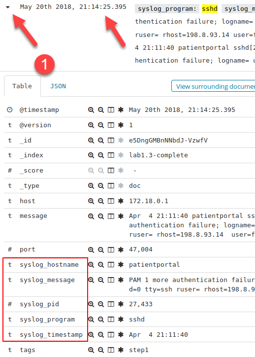  

    !!! note
        The **\#** next to **syslog\_pid**. This means it is a number field. The **t** on the other fields represents a string. The **clock** symbol represents a date.

    Now try looking for any logs not pertaining to sshd. This can be done using **-syslog\_program:sshd** and clicking on search.  

    ```bash
    -syslog_program:sshd
    ```

    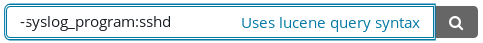  

    The dash **(-)** in front of **syslog\_program** converts it to a search for anything **NOT** sshd. This search should show **12** hits. Expand the log that states "**session closed for user lchancello**." This should be one of the first five logs.

    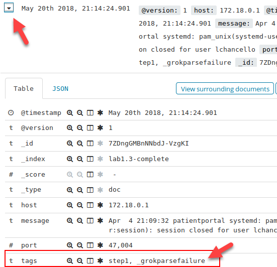  

    Notice the syslog fields are missing. Also, there is a **tag** of **\_grokparsefailure**. This **tag** means that the grok parser failed to parse a given log. In this case, it happened because these logs do not have **syslog\_pid** specified. Here is a breakdown using this log:

    ```javascript
    Apr  4 21:09:32 patientportal systemd: pam_unix(systemd-user:session): session closed for user lchancello
    ```

    The initial goal is to parse this type of log down into the below information.  

    **syslog\_timestamp** = Apr 4 21:09:32 (Your timestamp will be different)  
    **syslog\_hostname** = patientportal  
    **syslog\_program** = systemd  
    **syslog\_pid** = X (Does not exist. This is what is causing **grok** to fail) 
    **syslog\_message** = pam\_unix(systemd-user:session): session closed for user lchancello  

    Go back to your Logstash terminal and stop it with **CTRL + C**. You should see **Pipeline has terminated**.  

    ```bash
    [2018-05-21T04:32:44,244][WARN ][logstash.runner          ] SIGINT received. Shutting down.
    [2018-05-21T04:32:49,166][INFO ][logstash.pipeline        ] Pipeline has terminated {:pipeline_id=>"main", :thread=>"#<Thread:0x715b7eed run>"}
    ```

### Fix parse failures

Update your **grok** parser to account for logs missing the **syslog\_pid** field

??? tip "Solution"
    First, edit **grok.conf**.

    ```bash
    code /labs/1.3/student/grok.conf
    ```

    Update it to look like this:  

    ```javascript
    input {
      tcp {
        port => 1056
        tags => "step3"
      }
    }


    filter {
      grok {
        match => { "message" => "%{SYSLOGTIMESTAMP:syslog_timestamp} %{SYSLOGHOST:syslog_hostname} %{DATA:syslog_program}(\[%{POSINT:syslog_pid}\])?: %{GREEDYDATA:syslog_message}" }
      }
    }

    output {
      elasticsearch {
        hosts => "elasticsearch" 
        index => "lab1.3"
      }
    }
    ```

    !!! note
        The **grok** statement was updated to include **()?** around **[%{POSINT:syslog_pid}\]**. The **()?** marks the syslog_pid section as being optional. If it exists the syslog_pid is extracted. If it does not exist the section is ignored.

    Save the file and close the **Visual Studio Code** editor. Now have Logstash use the updated **grok.conf**.  

    ```bash
    logstash -f /labs/1.3/student/grok.conf
    ```

    In the **Agent Terminal,** use **netcat** to send the contents of **auth.log** to **Logstash**.  

    ```bash
    nc 127.0.0.1 1056 -q 1 < /labs/1.3/auth.log
    ```

    Switch back to **Firefox** and in **Kibana** search for **-syslog\_program:sshd AND tags:step3**. The **AND** must be in all caps. This is required when using **OR** and **AND** statements.  

    ```bash
    -syslog_program:sshd AND tags:step3
    ```

    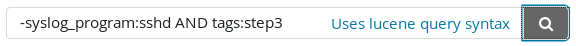

    Again, find the log that states "**session closed for user lchancello**" and expand it. Because **syslog\_pid** does not exist, the field is not created, but the other syslog fields are created. You can compare these logs vs. previous entries by switching **tags** from **step3** to **step1**.  

    !!! note
        The date and time of the logs (@timestamp) will not match what you see in your student VM. This is because the syslog timestamp has not yet been parsed and processed using the **date** plugin.  

    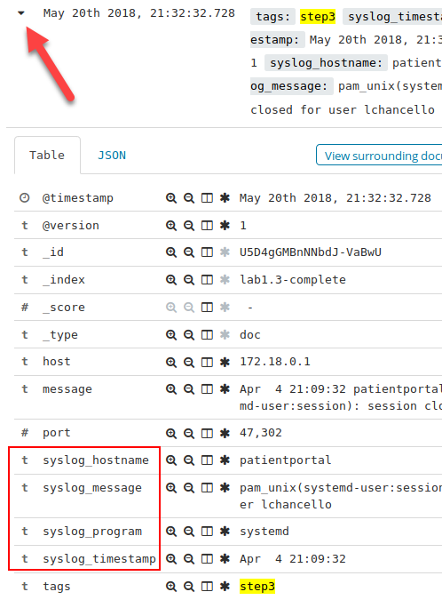

    Go back to your **Logstash** terminal and stop it with **CTRL + C**. You should see "**Pipeline has terminated."**  

    ```javascript
    [2018-05-21T04:34:44,244][WARN ][logstash.runner          ] SIGINT received. Shutting down.
    [2018-05-21T04:34:49,166][INFO ][logstash.pipeline        ] Pipeline has terminated {:pipeline_id=>"main", :thread=>"#<Thread:0x715b7eed run>"}
    ```

### Parse login failures

Further parse the **syslog\_message** field to extract the **user**, **source\_ip**, and **source\_port** of failed SSH logins. Also, add a **tag** of **logon\_failure** to these events

??? tip "Solution"
    Now, most of the syslog fields are extracted. However, the **severity** and **facility** are still missing. Also, the logs still lack functionality. This **auth.log** represents a brute force attack yet no fields exist to represent the end user. Back in Kibana, search for **tags:step3**.

    ```bash
    tags:step3
    ```

    

    Find the log that has the message containing "**Failed password for fraynor**." It should be within the first couple of logs.

    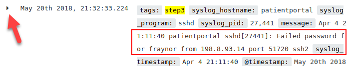  

    The **syslog\_message** reads "Failed password for fraynor from 198.8.93.14 port 51720 ssh". This contains some useful fields such as **user**, **source\_port,** and **source\_ip**. It also identifies a failed login.  

    Knowing this, modify **grok.conf** to add some additional parsing.

    ```bash
    code /labs/1.3/student/grok.conf
    ```

    In the **black terminal,** modify the input to have a **tag** of **step4** and also update the **filter** section to look like below.

    ```javascript
    input {
      tcp {
        port => 1056
        tags => "step4"
      }
    }

    filter {
      grok {
        match => { "message" => "%{SYSLOGTIMESTAMP:syslog_timestamp} %{SYSLOGHOST:syslog_hostname} %{DATA:syslog_program}(?:\[%{POSINT:syslog_pid}\])?: %{GREEDYDATA:syslog_message}" }
      }
      syslog_pri { }
      if [syslog_message] =~ "Failed password for" {
        grok {
          match => {
            "syslog_message" => "Failed password for %{USER:user} from %{IPV4:source_ip} port %{INT:source_port:int} %{WORD:auth_program}"
          }
        }
        mutate {
          add_tag => [ "logon_failure" ]
        }
      }
    }

    output {
      elasticsearch { 
        hosts => "elasticsearch"
        index => "lab1.3"
     }
    }
    ```

    The **syslog\_pri { }** function will automatically extract and parse the syslog **severity** and **facility** fields. The second **grok** statement will parse out additional fields specific to failed logins. The **mutate** function is used to modify logs arbitrarily. In this case, it is used to add a simple **tag** of **logon\_failure**.  

    Also, notice that parsing failed passwords is wrapped in an **if** statement. This is done so that the **grok** statement only applies if the **syslog\_message** contains "Failed password for." It also is to make sure the **tag** only gets added for failed login events.  

    Save the file and close the **Visual Studio Code Editor**. Now have **Logstash** use the updated **grok.conf**.  

    ```bash
    logstash -f /labs/1.3/student/grok.conf
    ```

    In the **Agent Terminal,** use **netcat** to send the contents of **auth.log** to Logstash.  

    ```bash
    nc 127.0.0.1 1056 -q 1 < /labs/1.3/auth.log
    ```

    Switch back to **Kibana** and search for **tags:step4 AND tags:logon\_failure.**  

    ```bash
    tags:step4 AND tags:logon_failure
    ```

    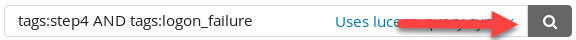  

    Expand the first log and voilà, more fields. Also, there is a **tag** marking the log with **logon\_failure**. But there is one problem, they have a weird orange exclamation mark next to them.  

    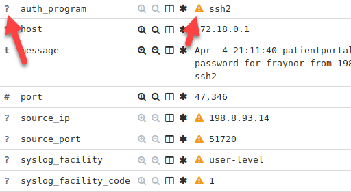  

    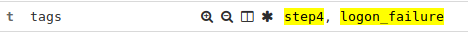  

    Notice each of these new fields has a **?** in front of the field name. This means that **Kibana** does not acknowledge the field type (integer, string, etc.). Therefore, the orange exclamation mark is appearing.

    To fix this, **click** on **Management**.

    

    Then **click** on **Index Patterns**.  

    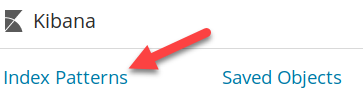

    **Click** on **lab 1.3** and then **click** on the **refresh** button.

    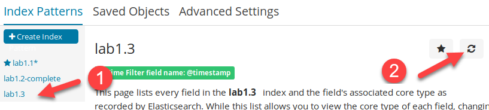

    When asked if you want to refresh the list, **click** on **Refresh**.  

    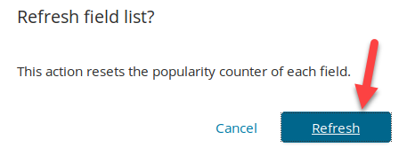  

    This step needs to be done anytime new fields or field types are set up. After doing this go back to **Discover** and look at the first log again.

      

    Now all the orange exclamation marks are gone, and the fields are properly identified as either strings, IP addresses, or integers.  

    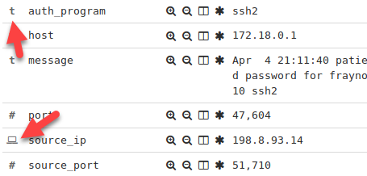  

    Go back to your **Logstash** terminal and stop it with **CTRL + C**. You should see "**Pipeline has terminated."**  

    ```javascript
    [2018-05-21T04:37:44,244][WARN ][logstash.runner          ] SIGINT received. Shutting down.
    [2018-05-21T04:37:49,166][INFO ][logstash.pipeline        ] Pipeline has terminated {:pipeline_id=>"main", :thread=>"#<Thread:0x715b7eed run>"}
    ```

### Parse login events

Next, parse the same fields out of successful logins over SSH and add a **tag** of **logon\_success**

??? tip "Solution"
    In **Kibana**, search for **tags:step4 AND** "**Accepted**".  

    ```bash
    tags:step4 AND "Accepted"
    ```

      

    Look at the **syslog\_message** of the first log. This is what needs to be parsed for SSH logins.  

    ```bash
    Accepted password for lchancello from 198.8.93.14 port 51460 ssh2
    ```

    Update **grok.conf** to parse this message. Run the following command from the **black terminal**.

    ```bash
    code /labs/1.3/student/grok.conf
    ```

    Modify the filter section to include an additional **grok** statement. Also, change the **tag** to **step5**.  

    ```javascript
    input {
      tcp {
        port => 1056
        tags => "step5"
      }
    }
    filter {
      grok {
        match => { "message" => "%{SYSLOGTIMESTAMP:syslog_timestamp} %{SYSLOGHOST:syslog_hostname} %{DATA:syslog_program}(?:\[%{POSINT:syslog_pid}\])?: %{GREEDYDATA:syslog_message}" }
      }
      syslog_pri { }
      if [syslog_message] =~ "Failed password for" {
        grok {
          match => {
            "syslog_message" => "Failed password for %{USER:user} from %{IPV4:source_ip} port %{INT:source_port:int} %{WORD:auth_program}"
          }
        }
        mutate {
          add_tag => [ "logon_failure" ]
        }
      }
      grok {
        match => {
          "syslog_message" => "Accepted password for %{USER:user} from %{IPV4:source_ip} port %{INT:source_port:int} %{WORD:auth_program}"
        }
        add_tag => [ "logon_success" ]
        tag_on_failure => []
      }
    }
    output {
      elasticsearch { 
        hosts => "elasticsearch"
        index => "lab1.3"
      }
    }
    ```

    Notice, in this instance, a **grok** statement is used without being wrapped in an **if** statement. In **Logstash**, there is usually more than one way to get the job done. In this case, **grok** looks for a log to match against the **match** statement. If there is a match, the **logon\_success** **tag** is added. If there is not a match, no **tag** is added, and the default **\_grokparsefailure** error is suppressed by **tag\_on\_failure** being set to an empty array of **\[\]**. This would be the same behavior as copying the previous if statement section and changing the word Failed to Accepted.  

    Save the file and close the **Visual Studio Code** editor. Now run Logstash in the **black terminal**.

    ```bash
    logstash -f /labs/1.3/student/grok.conf
    ```

    In the **Agent Terminal,** use **netcat** to send the contents of **auth.log** to Logstash.

    ```bash
    nc 127.0.0.1 1056 -q 1 < /labs/1.3/auth.log
    ```

    Switch back to **Kibana** and search for **tags:step5 AND tags:logon\_success**. 

    ```bash
    tags:step5 AND tags:logon_success
    ```

    

    You should have **4 hits**. Looking at the first log shows that SSH logins are properly being parsed. One problem remains. The **syslog\_timestamp** is when the event occurred and the **@timestamp** defaults to when **Logstash** received the log. While this discrepancy is not likely to be large in a production environment, it is off quite a bit compared to **auth.log** on disk. Plus, you always want to keep the time as accurate as possible.**  

    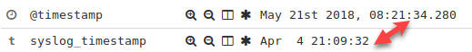

    This image shows the time difference between the logs. **Note**: The **@timestamp** on your system will **NOT** match this image. Instead, it will be whatever time you ingested logs through **Logstash**.

    Go back to your **Logstash** terminal and stop it with **CTRL + C**. You should see "**Pipeline has terminated.**"

    ```javascript
    [2018-05-21T04:37:44,244][WARN ][logstash.runner          ] SIGINT received. Shutting down.
    [2018-05-21T04:37:49,166][INFO ][logstash.pipeline        ] Pipeline has terminated {:pipeline_id=>"main", :thread=>"#<Thread:0x715b7eed run>"}
    ```

### Parse time

Make sure logs are ingested with the proper **timestamp**

??? tip "Solution"
    Update **grok.conf** to modify **@timestamp** to be the correct date and time.

    ```bash
    code /labs/1.3/student/grok.conf
    ```
    
    Set the **tags** to **step6** and update the **filter** section to match this:  

    ```javascript
    input {
      tcp {
        port => 1056
        tags => "step6"
      }
    }

    filter {
      grok {
        match => { "message" => "%{SYSLOGTIMESTAMP:syslog_timestamp} %{SYSLOGHOST:syslog_hostname} %{DATA:syslog_program}(?:\[%{POSINT:syslog_pid}\])?: %{GREEDYDATA:syslog_message}" }
      }
      mutate {
        gsub => [ "syslog_timestamp", "Apr  4", "Apr  4 2017"]
      }
      date {
        match => [ "syslog_timestamp", "MMM dd yyyy HH:mm:ss", "MMM  d yyyy HH:mm:ss", "MMM  d HH:mm:ss" ]
        remove_field => [ "syslog_timestamp" ]
      }
      syslog_pri { }
      if [syslog_message] =~ "Failed password for" {
        grok {
          match => {
            "syslog_message" => "Failed password for %{USER:user} from %{IPV4:source_ip} port %{INT:source_port:int} %{WORD:auth_program}"
          }
        }
        mutate {
          add_tag => [ "logon_failure" ]
        }
      }
      grok {
        match => {
          "syslog_message" => "Accepted password for %{USER:user} from %{IPV4:source_ip} port %{INT:source_port:int} %{WORD:auth_program}"
        }
        add_tag => [ "logon_success" ]
        tag_on_failure => []
      }
    }
    output {
      elasticsearch { 
        hosts => "elasticsearch"
        index => "lab1.3"
      }
    }
    ```

    !!! note
        **remove\_field** is invoked because **syslog\_timestamp** is no longer needed once parsed and used to replace **@timestamp**. If you wanted to keep this field for some reason, simply omit **remove\_field**. The **date** function must be underneath the first **grok** statement as **syslog\_timestamp** does not exist until it is parsed. Also, the mutate **gsub** parameter is being used to manually append the year the log was captured to the **syslog\_timestamp** field. This is because the log file did not have the year in its logs.

    Save the file and close the **Visual Studio Code** editor. Now run Logstash in the **black terminal**.

    ```bash
    logstash -f /labs/1.3/student/grok.conf
    ```

    In the **Agent Terminal,** use **netcat** to send the contents of **auth.log** to **Logstash**.

    ```bash
    nc 127.0.0.1 1056 -q 1 < /labs/1.3/auth.log
    ```
     
    At this point, you should have parsed SSH login events with the correct **@timestamp**. Switch to **Kibana** and search for **tags:step6**.

    ```bash
    tags:step6
    ```

    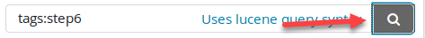  

    You are greeted with "**No results found.**" What is going on?  

      

    What is happening is that since the **@timestamp** field is now correct, the search time frame you have specified in the top right corner does not include logs from back in April. To do this, change the time to **Absolute** and set **From** to **2017-04-04 00:00:00.000** and set **To** to **2017-04-04 23:59:59.999**.  

    ```bash
    2017-04-04 00:00:00.000
    ```

    ```bash
    2017-04-04 23:59:59.999
    ```

    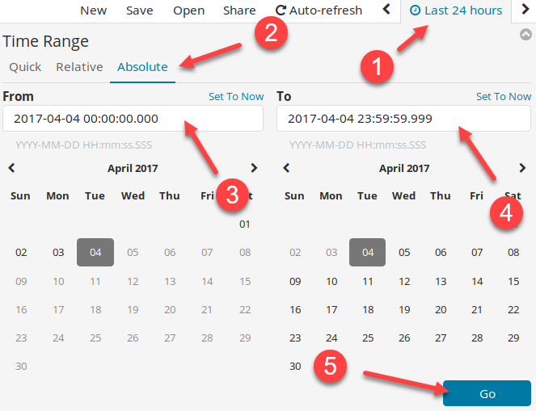  

    You now have properly set time on logs.  

    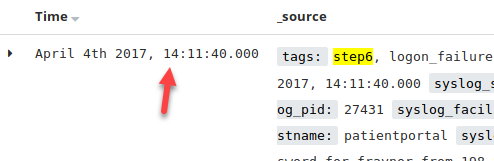  

    Go back to your **Logstash** terminal and stop it with **CTRL + C**. You should see "**Pipeline has terminated."**  

    ```javascript
    [2018-05-21T04:39:44,244][WARN ][logstash.runner          ] SIGINT received. Shutting down.
    [2018-05-21T04:39:49,166][INFO ][logstash.pipeline        ] Pipeline has terminated {:pipeline_id=>"main", :thread=>"#<Thread:0x715b7eed run>"}
    ```

### Identify brute force

Identify which accounts were successfully brute forced

??? tip "Solution"
    Now that data is ingested and properly parsed, it is time to track down the brute force events. First, search for **tags:step6 AND tags:logon\_failure**.

    ```bash
    tags:step6 AND tags:logon_failure
    ```

      

    There are **1,690** hits. This is too many to analyze manually. What we are interested in is which IP address is performing the brute force attacks and which accounts are being targeted. To find out which IP address is performing the attacks find the **source\_ip** field on the left of the screen and click on **Visualize**.  

    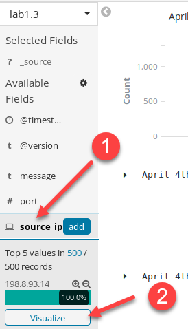  

    !!! note
        The **Quick Count** breakdown is only composed of the first 500 records returned from your search. While it shows 100% of the failed logins came from **198.8.93.14** it does not guarantee the other 1,190 records are also from **198.8.93.14**. Therefore, you need to have Kibana chart out all counts using **Visualize**.  

    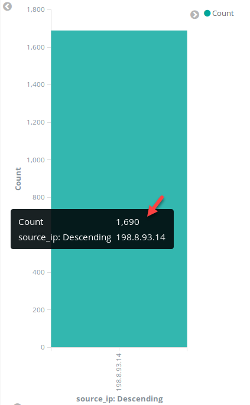  

    The chart generated by **Kibana** verifies that all 1,690 login failures are coming from **198.8.93.14**. Therefore, this is the system performing the attack.

    Next, we want to find out which accounts were used. To do this, change the visualization so that it charts off the **user** field rather than the **source\_ip** field. Do this by expanding the **X-Axis** bucket and then changing the **Field** from **source\_ip** to **user.keyword**. Then **click** on the **play** icon.

    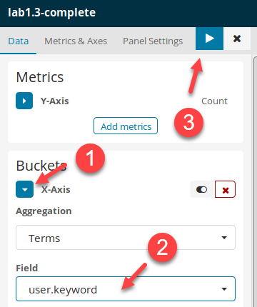  

    The resulting graph shows four accounts had attempted logins. These are **ploar**, **fraynor**, **lchancello**, and **wperry**.  

    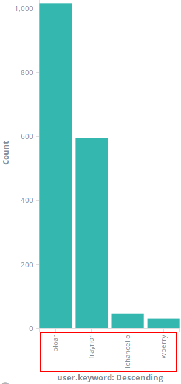  

    Now we need to find out if the attack was successful. Go back to the **Discover** tab and search for **tags:step6 AND tags:logon\_success**.

      

    ```bash
    tags:step6 AND tags:logon_success
    ```

      

    There are only **4 hits** this time. To view them, you can either expand each log, or add the **user** field as a column. To do this, hover over the **user** field in the left column and then click on **add**.  

    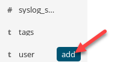  

    You can now see that there were four successful logins against three user accounts.

    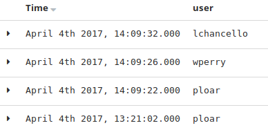  

    To see if these are from **198.8.93.14** hover over the **source\_ip** field and add it as a column as well.  

    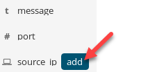  

    The resulting view shows that **198.8.93.14** is who logged into these accounts. This means the brute force attack was successful but only against 3 out of 4 accounts. The **user** fraynor was not successfully brute forced. 
     
    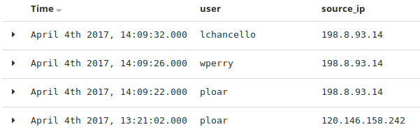

    You can remove or rearrange these columns by hovering over them and either **click** on the **X** to remove the column or arrow signs to move the column over.

    Hover over **user** and click the **X** to remove the field. Do the same for **source\_ip**.

    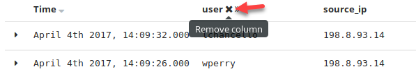

<h2 id="video"> Step-by-Step Video Instructions </h2>

<iframe class="tscplayer_inline" id="embeddedSmartPlayerInstance" src="../../../../Videos/555_1/3/v2_lab1.3_player.html?embedIFrameId=embeddedSmartPlayerInstance" scrolling="no" frameborder="0" webkitAllowFullScreen mozallowfullscreen allowFullScreen></iframe>

## Lab Conclusion

In this lab, you have parsed logs using traditional parsing. This included:

- Using **Logstash** to apply regex pattern matching

- Conditionally applying regex pattern matching

- Applying tags to identify logs based on specific conditions

- Correcting timestamp format issues

- Visually searching and identifying steps necessary to parse logs fully

**Lab 1.3 is now complete**\!

<link href="../../../../Videos/555_1/3/skins/remix/techsmith-smart-player.min.css" rel="stylesheet" type="text/css" />
<link href="../../../../Videos/555_1/3/v2_lab1.3_embed.css" rel="stylesheet" type="text/css">