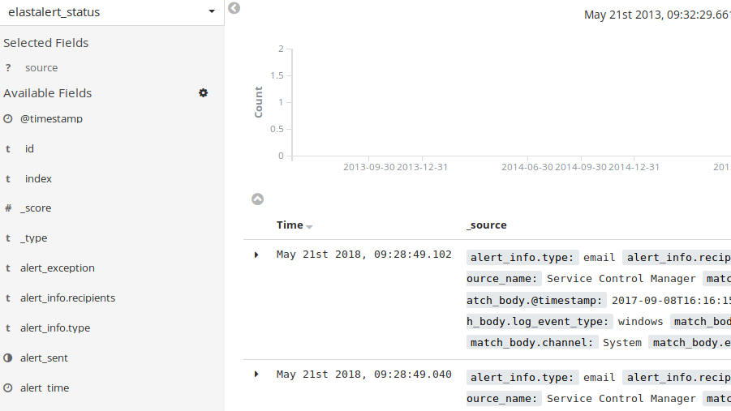
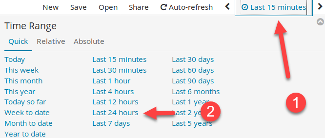

# Lab 1.4 - Tactical Alerting

## Objectives

- Build custom alert rules

- Evaluate and test rules to make sure they function as intended

- Generate custom alerts to identify malicious traffic

- Identify how to use various alert conditions tactically

- Learn how to tune alerts

## Exercise Preparation

Log into the Sec-555 VM

- Username: student

- Password: sec555


!!! note
    This lab utilizes the Elasticsearch index named **lab1.4-complete-windows**. This index already exists with the necessary data for this lab. During this lab, the term **ElastAlert** refers to an open source alert service. The term **elastalert** refers to the command line program used to invoke **ElastAlert** manually or as a service.

## Exercises

### Log cleared rule

Create an alert rule that identifies whenever the Windows event log is cleared

??? tip "Solution"
    First, create an **ElastAlert** rule file using the **Visual Studio Code Editor** to alert on logs being cleared**.** Store the rule in **/labs/1.4/student/windows\_logs\_cleared.yaml**.  

    ```bash
    code /labs/1.4/student/windows_logs_cleared.yaml
    ```

    Next, enter the rule configuration below. Save the file with either **CTRL + S** or click on **File** -\> **Save**.  

    ```bash
    name: Log cleared
    type: frequency
    index: lab1.4-complete-windows

    realert:
      minutes: 0

    num_events: 1
    timeframe:
      hours: 1

    filter:
    - term:
        event_id: 1102

    alert: debug
    ```

    !!! note
        This rule looks for **any** occurrence of a Windows log with an Event ID of 1102, which is the Event ID for logs being cleared on Windows. This rule is also set to alert on every occurrence by setting **realert minutes** to **0**. The default behavior would only alert once every so many minutes. Given that logs should not be cleared under normal circumstances, we want to see an alert on all occurrences.  

    Switch back to a terminal window. Test this rule by running the command below.

    ```bash
    $ elastalert --config /labs/elastalert/config.yaml --rule /labs/1.4/student/windows_logs_cleared.yaml --start "2017-09-07 00:00:00.000" --end "2017-09-08 23:59:59.999" --debug
    ```

    You should see the following result:  

    ```bash
    INFO:elastalert:Skipping writing to ES: {'hits': 1, 'matches': 1, '@timestamp': '2018-05-21T16:21:56.617026Z', 'rule_name': 'Log cleared', 'starttime': '2017-09-07T00:00:00Z', 'endtime': '2017-09-08T23:59:59.999Z', 'time_taken': 0.557060956954956}
    INFO:elastalert:Ran Log cleared from 2017-09-07 00:00 UTC to 2017-09-08 23:59 UTC: 1 query hits (0 already seen), 1 matches, 0 alerts sent
    ```

    Because the **elastalert** command was used with **--debug** no alert is generated. Using debug allows you to test a rule. In this case, the rule worked as there was **1** match. Without **--debug** an alert would have been generated.

### Brute force login rule

Create an alert rule that identifies whenever there are more than 50 failed login attempts against the same account within an hour

??? tip "Solution"
    Next, create an **ElastAlert** rule file using the **Visual Studio Code Editor** that will generate an alert if brute force logins are discovered. Store the rule in **/labs/1.4/student/windows\_brute\_force\_logins.yaml**.

    ```bash
    code /labs/1.4/student/windows_brute_force_logins.yaml
    ```

    Next, enter the rule configuration below. Save the file with either **CTRL + S** or click on **File** -\> **Save**.  

    ```bash
    name: Brute Force Logins
    type: frequency
    index: lab1.4-complete-windows

    realert:
      minutes: 5

    num_events: 50
    timeframe:
      hours: 1
    query_key: user

    filter:
    - term:
        event_id: 4625

    alert: email
    email: foo@example.com
    ```

    !!! note
        This rule looks for 50 or more failed logins against the same user within an hour. This works by counting the Windows Event ID for failed logins, which is **4625**, and then aggregating the counts against the **user** field. Aggregating the count against the **user** field is done by specifying a **query\_key**. Because brute force logins tend to occur over a long period of time, alerts are set only to generate once every **5** minutes.

    Switch back to a terminal window. Test this rule by running the command below.

    ```bash
    elastalert --config /labs/elastalert/config.yaml --rule /labs/1.4/student/windows_brute_force_logins.yaml --start "2017-09-07" --end "2017-09-09" --debug
    ```

    !!! note
        The time range in this example is not fully filled out. **ElastAlert** allows you to be specific or more general when specifying time ranges. When running **ElastAlert** as a service, no time range is specified, and it monitors Elasticsearch in near real-time.

    You should see the following result:  

    ```bash
    INFO:elastalert:Ignoring match for silenced rule Brute Force Logins.jdoe
    INFO:elastalert:Ignoring match for silenced rule Brute Force Logins.jdoe
    INFO:elastalert:Skipping writing to ES: {'hits': 3054, 'matches': 61, '@timestamp': '2018-05-21T16:24:25.608283Z', 'rule_name': 'Brute Force Logins', 'starttime': '2017-09-07T00:00:00Z', 'endtime': '2017-09-09T00:00:00Z', 'time_taken': 1.8777990341186523}
    INFO:elastalert:Ran Brute Force Logins from 2017-09-07 00:00 UTC to 2017-09-09 00:00 UTC: 3054 query hits (0 already seen), 61 matches, 0 alerts sent
    ```

    Because the **elastalert** command was used with **--debug** no alert is generated. In this case, the rule worked as there were **61** matches. Without **--debug** an alert would have been generated. Keep in mind that **61** matches does not mean this would have generated **61** alerts. The rule file created would only create an alert once every **5** minutes.  

    If you scroll up in the terminal, you would see there was only **1** alert generated as all the failed login events occurred within **5** minutes of each other. The only user with failed logins was **jdoe**.  

    ```bash
    INFO:elastalert:Alert for Brute Force Logins, jdoe at 2017-09-08T16:13:06Z:
    INFO:elastalert:Brute Force Logins

    At least 50 events occurred between 2017-09-08 15:13 UTC and 2017-09-08 16:13 UTC
    ```

### New service creation rule

Create an alert rule that identifies whenever a new windows service is created that has not been seen in the last 90 days

??? tip "Solution"
    For the final alert rule of this lab, create an **ElastAlert** rule file using the **Visual Studio Code Editor** that will generate an alert if a new Windows service is created that has not been previously seen. Store the rule in **/labs/1.4/student/windows\_new\_service\_creation.yaml**.

    ```bash
    code /labs/1.4/student/windows_new_service_creation.yaml
    ```
      
    Next, enter the rule configuration below. Save the file with either **CTRL + S** or click on **File** -\> **Save**.  

    ```bash
    name: New service creation
    type: new_term
    realert:
      minutes: 0

    index: lab1.4-complete-windows
    doc_type: "doc"

    fields:
     - "service_name"

    terms_window_size:
      days: 90

    filter:
    - term:
        event_id: 7045

    alert: email
    email: foo@example.com
    ```

    !!! note
        This rule dynamically builds a list of **service\_name** entries that were created in the last **90** days using **terms\_window\_size**. It then monitors for **service\_name** entries that are not on this list. Effectively, this rule allows for a dynamic rolling whitelist. The **90**-day dynamic whitelist updates itself each day and will be used to monitor for new values continuously. This makes for an extremely easy and powerful way of implementing whitelisting.  

    Switch back to a terminal window. Run this rule by running the command below. This time **--debug** will not be used so no alert will appear inside the terminal. Instead, it will log the alert to Elasticsearch in an index called **elastalert\_status**.

    ```bash
    elastalert --config /labs/elastalert/config.yaml --rule /labs/1.4/student/windows_new_service_creation.yaml --start "2017-09-07" --end "2017-09-09"
    ```

    You should see the below result. These SMTP errors are because **--debug** was not used, so alerts were generated. However, your student VM has not been set up to send an email, so when **ElastAlert** attempts to send an email, you get an error. **Step four** shows how to see the 2 alerts that generated using Kibana visually.

    ```bash
    ERROR:root:Error while running alert email: Error connecting to SMTP host: [Errno 99] Cannot assign requested address
    ERROR:root:Error while running alert email: Error connecting to SMTP host: [Errno 99] Cannot assign requested address
    ```

### View alerts

View the alerts within Kibana

??? tip "Solution"
    **step three** involved running **elastalert** without **--debug**. This caused the alerts to be logged to **Elasticsearch**. To view these logs, first open **Firefox**.  

      

    Next, open **Kibana** by clicking on the bookmark link for **Kibana**.  

    

    Switch to the **Discover** tab by **clicking** on **Discover**.  

    

    To view the alerts generated by **ElastAlert**, switch to the index called **elastalert\_status**.  

      
      
    If **step three** was performed within the last **15 minutes**, you should see two alerts.  

      

    If it has been more than **15 minutes,** you will need to change your time from **Last 15 minutes** to **Last 24 hours**. Then you will be able to see the **two** alerts generated from **step three**.  

    

<h2 id="video"> Step-by-Step Video Instructions </h2>

<iframe class="tscplayer_inline" id="embeddedSmartPlayerInstance" src="../../../../Videos/555_1/4/v2_lab1.4_player.html?embedIFrameId=embeddedSmartPlayerInstance" scrolling="no" frameborder="0" webkitAllowFullScreen mozallowfullscreen allowFullScreen></iframe>

## Lab Conclusion

In this lab, you used **ElastAlert** to demonstrate some of the capabilities of an alert engine. This included:

- Setting up an alert for a single occurrence of an event

- Setting up an alert for multiple occurrences of an event such as brute force attacks

- Implementing a dynamic whitelisting using a **new term** rotation

- Debugging rules for testing and alert creation

- Viewing alerts within Kibana

**Lab 1.4 is now complete**\!

<link href="../../../../Videos/555_1/4/skins/remix/techsmith-smart-player.min.css" rel="stylesheet" type="text/css" />
<link href="../../../../Videos/555_1/4/v2_lab1.4_embed.css" rel="stylesheet" type="text/css">