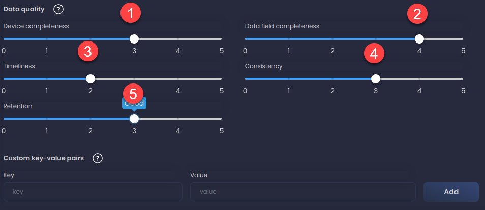
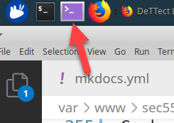
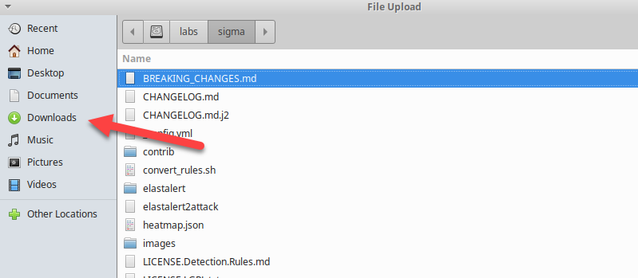
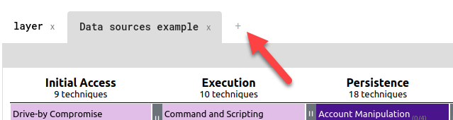
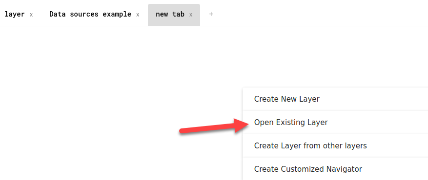

# DeTTECT Lab - Visualizing Visibility and Detection

## Objectives

- Visualize Data Source Coverage
- Review the Functionality of DeTTECT
- Add Data Sources to DeTTECT
- Identify Visibility Gaps

## Exercise Preparation

Log into the Sec-555 VM

- Username: student

- Password: sec555

We will be looking at a company called **Lab Me Inc.**. Our objective is to review their current data sources and determine if they have the appropriate visibility and detection capabilities for their organization. **Lab Me Inc.** is like most organizations and has the following data sources currently being ingested into their Security Incident and Events Management(SIEM) system.

- **Windows Logs**
- **Endpoint Security Logs**
- **Linux Logs**
- **Network Device Logs**

To accomplish this review we will be utilizing a tool called **DeTTECT** which will allow us to map out the data sources that **Lab Me Inc.** is collecting and determine what visibility they have. Let us start by reviewing the functionality that DeTTECT provides.

### Review the Functionality of DeTTECT

Per https://github.com/rabobank-cdc/DeTTECT self description as of 2020:

**DeTTECT** aims to assist blue teams using ATT&CK to score and compare data log source quality, visibility coverage, detection coverage, and threat actor behaviors. All of which can help, in different ways, to get more resilient detection techniques against attacks targeting your organization. The DeTTECT framework consists of a **Python** tool, **YAML administration files**, the **DeTTECT Editor**, and **scoring tables** for the different aspects.

DeTTECT provides the following functionality:

- Administrate and score the quality of your data sources.
- Get insight on the visibility you have on for example endpoints.
- Map your detection coverage.
- Map threat actor behaviors.
- Compare visibility, detections, and threat actor behaviors to uncover possible improvements in detection and visibility. This can help you to prioritize your blue teaming efforts.

### Add Data Sources to DeTTECT

Now that we know a little more about DeTTECT let us launch it and begin to map out the data sources from **Lab Me Inc.**.

To begin click on the **terminal icon** at the top of the Student VM.


**Copy** and **Paste** the following command in the terminal window and **Press Enter**

```bash
docker run -it --name dettect --rm -p 8081:8080 -v /labs:/labs:ro -v /home/student/Downloads:/opt/DeTTECT/output -v /home/student/Downloads:/opt/DeTTECT/input hasecuritysolutions/dettect:1.4.0 /bin/bash
```

!!! note
    This command will run the DeTTECT image inside a docker container, and will map the **/labs** folder to **/labs**, **/home/student/Downloads** to **/opt/DeTTECT/input**, and **/home/student/Downloads** to **/opt/DeTTECT/output** inside the container, respectively. It will also map TCP port **8081** on your VM to port **8080** on the container.
    
**Copy** and **Paste** the following command in the terminal window and **Press Enter**

```bash
python dettect.py editor &
```

The output of this command should be similar to below.

```bash
root@48978942f143:/opt/DeTTECT# Editor started at port 8080
You can open the Editor on: http://localhost:8080/dettect-editor
```

!!! info
	Remember, even though the output states **http://localhost:8080/dettect-editor** the Docker container is mapping **8081** to **8080**. Therefore, you cannot access DeTTECT unless you use **http://localhost:8081/dettect-editor**.

Click on the link below to open **DeTTECT Editor**.

<a href="http://localhost:8081/dettect-editor" target="_blank">DeTTECT Editor</a>

This will take you to the web interface for DeTTECT that we locally are running on your VM. You should see the following screen. We will begin by clicking on **Data Sources**


Next, click **New file**


!!! info
	In the following steps, you will be qualitatively measuring organizational visibility. How you will achieve this is using **DeTTECT** to add data sources and providing scores for how well the data source is handled. For this lab, we are providing you with the scores with some reasoning behind what the scores mean.

### Windows

Then click **Add data source**


We will start by adding the first data source in the list of data sources for **Lab Me Inc.**.


!!! note
	The steps below reflect the numbers in the image above.

1. Type **Windows event logs** into the Data source field. Click the **Add** button to the right.
   ```bash
   Windows event logs
   ```

2. Click on **Date registered** and pick today's date.

3. Click on **Date connected** and pick today's date. In normal circumstances, you would select the date you began collecting this data source's logs. 

4. Click **Available for data analytics**. This option defaults to `No` but you can change it to `Yes` as **Lab Me Inc.** is actively monitoring the logs. 

5. Click **Data source enabled**. This option defaults to `No` but you can change it to `Yes` as **Lab Me Inc.** is actively collecting the logs. 

6.  Type **Windows** in the **Products** field and then click **Add** - This field provides a way to categorize the data sources you are collecting as certain data sources may have more than one entry depending on the data they provide.
	```bash
	Windows
	```

7.  The comments field is for internal notes or additional information you would like to include during this exercise. We will not add any notes for this exercise. 

Scroll down to the final section of settings that we can configure for this data source. 


!!! note
    Please note that every organization will vary in the answers to these questions and your answers will vary between each data source.

1. Device Completeness - Are all Windows devices sending their logs to the SIEM?
    * **Set setting to 3**. This assumes that not all Windows devices are sending logs but that many are.
2. Data Field Completeness - Are all Windows log fields being parsed?
    * **Set setting to 3** - A single Windows box has over **1000** fields. A value of **3** assumes that mainstream fields are being parsed.
3. Timeliness - How quickly are the logs received and ingested into the SIEM?
    * **Set setting to 4** - A value of **4** assumes that logs are quickly being received by the SIEM. Exceptions might be laptops off the network and VPN.
4. Consistency - Are logs ingested on a regular basis or are their large delays or outages?
    * **Set setting to 2** - A value of **2** assumes that logs reach the SIEM with a delay.
5. Retention - How long are the logs retained? 
    * **Set setting to 3** - A setting of **3** implies average retention span such as **90** days.

!!! note
	Please keep in mind that the goal in many cases is a score of **3** or **4**. A score of **5** often requires additional controls for continuous monitoring and validation. Some of these controls may be warranted and others may not. For example, a score of **5** for Timeliness may require ingesting logs with receive time and event time with automated alerts to notify if there is a gap between the two. The alert would need to check for considerable delays or even event times that appear from the future. Events from the future would pinpoint time errors on individual assets, and delays would identify a lag in receiving logs.

Now that we are finished with configuring the settings for Windows let us proceed to map the next data source.

### Endpoint Security

Click **Add data source**


Let us proceed to add the **Endpoint Security** logs.


1. Type **Anti-virus** into the Data source field. Click the **Add** button to the right.
   ```bash
   Anti-virus
   ```

2. Click on **Date registered** and pick today's date.
   
3. Click on **Date connected** and pick today's date. In normal circumstances, you would select the date you began collecting this data source's logs.
   
4. Click **Available for data analytics** This option defaults to `No` but you can change it to `Yes` as **Lab Me Inc.** is actively monitoring the logs.
   
5. Click **Data source enabled** This option defaults to `No` but you can change it to `Yes` as **Lab Me Inc.** is actively collecting the logs.
   
6. Type **Endpoint Security** in the **Products** field and then click **Add** - This field provides a way to categorize the data sources you are collecting as certain data sources may have more than one entry depending on the data they provide.
   ```bash
   Endpoint Security
   ```

7. The comments field is for internal notes or additional information you would like to include during this exercise. We will not add any notes for this exercise.

Scroll down to the final section of settings that we can configure for this data source.


!!! note
    Please note that every organization will vary in the answers to these questions and your answers will vary between each data source.

1. Device Completeness - Are all devices sending their endpoint security logs to the SIEM?
    * **Set setting to 4** - A score of **4** assumes that most endpoint systems have antivirus deployed and the logs are being received
2. Data Field Completeness - Are all antivirus log fields being parsed?
    * **Set setting to 1** - A score of **1** assumes logs are collected but not being parsed
3. Timeliness - How quickly are the logs received and ingested into the SIEM?
    * **Set setting to 3** - A score of **3** means logs are received but sometimes delayed
4. Consistency - Are logs ingested on a regular basis or are their large delays or outages?
    * **Set setting to 3** - A score of **3** means logs are usually consistent
5. Retention - How long are the logs retained? 
    * **Set setting to 1** - A score of **1** means the logs are not kept long. This may be 30 days or maybe even a week or less

Now that we are finished with configuring the settings for Endpoint Security let us proceed to map the next data source.

### Linux

Click **Add data source**


Let us proceed to add the **Linux** logs.


1. Type **Authentication logs** into the Data source field. Click the **Add** button to the right.
   ```bash
   Authentication logs
   ```

2. Click on **Date registered** and pick today's date.
   
3. Click on **Date connected** and pick today's date. In normal circumstances, you would select the date you began collecting this data source's logs. 
   
4. Click **Available for data analytics** This option defaults to `No` but you can change it to `Yes` as **Lab Me Inc.** is actively monitoring the logs. 
   
5. Click **Data source enabled** This option defaults to `No` but you can change it to `Yes` as **Lab Me Inc.** is actively collecting the logs. 
   
6. Type **Linux** in the **Products** field and then click **Add** - This field provides a way to categorize the data sources you are collecting as certain data sources may have more than one entry depending on the data they provide.
   ```bash
   Linux
   ```

7. The comments field is for internal notes or additional information you would like to include during this exercise. We will not add any notes for this exercise.

!!! note
	The Linux data source will require multiple steps to tag the type of logs being collected. In this first part of the **Linux** step you are selecting **Authentication logs**. In the next part you will also be selecting **Web logs**.

Scroll down to the final section of settings that we can configure for this data source. 


!!! note
    Please note that every organization will vary in the answers to these questions and your answers will vary between each data source.

1. Device Completeness - Are all Linux devices sending their logs to the SIEM?
    * **Set setting to 3** - A value of **3** here means that some but not all of the Linux systems are sending logs to the SIEM
2. Data Field Completeness - Are all Linux log fields being parsed?
    * **Set setting to 2** - A value of **2** means many fields are not parsed. Parsing Linux logs can be challenging as each operating system or application can have custom fields and values.
3. Timeliness - How quickly are the logs received and ingested into the SIEM?
    * **Set setting to 2** - A value of **2** here may be because **Lab Me Inc.** uses Linux at remote locations which may be causing delays
4. Consistency - Are logs ingested on a regular basis or are their large delays or outages?
    * **Set setting to 3** - A value of **3** means that logs are mostly consistent but sometimes delayed
5. Retention - How long are the logs retained? 
    * **Set setting to 3** - value of **3** means that logs follow standard retention such as **90** days

With the Linux logs, **Lab Me Inc.** is collecting more than just **Authentication Logs** from these systems. To account for this we will need to add in the additional logs they are collecting from this data source.

Click **Add data source**


1. Type **Web logs** into the Data source field. Click the **Add** button to the right.
   ```bash
   Web logs
   ```

2. Click on **Date registered** and pick today's date.
   
3. Click on **Date connected** and pick today's date. In normal circumstances, you would select the date you began collecting this data source's logs. 
   
4. Click **Available for data analytics** This option defaults to `No` but you can change it to `Yes` as **Lab Me Inc.** is actively monitoring the logs. 
   
5. Click **Data source enabled** This option defaults to `No` but you can change it to `Yes` as **Lab Me Inc.** is actively collecting the logs. 
   
6. Type **Linux** in the **Products** field and then click **Add** - This field provides a way to categorize the data sources you are collecting as certain data sources may have more than one entry depending on the data they provide.
   ```bash
   Linux
   ```

7. The comments field is for internal notes or additional information you would like to include during this exercise. We will not add any notes for this exercise. 

Scroll down to the final section of settings that we can configure for this data source. 



!!! note
    Please note that every organization will vary in the answers to these questions and your answers will vary between each data source.

1. Device Completeness - Are all web servers sending their logs to the SIEM?
    * **Set setting to 3** - A value of **3** here means that some but not all of the web applications are sending logs to the SIEM
2. Data Field Completeness - Are all web server fields being parsed?
    * **Set setting to 4** - A value of **4** means most of the web server fields are being parsed
3. Timeliness - How quickly are the logs received and ingested into the SIEM?
    * **Set setting to 2** - A value of **2** here may be because **Lab Me Inc.** uses Linux at remote locations which may be causing delays
4. Consistency - Are logs ingested on a regular basis or are their large delays or outages?
    * **Set setting to 3** - A value of **3** means that logs are mostly consistent but sometimes delayed
5. Retention - How long are the logs retained? 
    * **Set setting to 3** - value of **3** means that logs follow standard retention such as **90** days

Now that we are finished with configuring the settings for Linux let us proceed to map the next data source.

### Network Devices

Click **Add data source**


Let's proceed to add the Network Device logs. 


1. Type **Network device logs** into the Data source field. Click the **Add** button to the right.
   ```bash
   Network device logs
   ```

2. Click on **Date registered** and pick today's date.
   
3. Click on **Date connected** and pick today's date. In normal circumstances, you would select the date you began collecting this data source's logs.
   
4. Click **Available for data analytics** This option defaults to `No` but you can change it to `Yes` as **Lab Me Inc.** is actively monitoring the logs.
   
5. Click **Data source enabled** This option defaults to `No` but you can change it to `Yes` as **Lab Me Inc.** is actively collecting the logs.
   
6. Type **Network Devices** in the **Products** field and then click **Add** - This field provides a way to categorize the data sources you are collecting as certain data sources may have more than one entry depending on the data they provide.
   ```bash
   Network Devices
   ```

7. The comments field is for internal notes or additional information you would like to include during this exercise. We will not add any notes for this exercise.

Scroll down to the final section of settings that we can configure for this data source.


!!! note
    Please note that every organization will vary in the answers to these questions and your answers will vary between each data source.

1. Device Completeness - Are all network devices sending their logs to the SIEM?
    * **Set setting to 2** - A score of **2** means that many network devices are not configured to ship logs to the SIEM
2. Data Field Completeness - Are all network log fields being parsed?
    * **Set setting to 2** - A score of **2** means many fields are not being parsed
3. Timeliness - How quickly are the logs received and ingested into the SIEM?
    * **Set setting to 3** - A score of **3** means that logs are being received routinely and on time
4. Consistency - Are logs ingested on a regular basis or are their large delays or outages?
    * **Set setting to 1** - A score of **1** means that logs are often missing or delayed. This can be due to potentially unreliable network links
5. Retention - How long are the logs retained?
    * **Set setting to 3** - A score of **3** means that standard retention is in place such as **90** days

We now have added all of the data sources for **Lab Me Inc.** and now it is time to save the file and let **DeTTECT** do its magic. 


Click **Save YAML file**

When you receive the save prompt, click on **Save File** and then **OK**.


### Convert YAML file to .JSON

With the YAML file now saved it is time to utilize DeTTECT to convert the YAML file to .JSON.

Go back to your **terminal window** and press **Enter**. You should see a command prompt similar to below.

```bash
root@48978942f143:/opt/DeTTECT#
```

**Copy** and **Paste** the following command into the **terminal window** and press **Enter**. This command converts the data source list you configured to a JSON file for use with **MITRE Navigator**.

```bash
python /opt/DeTTECT/dettect.py ds -fd /opt/DeTTECT/input/data-sources-new.yaml -l
```

!!! note
	Remember, the docker container for **DeTTECT** maps **/opt/DeTTECT/input** to **/home/student/Downloads**.

!!! warning
    By default, DeTTECT will save the file to your Downloads folder on the Student VM. If you move this file or if you fail to save it, the above command will not work. Please verify that the file does exist prior to running the command.

Once the script runs successfully there should now be a file in **/home/student/Downloads** called **data_sources_example.json**. To confirm, open a **new terminal**.



In the **new terminal** you can confirm the file exists by running the command below.

```bash
ls -l /home/student/Downloads/data_sources_example.json
```

The output should be similar to below if the file exists. Only the date should be different.

```bash
-rw-r--r-- 1 root root 42978 Jul 14 12:05 /home/student/Downloads/data_sources_example.json
```

At this point you may close out of all open terminals.

### Visualize Data Sources to the MITRE Framework 

Now that we have utilized **DeTTECT** to create the **data_sources_example.json** file we are ready to map these data sources against the MITRE Framework to determine what visibility **Lab Me Inc.** actually has. We will be utilizing the MITRE ATT&CK Navigator to visualize the **data_source_example.json** file.

To begin **click** the link below to open MITRE ATT&CK Navigator.

<a href="https://mitre-attack.github.io/attack-navigator/enterprise/" target="_blank">MITRE ATT&CK Navigator</a>

Next, click on the **+** sign next to the layer tab.


Next, click on **Open Existing Layer**.


Now, click on **Upload from Local**.


Then navigate to **/home/student/Downloads/data_sources_example.json** file.




You may receive a warning message about the **layer version**. Just click **OK**


The file will still load successfully. 


The result will be MITRE Navigator showing a map of the visibility **Lab Me Inc.**'s data sources provide against the MITRE framework. This is very beneficial as we can clearly see techniques that **Lab Me Inc.** is vulnerable to. The next step would be to evaluate **Lab Me Inc.** and determine what are the most common attack vectors used against them as they are a Health Organization. This would narrow down which techniques we would recommend they gain additional visibility and detection capabilities. 

Just like **Lab Me Inc.**, many organizations have similar visibility and often feel stuck due to limited resources and staff. Over the course of this class, we will be walking through many data sources and detection techniques that will allow you to level up your visibility and detection. To give you a sneak peek at what this will look like we have created a second JSON file that includes these additional data sources which will be covered in the class. Let us compare this against the file we generated for **Lab Me Inc.**.

Click on the **+** sign next to the layer tab.



Next, click on **Open Existing Layer**.



Now, click on **Upload from Local**.


Then navigate to **/labs/dettect** and open **data_sources_leveled_up.json** file.


You may receive a warning message about the **layer version**. Just click **OK**


The file will still load successfully. 


Compare the two tabs now. You can easily see that by strategically adding in key data sources and detection capabilities **Lab Me Inc.** would be able to level up their overall security. Now would be a great time to begin to map out your organization's visibility and detection capabilities. How do you stack up against **Lab Me Inc.**?

## Step-by-Step Video Instructions

<iframe width="534px" height="300px" class="tscplayer_inline" id="embeddedSmartPlayerInstance" src="../../../../Videos/555_1/dettect_lab/dettect_lab_player.html?embedIFrameId=embeddedSmartPlayerInstance" scrolling="no" frameborder="0" webkitAllowFullScreen mozallowfullscreen allowFullScreen></iframe>

## Lab Conclusion

In this lab, you reviewed the functionality of the DeTTECT tool and used it to map out data source visibility and detection capabilities. From that exercise, you were able to visualize the data source against the MITRE Framework to evaluate **Lab Me Inc.**'s current capability to see and detect evil within their environment. 

**DeTTECT Lab is now complete**\!

<link href="../../../../Videos/555_1/dettect_lab/skins/remix/techsmith-smart-player.min.css" rel="stylesheet" type="text/css" />
<link href="../../../../Videos/555_1/dettect_lab/dettect_lab_embed.css" rel="stylesheet" type="text/css">
