# Lab 2.1 - Catching the Adversary with DNS

## Objectives

- Use DNS for blacklist detection

- Find malware by applying frequency analysis to DNS records

- Apply methods to identify likely phishing domains

- Identify anomalous DNS use

- Learn to build and use visualizations and dashboards

## Exercise Preparation

Log into the Sec-555 VM

- Username: student

- Password: sec555

Open **Firefox** by **clicking** on the **Firefox** **icon** in the top-left corner of your student VM.

  

Then **click** on the **Kibana** bookmark in **Firefox**.


Logs for this lab have already been ingested and are stored in index **lab2.1-complete**. Answer the questions below using **Kibana**. All events for this lab occurred during **April 11, 2017**.

Change the index to **lab2.1-complete**.

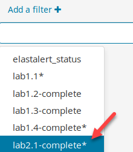

All events for this lab occurred during **April 11, 2017**. To view the logs, click on the time picker in the top right. Then click on **Absolute** and enter in **2017-04-11 00:00:00.000** for the **From** field and **2017-04-11 23:00:00.000** for the **To:** field. Then click on **Go**.

```bash
2017-04-11 00:00:00.000
```

```bash
2017-04-11 23:00:00.000
```

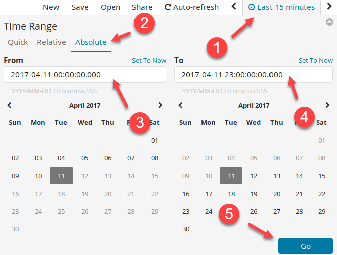  

After clicking **Go,** the time picker should reflect **April 11<sup>th</sup> 2017, 00:00:00.000 to April 11<sup>th</sup> 2017, 23:00:00.000**.

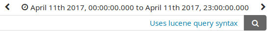

## Exercises

### Visualize DNS sinkholes

An end user browsed to a malicious site. Fortunately, the domain for this site was in a DNS sinkhole pointing to **0.0.0.0**.

<ol type="a"><li>Which system attempted to access this site?</li>
<li>What was the domain for the site?</li></ol>

??? tip "Solution"
    !!! note
        DNS sinkhole is used to take known bad domain requests and point them to a different IP address. For instance, if evil.com is a malicious domain, an internal DNS can be set to be authoritative for the domain and to always reply to requests with **0.0.0.0** or a specific IP address. Lab Me Inc. has decided to use a DNS sinkhole of **0.0.0.0**. This is a prevention technique. However, looking for the sinkhole IP makes it also a detective technology.

    Click on **Visualize** to create a new Visualization.

    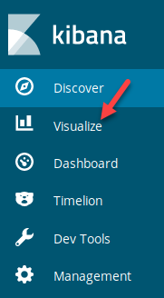  

    You should see this screen:  

      

    If you do not see the image above on your screen, you need to **click** on **Visualize** at the top of the screen.

    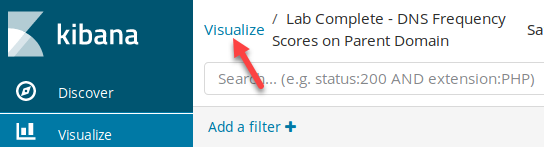  

    To create a new visualization, you need to **click** on the **plus sign**.

    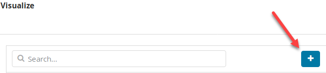  

    Click on the **Vertical bar** to create a Vertical bar chart.

    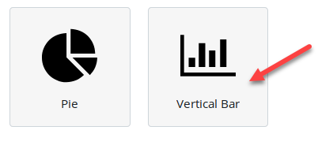  

    Then click on **lab2.1-complete\*** for the search index. If need be, type in **lab2.1** in the **Filter** box.

    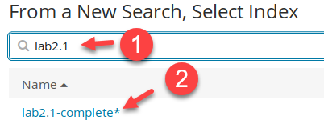  

    For this visualization to work properly, it needs only to represent DNS sinkhole requests. To do this, set the search filter to **tags:dns\_sinkhole** and click on the search icon.

    ```bash
    tags:dns_sinkhole
    ```

    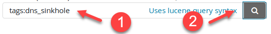

    !!! note
        This tag was created using the Logstash code below.

    ```javascript
    if [answers] == "0.0.0.0" {
      mutate { 
        add_tag => [ "dns_sinkhole" ] 
      }
    }
    ```

    Next, click on **X-Axis**.

    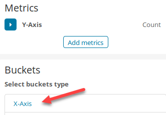

    Then select **Terms** for **Aggregation** and **highest\_registered\_domain.keyword** for the **Field**. Then set the **Custom Label** to **Domain** and click on **Add sub-buckets**.

    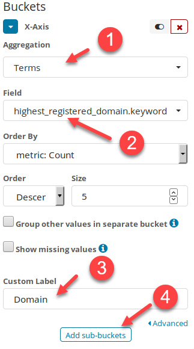  

    !!! note
        The difference between **highest\_registered\_domain** and **highest\_registered\_domain.keyword** is that highest\_registered\_domain is a field that contains a tokenized copy of data. The highest\_registered\_domain field is used for non-exact searches such as finding the name "Justin" in a field containing "Justin Henderson." The highest\_registered\_domain.keyword field represents and contains only exact field data. Therefore, on a visualization, it will only graph out full field data, and on a search, it will only find exact matches.

    Select **Split Series** for bucket type.

    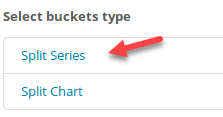  

    Set **Sub Aggregation** to **Terms**, **Field** to **source\_ip**, and **Custom Label** to **Source IP**. Then click on the play button.

    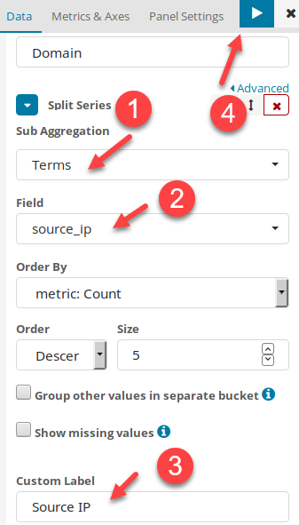

    You should be rewarded with this screen:  

    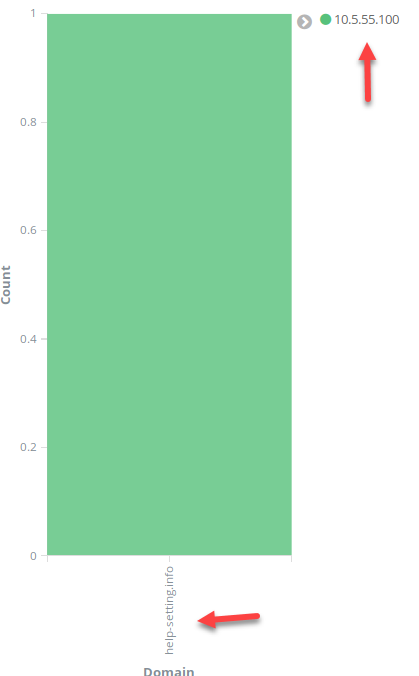  

    **Answer**: This shows **10.5.55.100** had a DNS request to a blacklisted domain called **help-setting.info**.

    !!! note
        It should not be normal for internal systems to be requesting blacklisted domains. If this happens, you should investigate the system to find out why it requested the domain. This also means that deploying this technique in production ideally will display an empty graph or table.

    Save the visualization by **clicking** on **Save**. Set the **Title** to **DNS Sinkhole Requests** and click **Save**.

    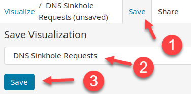

### Chart DNS request types

Charting out the \# of DNS request types can be used to find anomalous DNS use.

<ol type="a"><li>Which domain had the highest number of **MX** records?</li>
<li>Which domain had the highest number of **A** records?</li></ol>

??? tip "Solution"
    Go back to the create new visualizations page by clicking on **Visualize** in the top-left corner.

    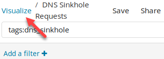  

    To create a new visualization, you need to **click** on the **plus sign**.

      

    Click on the **Vertical bar** to create a Vertical bar chart.

      

    Then click on **lab2.1-complete\*** for the search index. If need be, type in **lab2.1** in the **Filter** box.

      

    Since the visualization you are about to create uses all DNS logs, no search filter needs to be applied. Next, click on **X-Axis**.

    

    Then select **Terms** for **Aggregation** and **query\_type\_name.keyword** for the **Field**. Then set the **Custom Label** to **Query Type** and click on **Add sub-buckets**.

    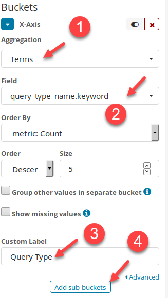  

    Select **Split Series** for bucket type.

    

    Then select **Terms** for **Sub** **Aggregation** and **highest\_registered\_domain.keyword** for the **Field**. Then set the **Custom Label** to **Domain** and click on the play button.

    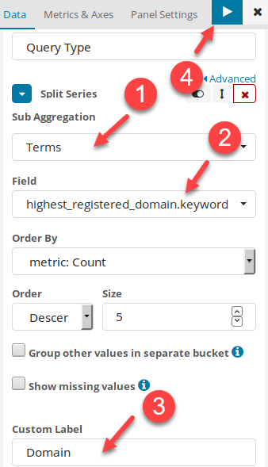

    You should now see the completed chart.

    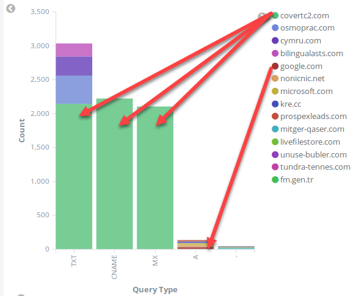  

    **Answer**: In this case, **covertc2.com** has an enormous amount of **TXT**, **CNAME**, and **MX** records compared to other domains. The domain **google.com** has the highest amount of **A** records.

    !!! note
        In this case, **covertc2.com** was being used as a DNS tunnel. It was performed using **dnscat2** which uses IPsec to send encrypted data using DNS **TXT**, **CNAME**, and **MX** records. To better identify DNS tunneling, it may be helpful to create another chart showing DNS requests over time by source IP address.

    Save the visualization by clicking on the save icon. Set the **Title** to **DNS Query Type by Domain** and click **Save**.

    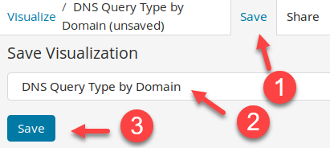

### DNS frequency analysis

Frequency analysis is extremely useful for finding adversaries trying to evade detection.

<ol type="a"><li>Find the primary domain with the lowest frequency score.</li>
<li>Find the subdomain with the lowest frequency score.</li></ol>

??? tip "Solution"
    **a) This visualization will be based on the parent\_domain field.**

    Go back to the create new visualizations page by clicking on **Visualize** in the top-left corner.

    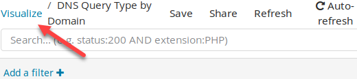  

    To create a new visualization, you need to **click** on the **plus sign**.

    

    Click on **Data table**.

    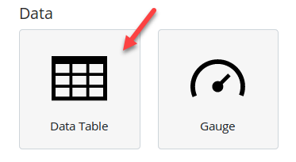  

    Then click on **lab2.1-complete\*** for the search index. If need be, type in **lab2.1** in the **Filter** box.

      

    Then click on **Split Rows**.

    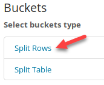

    Set **Aggregation** to **Terms**, **Field** to **parent\_domain\_frequency\_score**, **Order By** to **Term**, **Order** to **Ascending**, **Size** to **10**, and **Custom Label** to **Frequency Score**. Then click on **Add sub-buckets**.

    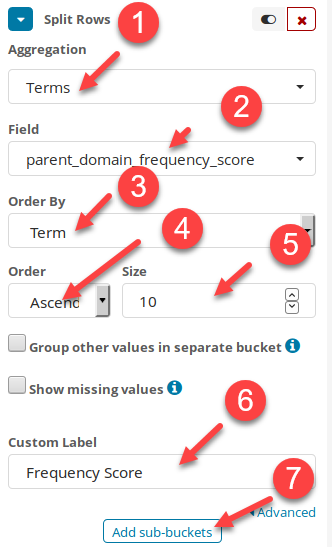  

    Click on **Split Rows**.

    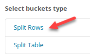

    Set **Sub Aggregation** to **Terms**, **Field** to **parent\_domain.keyword**, and **Custom Label** to **Domain**. Then click on the play button.

    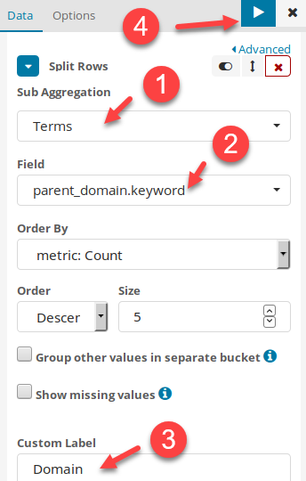L

    You should now have the complete table showing **parent domains** with the lowest frequency score or highest chance of being random.

    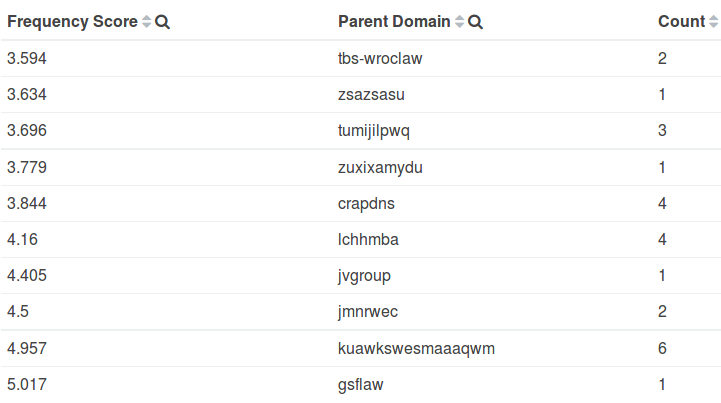  

    **Answer**: The primary domain with the lowest frequency score is **tbs-wroclaw**  

    Save this visualization by clicking on the save icon. Set the **Title** to **DNS Frequency Scores on Parent Domain**. Then click **Save**.

    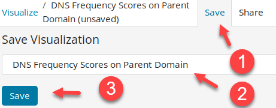

    **b) Setup a frequency analysis visualization to find adversaries trying to evade detection with random domain names. This visualization will be based on the subdomain field.**

    Go back to the create new visualizations page by clicking on **Visualize** in the top-left corner.

    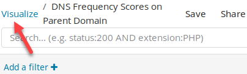  

    To create a new visualization, you need to **click** on the **plus sign**.

      

    Click on **Data table**.

      

    Then click on **lab2.1-complete\*** for the search index. If need be, type in **lab2.1** in the **Filter** box.

      

    Then click on **Split Rows**.

    

    Set **Aggregation** to **Terms**, **Field** to **subdomain\_frequency\_score**, **Order By** to **Term**, **Order** to **Ascending**, **Size** to **10**, and **Custom Label** to **Frequency Score**. Then click on **Add sub-buckets**.

    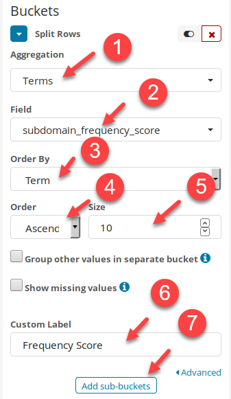

    Then click on **Split Rows**.

    

    Set **Sub Aggregation** to **Terms**, the **Field** to **subdomain.keyword**, and **Custom Label** to **Subdomain**. Then click the play button at the top of the screen.

    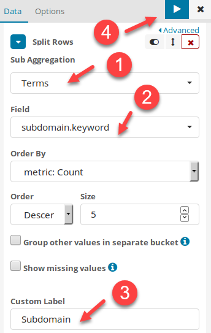  

    You should now see the table for lowest frequency subdomains.

      

    **Answer**: The **subdomain** with the lowest frequency score is **1aw2nml**.

    Save the visualization by clicking on the save icon. Set the **Title** to **DNS Frequency Scores on Subdomains** and click **Save**.

    

### Phishing identification

Lab Me Inc. received a phishing email. The end user clicked the link because it **looked like it came from labmeinc.com**.

<ol type="a"><li>What is the phishing domain?</li>
<li>What system requested this domain?</li></ol>

??? tip "Solution"
    Switch back to the discover tab by **clicking** on **Discover**.

      

    Search for **highest\_registered\_domain:labmeinc.com~ -highest\_registered\_domain:labmeinc.com**. 

    ```bash
    highest_registered_domain:labmeinc.com~ -highest_registered_domain:labmeinc.com
    ```

    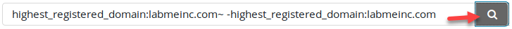

    !!! note
        If you do not see any results, make sure you have **lab2.1-complete\*** selected as your index.

    Immediately, you will see results for **1abmeinc.com**. Notice the starting character is the number **1** not the letter **L**.

    **Answer**: The phishing domain is **1abmeinc.com**

    This search can be saved and used to identify phishing domains being used visually. To do this, click on the save icon. Set the **Save Search** title to **DNS Internal phishing domain matches** and click **Save**.

    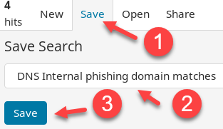  

    Switch back to the **Visualize** tab.

    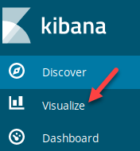  

    Go back to the create new visualizations page by clicking on **Visualize** in the top-left corner.

    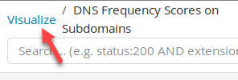  

    To create a new visualization, you need to **click** on the **plus sign**.

    

    Click on **Gauge.**  

    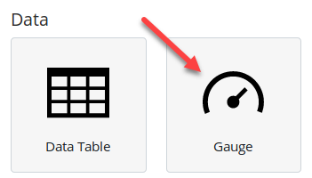  

    Click on **DNS Internal phishing domain matches** in the **From a saved search** section. If need be, type phishing in the filter section to limit the available saved searches you can click on.

    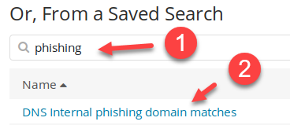  

    !!! note
        This will tell the visualization to use the previously saved search filter. Updating the saved search will update any visualizations linked to it.

    Now click on **Options**, uncheck **Show Legend**, set the **initial range** so that it is from 0 to 0, set the **second range** so that it is from 1 to 1, remove the **third range**, and then click on the play icon.

    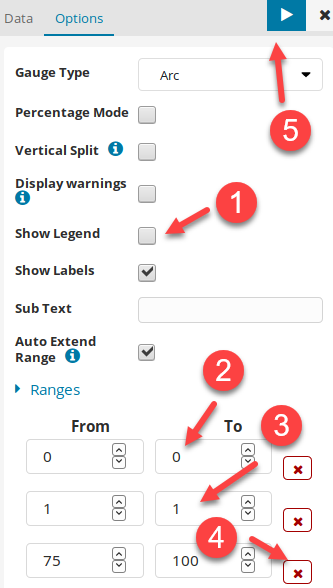

    What this does is create a color-coded visualization. If there are zero phishing domains found, then the number 0 will be displayed in a green box. If one or more logs exists showing a phishing domain is in use, then the box will be red and display a count of how many logs were found.

    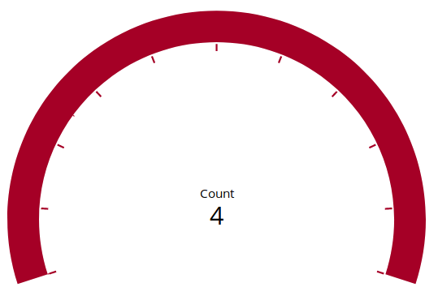  

    Save the visualization by clicking on the save icon. Set the **Title** to **DNS Fuzzy Domain Matches** and click **Save**.

    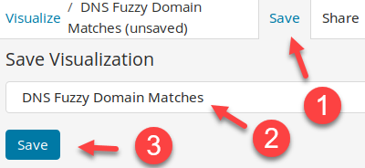

### DNS dashboard

Build a dashboard that contains any visualizations built to answers steps 1 through 4.

??? tip "Solution"
    Switch to the Dashboard page by **clicking** on **Dashboard**.

    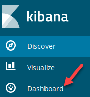  

    You should be presented with this screen.

    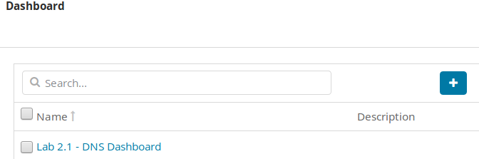  

    If you are presented with a different screen, then click on the Dashboard breadcrumb in the top-left corner.

    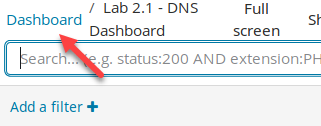

    Create a new dashboard by **clicking** on the **plus sign**.

    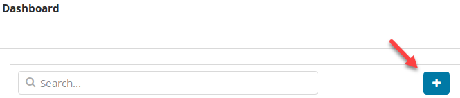  

    Next, click on **Add**.

    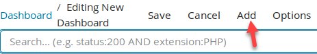

    Add the visualizations to the dashboard by clicking on their names. You can type DNS in the Visualization Filter to only show visualizations that contain the word DNS in them. Add them in the following order:  

    - **DNS Query Type by Domain**

    - **DNS Fuzzy Domain Matches** 

    - **DNS Sinkhole Requests**

    - **DNS Frequency Scores on Parent Domain** 

    - **DNS Frequency Scores on Subdomains**  

    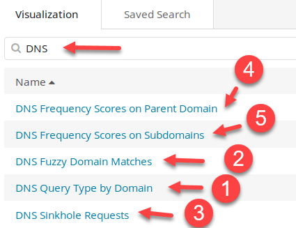  

    You can then resize each visualization on the dashboard by dragging the window using the symbol in the bottom right corner of each visualization.

    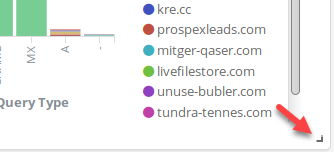

    Resize the windows to make the dashboard look like below. Your luck may vary based on screen size. It helps to maximize Firefox's window during this process.

    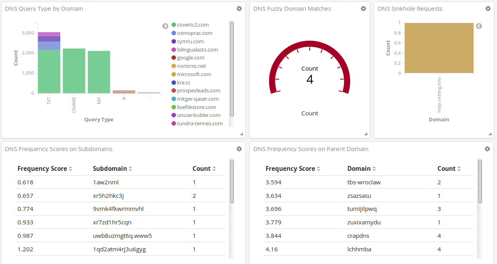  

    Now save the dashboard by clicking on Save and setting the title to **DNS Dashboard**. Then click **Save**. Congratulations. You now have a simple, yet effective, tactical dashboard. This is a basic example that can still be extremely effective.

    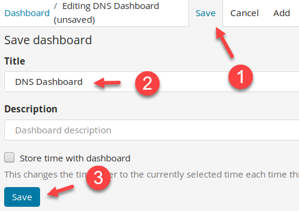

    !!! note
        A little trick worth knowing is to add a saved search to the bottom of a dashboard. Dashboards in **Kibana** are for the most part interactive. This means if you click on anything within the dashboard, it will apply it as a search filter and the whole dashboard will update to reflect it. However, sometimes the dashboard does not show all the details you want. If you add a saved search to the bottom of the dashboard, you can simply scroll down and look at the logs. You can see this by first going back to the Dashboards screen. 

      

    Then search for Lab 2.1 and then click on the dashboard called "**Lab 2.1 – DNS Dashboard**".

    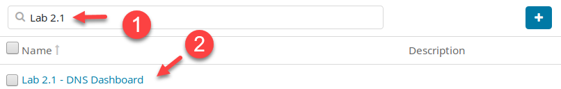  

    Then scroll to the bottom, and you will see the DNS logs underneath the dashboard.

      

    This allows you to start an investigation directly from a dashboard. You will not need to switch back to the **Discover** tab.

<h2 id="video"> Step-by-Step Video Instructions </h2>

<iframe class="tscplayer_inline" id="embeddedSmartPlayerInstance" src="../../../../Videos/555_2/1/lab2.1_player.html?embedIFrameId=embeddedSmartPlayerInstance" scrolling="no" frameborder="0" webkitAllowFullScreen mozallowfullscreen allowFullScreen></iframe>

## Lab Conclusion

In this lab, you have learned how to build out a tactical dashboard for inspecting DNS traffic. This included:

- Building out visualizations to graphically represent data

- Using Levenshtein distance in the form of fuzzy searching to find phishing domains

- Constructing a dashboard composed of multiple visualizations

- Implementing color coordinated visualizations to represent good or bad

**Lab 2.1 is now complete**\!

<link href="../../../../Videos/555_2/1/skins/remix/techsmith-smart-player.min.css" rel="stylesheet" type="text/css" />
<link href="../../../../Videos/555_2/1/lab2.1_embed.css" rel="stylesheet" type="text/css">