# Lab 2.2 - Investigating HTTP

## Objectives

- Use standard HTTP fields to find abnormal events

- Use log enrichment data to filter out the noise

- Identify web server scans

- Look for unusual naked IP requests

- Learn to build and use visualizations and dashboards

## Exercise Preparation

Log into the Sec-555 VM

- Username: student

- Password: sec555

Logs for this lab have already been ingested and are stored in index **lab2.2-complete** and have a **log\_event\_type** of **http**. To answer the questions below, use **Kibana**.

Open **Firefox** by **clicking** on the **Firefox** **icon** in the top-left corner of your student VM.

  

Then **click** on the **Kibana** bookmark in **Firefox**.


Change to the Discover section.  

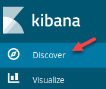  

**Click** on **New** to wipe out any previous search settings.  

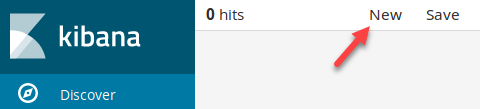  

Change the index to **lab2.2-complete**.  

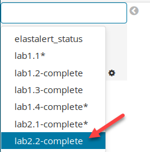

## Exercises

### Identify web scan

Between **March 10<sup>th</sup>** and **March 15<sup>th</sup>** of **2017**, multiple web scans were performed against **vmmonitor.test.int** and **pki01.test.int**. This activity included attempts to perform directory traversals, cross-site scripting, and many other forms of web attacks.

<ol type="a"><li>Which system performed the scan?</li>
<li>How many 404 errors were caused by this scan?</li>
</li>Was the scan malicious?</li></ol>

??? tip "Solution"
    First, click on the **date picker** in the top-right corner and then click on **Absolute**. Set the **From** field to **2017-03-10** and the **To** field to **2017-03-15 23:59**.  

    ```bash
    2017-03-10
    ```

    ```bash
    2017-03-15 23:59
    ```

    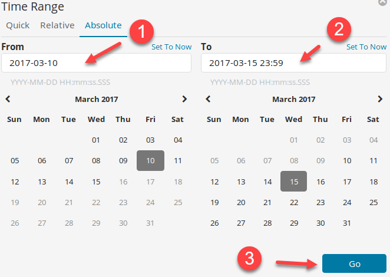  

    !!! note
        Notice that the **From** and **To** fields do not have to be filled out. If you do not specify something, a zero is submitted in its place. For example, the **From** field for this search was changed to **2017-03-10 00:00:00.000**.  

    This shows **118,084** hits. Visually there are some spikes, but the **Discover** tab is not the best way to track the web scan down.  

    Switch to the **Visualize** section.  

    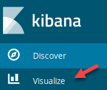  

    You should see this screen:  

    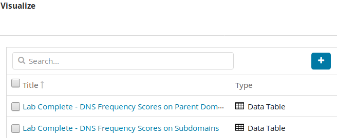  

    If you do not see the image above on your screen, you need to **click** on **Visualize** at the top of the screen.  

      

    To create a new visualization, you need to **click** on the **plus sign**.  

      

    Click on the **Vertical bar** to create a Vertical bar chart.  

    

    Then click on **lab2.2-complete\*** for the search index. If need be, type in **lab2.2** in the **Filter** box.  

    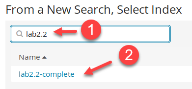  

    When looking for web scan activity, it is common to see a status code of 404 as well as 200. Start by building out a bar chart that identifies the top sources of 404 errors by source IP. In the search bar, enter "**log\_event\_type:http AND status\_code:404**". Then click on the search icon.  

    ```bash
    log_event_type:http AND status_code:404
    ```

    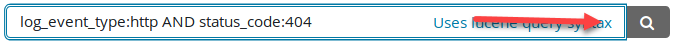  

    Next, **click** on **Split Series**.  

    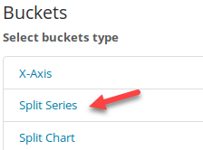

    Then set the **Aggregation** to **Terms**, **Field** to **source\_ip**, **Size** to **3**, and **Custom Label** to **Source IP**. Then click on **Add sub-buckets**.

    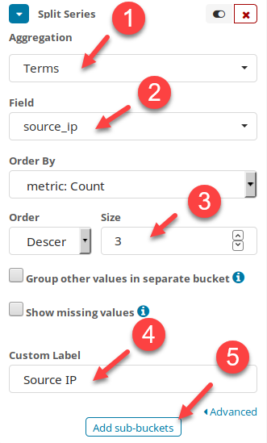  

    Select **X-Axis**.  

    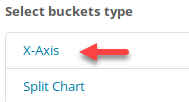

    Then set **Sub Aggregation** to **Date Histogram**. Then **click** on the **play** button.  

    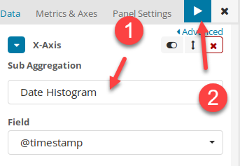  

    !!! note
        The reason for adding the **Split Bars** before the **X-Axis** is so that the search is first sorted by **source\_ip** and then by **date**. This makes the legend reflect the top **source\_ip** that has 404 status codes. If you were to add the **X-Axis** first and then the **Split Bars,** the outcome would display differently due to the order of the search.  

    You should then see the below graph.  

    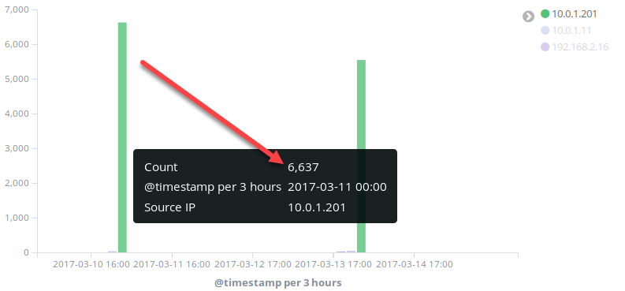

    Save the visualization by clicking on the save icon. Set the **Title** to **HTTP Status Code 404 by Source IP** and then click on **Save**.  

    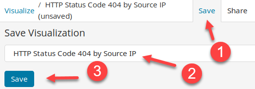  

    **10.0.1.201** has by far more 404 status codes than any other IP. At this point, it is likely that **10.0.1.201** is scanning one or more systems. Before diving more into this, modify the chart to be for a status code of 200. Do this by changing the search bar to have "**log\_event\_type:http AND status\_code:200**" and then click on the search icon.

    ```bash
    log_event_type:http AND status_code:200
    ```

    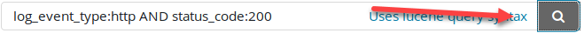  

    In this graph, **10.0.0.1** has the most 200 status codes followed by **10.0.1.201**. This means that **10.0.0.1** could also be performing a web scan. However, it is unclear without knowing the destination **virtual\_host(s)**.  

    

    You now have the same chart layout but specific to web page requests that were successful. Click on the save icon and change the **Title** to **HTTP Status Code 200 by Source IP** and then click on **Save**.  

    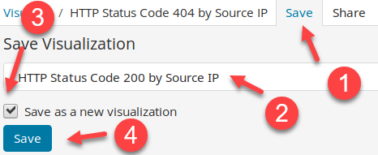  

    While **10.0.1.201** still looks like the primary suspect, these charts do not identify the target web site(s). To identify these targets, create a new visualization by first clicking on Visualize in the top-left corner.  

    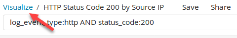  

    To create a new visualization, you need to **click** on the **plus sign**.  

      

    Select **Data Table**.  

    

    Type **lab2.2** in the filter and then click on **lab2.2-complete**.  

    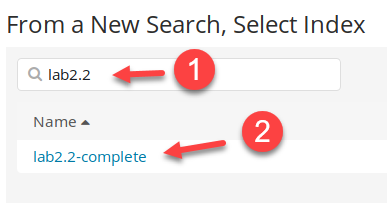  

    First, set the search filter to "**log\_event\_type:http**". This makes the visualization specific to only **http** events.  

    ```bash
    log_event_type:http
    ```

    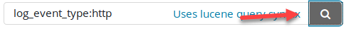  

    For the bucket type, select **Split Rows**.  

    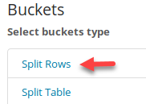

    Set **Aggregation** to **Terms**, **Field** to **method.keyword**, and **Custom Label** to **Method**. Then click on **Add sub-buckets**.  

    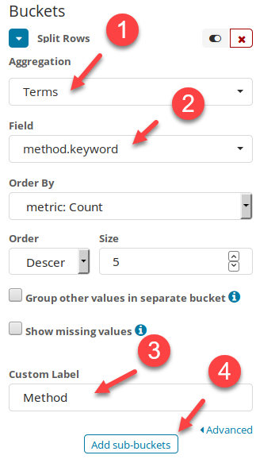  

    For the bucket type, select **Split Rows**.  

    

    Set **Sub Aggregation** to **Terms**, **Field** to **virtual\_host.keyword**, **Size** to **2**, and **Custom Label** to **Virtual Host**. Then click on **Add sub-buckets**.  

    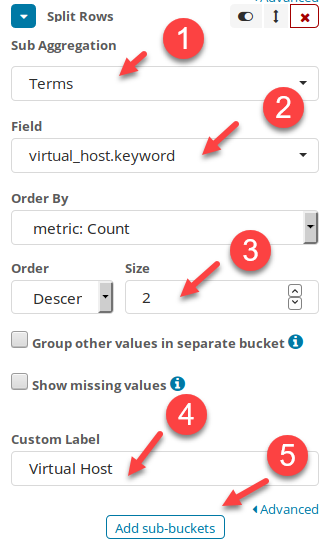  

    For the bucket type, select **Split Rows**.  

    

    Set **Sub Aggregation** to **Date Histogram** and then click on the play button.  

    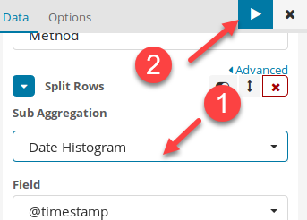  

    You should see the below table.  

    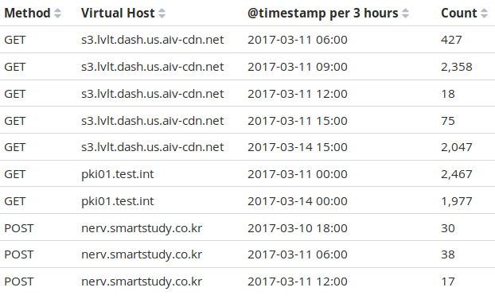  

    !!! note
        The remaining question for step one is what are the target web servers that were scanned. This only requires the **virtual\_host.keyword** field. However, adding the **method.keyword** and **Date Histogram** into the visualization allows it to be multi-purpose. For instance, it could be used to find abnormal GET vs. POST use. Also, the timestamp breakdown helps identify if this is many events over a short period or many events simply because you are searching over a long period.

    Save the visualization by **clicking** on **Save**. Set the **Title** to **HTTP Methods by Virtual Host** and then click **Save**.  

    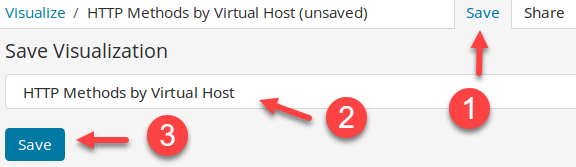  

    Before adding these visualizations to a dashboard, switch back to the **Discover** tab and create a saved search for HTTP. First, click on the **Discover** tab.  

    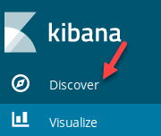  

    Then search for "**log\_event\_type:http**".  

    ```bash
    log_event_type:http
    ```

    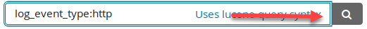  

    Hover over the following fields in the left column and click on Add to add them as columns:  

    \- method  
    \- virtual\_host  
    \- uri  
    \- uri\_length  
    \- destination\_geo.asn  
    \- destination\_geo.country\_name  

    Example using method:  

    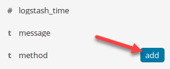  

    Click on **Save** and set the **Save Search** title to **HTTP Default Saved Search**. Then click on **Save**.  

    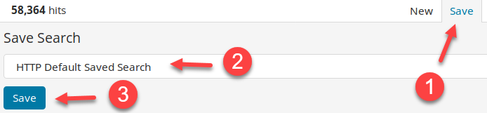  

    Now you are going to create a dashboard and add these three visualizations and saved search to it. Switch to the **Dashboard** tab.  

    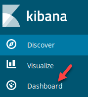  

    If an existing dashboard loads, **click** on the **Dashboard** link in the top-left corner.  

      

    Then click on the **New Dashboard** icon.  

    

    Click on the **Add**.  

    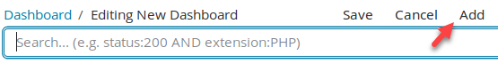  

    Add **HTTP Methods by Virtual Host**, **HTTP Status Code 200 by Source IP**, and **HTTP Status Code 404 by Source IP** by clicking on them. It may help to type HTTP in the Visualization Filter.  

    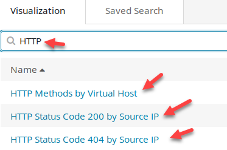  

    Then switch to the **Saved Search** tab and add **HTTP Default Saved Search**. Again, it helps to type HTTP in the Saved Search Filter to limit the results displayed.  

    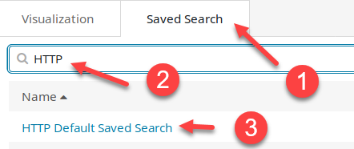

    Rearrange the visualizations to your liking. Your dashboard should look similar to below.  

    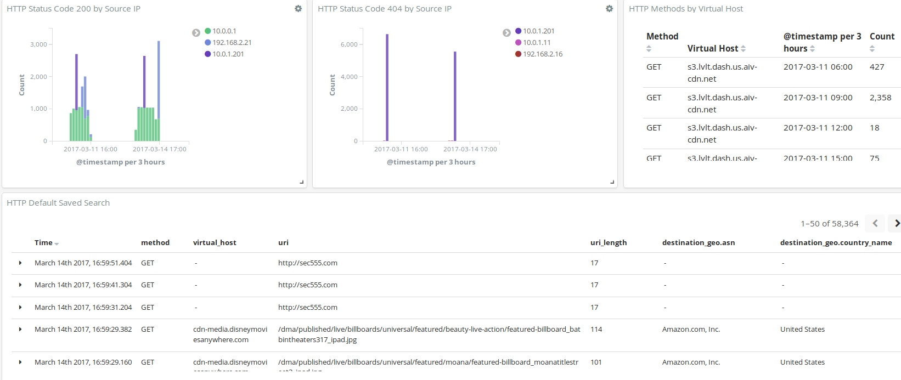  

    Throughout this process, the time should still be set to **March 10<sup>th</sup>** to **March 15<sup>th</sup>**. The dashboard reflects this by showing relative times such as X months ago or X years ago. If the date is not accurate, set it to March 10<sup>th</sup> to March 15<sup>th</sup> again. Save the dashboard by clicking on **Save** and setting the title to **HTTP Dashboard** and then click **Save**.  

    

    Now click on **10.0.1.201** on the **HTTP Status Code 404 by Source IP** visualization, and then click on the magnifying glass with the + sign. This will apply a search filter of **source\_ip:"10.0.1.201"** to the dashboard.  

      

    Now the dashboard only reflects activity from a source IP address of 10.0.1.201. However, the first question specifically is asking about **vmmonitor.test.int** and **pki01.test.int**. To have the dashboard filter down on these systems, search for "**log\_event\_type:http AND (virtual\_host:"vmmonitor.test.int" OR virtual\_host:"pki01.test.int")**" in the search bar.  

    ```bash
    log_event_type:http AND (virtual_host:"vmmonitor.test.int" OR virtual_host:"pki01.test.int")
    ```

    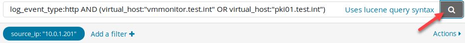  

    The search results show many GET and POST requests against both of these target sites. The question remaining is whether this is a malicious scan or not. This can be difficult to identify if you do not know if there are trusted scanners at your organization. Within the saved search, click on the **Time** column to sort the Time in Chronological order.  

    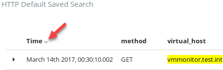

    This should show that the first event from 10.0.1.201 occurred on March 11<sup>th</sup> 2017 at 00:01:26.761.  

    !!! note
        This timestamp is specific to Pacific Time. The time of the logs will be shown according to the time zone of the machine accessing **Kibana**.  

    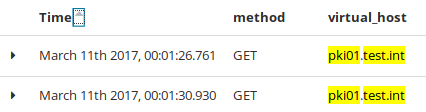  

    Occasionally, a **user-agent** will give away whether something is malicious or not. However, looking at any of these logs shows that 10.0.1.201 has a **user-agent** of **Mozilla/4.0 (compatible; MSIE 8.0; Windows NT 5.1; Trident/4.0).** This is not helpful as it reflects a Windows XP system using Internet Explorer 8. The next step could be to analyze the **uri** field to see if there are any telltale signs.  

    Go ahead and scroll through a few pages of the saved search results and look at the **uri** field. Scroll to the bottom of the **Saved Search** and click the right arrow. Repeat this step a total of **four times**.  

    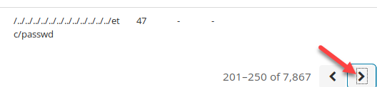  

    When you have done this **four times,** you should be displayed records 201 through 250 as seen below.  

    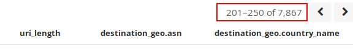  

    In the middle of this page of search results, there are two logs that show directory traversal attacks trying to access **win.ini**. These start at March 11<sup>th</sup> 2017, 00:06:51.408.  

    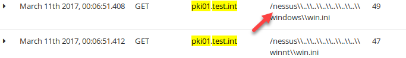

    This time, the directory traversal attack starts with **/nessus**. This gives away that the scan is being performed by a Nessus vulnerability scanner.  

    **Answer**: **10.0.1.201** is likely not a malicious system. It is a vulnerability scanner. Between March 10<sup>th</sup> and March 15<sup>th</sup>, it caused **4,504** status code 404 errors against **vmmonitor.test.int** and **pki01.test.int**. The 404 count can be calculated by hovering over the bars in the **HTTP Status Code 404 by Source IP** visualization and adding the totals.

### Investigate naked IP requests

Starting in **2017**, Lab Me Inc. began monitoring naked IP requests. These are tagged with **naked\_ip**. Specifically, they are monitoring outbound connections from **192.168.2.0/24** and **10.0.0.0/24**. Outbound connections from these subnets are being monitored as they go out to the internet through a **Fortinet** firewall.

<ol type="a"><li>There are many naked IP requests. Which two ASNs eliminate almost all the naked IP requests?</li>
<li>Are there naked IP requests to other common businesses?</li>
<li>After eliminating common ASNs, how many naked IP addresses need to be investigated?</li></ol>

??? tip "Solution"
    !!! note
        A naked IP request is a web request to an IP address rather than a domain name.  

    This question involves looking for naked IP requests and finding ways to filter out legitimate noise. This requires finding naked IP requests as well as information that can be used to filter on. For this lab, a **tag** of **naked\_ip** has been added to any HTTP event that has a **virtual\_host** using an IP address.  

    Begin by switching to the **Visualize** section.  

      

    **Click** on **Visualize** at the top of the screen.  

    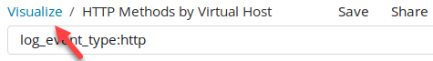  

    To create a new visualization, you need to **click** on the **plus sign**.  

    

    Select **Data Table**.  

    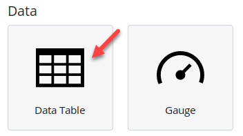  

    In the **From a new search** section, enter a Filter of **lab2.2** and then select **lab2.2-complete**.  

    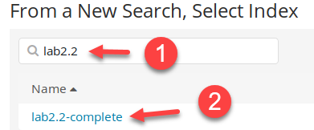  

    First, set the search filter to "**log\_event\_type:http AND tags:naked\_ip**". This makes the visualization specific to only **http** events. 

    ```bash
    log_event_type:http AND tags:naked_ip
    ```

    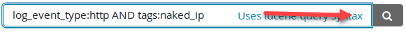  

    For the bucket type, select **Split Rows**.  

    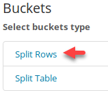

    Set **Aggregation** to **Terms**, **Field** to **virtual\_host.keyword**, **Size** to **6**, and **Custom Label** to **Virtual Host**. Then click on **Add sub-buckets**.  

    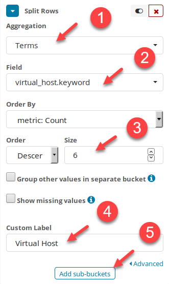  

    For the bucket type, select **Split Rows**.  

    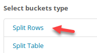

    Set **Sub Aggregation** to **Terms**, **Field** to **reverse\_dns.keyword**, and **Custom Label** to **Reverse DNS**. Then click the play button.  

    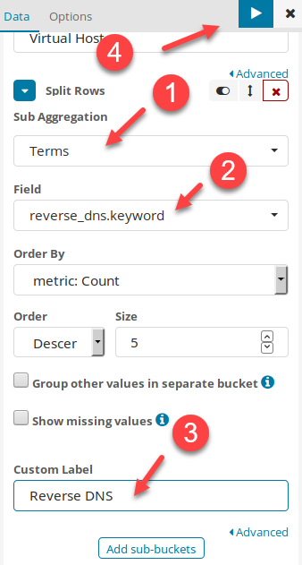  

    !!! note
        Reverse DNS takes an IP address and attempts to resolve it back to a domain. Some sites do not have reverse DNS entries. However, when they do, it is very helpful to identify and filter out legitimate traffic.

    Your table should look like below.  

      

    Save the visualization by **clicking** on **Save**. Set the **Title** to **HTTP Naked IPs** and then click on **Save**.  

    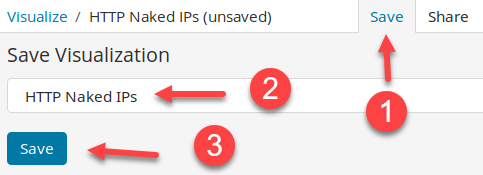  

    ASN and geo-information are extremely helpful for filtering out legitimate naked IP requests. Proceed by building a visualization with this information. **Click** on **Visualize**.  

    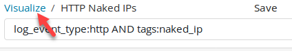  

    To create a new visualization, **click** on the **plus sign**.  

    

    Select **Data Table**.  

      

    In the **From a new search** section, enter a Filter of **lab2.2** and then select **lab2.2-complete**.  

      

    Search for "**log\_event\_type:http**". 

    ```bash
    log_event_type:http
    ```

      

    For the bucket type, select **Split Rows**.  

    

    Set **Aggregation** to **Terms**, **Field** to **destination\_geo.asn.keyword**, and **Custom Label** to **ASN**. Then click on **Add sub-buckets**.  

      

    For the bucket type, select **Split Rows**.  

    

    Set **Sub Aggregation** to **Terms**, **Field** to **destination\_geo.country\_name.keyword**, **Size** to **3**, and **Custom Label** to **Country**. Then click the play button.  

    

    The results should look like this:  

      

    Save the visualization by clicking on **Save**. Set the **Title** to **HTTP ASN and Country** and then click on **Save**.  

      

    Switch back to the **Dashboard** section.  

    

    This should bring up the **HTTP Dashboard** previously built. Now, **click** on **Edit**.  

      

    Next, **click** on **Add**.  

      

    Add the two new visualizations you just created by clicking on **HTTP ASN and Country** and **HTTP Naked IPs**.  

    

    Drag the **HTTP Default Saved Search** below the two tables you just added. It should look like below.  

      

    Change the search filter previously used to "**log\_event\_type:http**" and then click on search.

    ```bash
    log_event_type:http
    ```

      

    Also, hover over the previous source\_ip filter and then click on the trash can icon to remove it.  

    

    Save the dashboard again by clicking on **Save** and then clicking on **Save**.  

      

    Now that the dashboard has been updated, it is time to see what naked IP requests there are. The question is about logs from 2017. Change the search time to reflect this by clicking on the date picker and clicking on Absolute. Set the **From** date to **2017** and the **To** date to **2018**. Then click **Go**.  

    ```bash
    2017
    ```

    ```bash
    2018
    ```

      

    With the current settings, only the **HTTP Naked IPs** visualization reflects events that are related to naked IPs. Also, the question only pertains to events dealing with the IP address subnets of **192.168.2.0/24** and **10.0.0.0/24.** To change this, set the search bar to "**tags:naked\_ip AND (source\_ip:\[192.168.2.0 TO 192.168.2.255\] OR source\_ip:\[10.0.0.0 TO 10.0.0.255\])**".  

    ```bash
    tags:naked_ip AND (source_ip:[192.168.2.0 TO 192.168.2.255] OR source_ip:[10.0.0.0 TO 10.0.0.255])
    ```

      

    Looking at the **HTTP Naked IPs** visualization shows multiple Reverse DNS entries ending with **nflxvideo.net**. If you were to investigate this, you would discover that this is traffic related to Netflix.  

      

    Also, looking at the **HTTP ASN and Country** visualization shows **Netflix Streaming Services Inc**. with a count of **2,544**. It also shows an ASN for **Fortinet Inc**. Since the question states these subnets are going out to the internet using a Fortinet firewall, this is likely expected traffic. Hover over the **Netflix Streaming Services Inc.** and then click on the magnifying glass with the minus sign to exclude it.  

    

    Do the same for **Fortinet Inc**.  

      

    At this point, over 90% of the naked IP requests have been filtered out. However, 67 events may still be too many remaining to treat monitoring naked IP requests as effective. Yet more events can still be filtered. The highest remaining ASN is **Amazon.com, Inc**. Reverse DNS entries show these are related to **s3-1-w.amazonaws.com**. This is Amazon's Amazon Web Service (AWS), which is for cloud hosting. While www.amazon.com is likely trusted, AWS can be used for anything including attacks from adversaries.  

    Look at the raw events in the saved search section. Find the first event related to **s3-1w.amazonaws.com**. Notice, the **uri** is for **/kindle-wifi/wifistub.html**. In fact, it looks like these are the same for all **s3-1w.amazonaws.com** events. Expand the log and click on the magnifying glass with the minus sign to exclude events related to **/kindle-wifi/wifistub.html**.  

      

    The next highest remaining ASN is **Google Inc.** Hover over the ASN of Google Inc. in the HTTP ASN and Country table and click on the magnifying glass with the plus sign to filter in on it.  

    

    The problem with Google is it also has cloud hosting. Filtering out the ASN of **Google Inc**. could mask attacks from a Google-hosted cloud server. Looking at the **HTTP Naked IPs** table shows multiple naked IPs ending in **1e100.net**.  

      

    **1e100.net** is a Google-owned domain used to identify their servers. It is not malicious and not associated with cloud-hosted servers. Thus, it can be used to filter out these Google events. To do so, update the search filter to include **-reverse\_dns:1e100.net** as follows:  

    ```bash
    tags:naked_ip AND (source_ip:[192.168.2.0 TO 192.168.2.255] OR source_ip:[10.0.0.0 TO 10.0.0.255]) -reverse_dns:1e100.net
    ```

      

    There are no logs shown after submitting the search. This is because all of the naked IP addresses dealing with **Google Inc.** are related to **1e100.net**. Remove the **destination\_geo.asn.keyword** filter of **Google Inc.** by hovering over it and clicking on the **garbage can icon**.  

      

    Using ASN and reverse DNS filtering narrows the remaining naked IP requests to 3 web servers and 11 events. This is much easier for an analyst to handle.  

    **Answer**: **Netflix Streaming Services Inc.** and **Fortinet Inc.** were by far the two most used ASNs related to naked IP request. However, both Google and Amazon were common as well. In regard to these companies, filtering can be done with either the ASN or fields such as **uri** and **reverse\_dns**. Because of cloud hosting filtering on **uri** and **reverse\_dns** may be a safer way to go. Using a combination of these results in **3 virtual\_hosts** with a total of **11** events that require investigation.

<h2 id="video"> Step-by-Step Video Instructions </h2>

<iframe class="tscplayer_inline" id="embeddedSmartPlayerInstance" src="../../../../Videos/555_2/2/v2_lab2.2_player.html?embedIFrameId=embeddedSmartPlayerInstance" scrolling="no" frameborder="0" webkitAllowFullScreen mozallowfullscreen allowFullScreen></iframe>

## Lab Conclusion

In this lab, you have learned how to build out a tactical dashboard for inspecting HTTP traffic. This included:

- Learning the value of HTTP logs

- Understanding how basic log enrichment such as tactical reverse DNS lookups can aid in false positive reduction

- Using Geo ASN information to identify the identity or business associated with a web server

- Analyzing user-agents and HTTP methods for signs of abnormal activity

- Breaking out HTTP status codes for signs of abnormal activity

**Lab 2.2 is now complete**\!

<link href="../../../../Videos/555_2/2/skins/remix/techsmith-smart-player.min.css" rel="stylesheet" type="text/css" />
<link href="../../../../Videos/555_2/2/v2_lab2.2_embed.css" rel="stylesheet" type="text/css">