# Lab 3.1 - Windows Log Filtering

## Objectives

- Develop a process for filtering out the noise

- Understand what to look for and how to filter out logs

- Identify tags that can greatly aid in searching and/or filtering

## Exercise Preparation

Log into the Sec-555 VM

- Username: student

- Password: sec555

Open **Firefox** by **clicking** on the **Firefox** **icon** in the top left corner of your student VM.  

  

Then **click** on the **Kibana** bookmark in **Firefox**.


Switch to the **Discover** section.

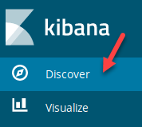  

Next, select the **lab3.1-complete** index.  

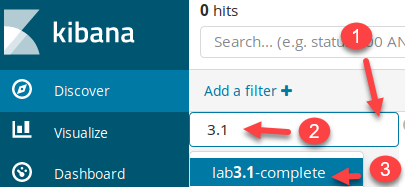

This lab deals with events that occurred on April 13<sup>th</sup>, 2017. To perform this lab, you need to filter down to a specific time. To do this, click on the time picker, select **Absolute**, and set **From** to **2017-04-13 00:00:00** and **To** to **2017-04-13 23:59:00**. Then click on **Go.**

```bash
2017-04-13 00:00:00
```

```bash
2017-04-13 23:59:00
```

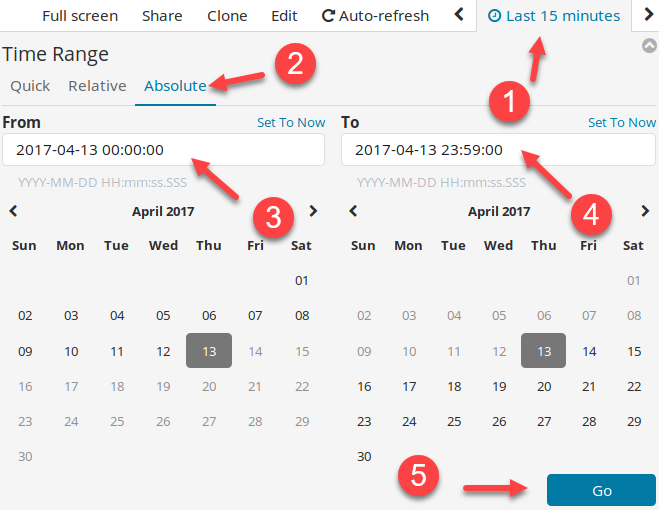  

There is a pre-built dashboard available for this lab called **Lab 3.1 - Windows Event Dashboard**.

## Exercises

Filtering is simplified by using an interactive dashboard. A dashboard helps identify areas that could use filtering. To speed up the lab, consider using the pre-built visualizations, search, or dashboard identified in the Dashboard called **Lab 3.1 - Windows Event Dashboard**.  

First, click on **Dashboard** to switch to the dashboard section.  

  

If the dashboard selection screen is not displayed, click on **Dashboard**.  

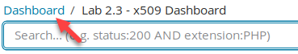  


Load the **Lab 3.1 - Windows Event Dashboard** by typing **3.1** in the filter section and then **clicking** on **Lab 3.1 - Windows Dashboard**.  

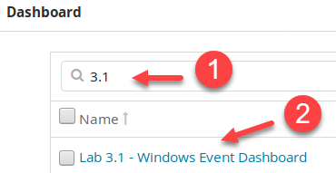

### Most frequent events

What is the most frequent **event\_id**?

??? tip "Solution"
    Looking at the **Windows Top Event IDs** shows that Event ID **5156** is clearly the highest volume event.  

    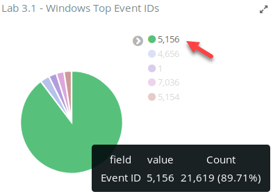  

    **Answer**: Event ID **5156** is the highest volume Event ID.  

    Click on either **5156** in the legend or the slice of the pie chart that has the largest amount. This will apply it as a filter.  

    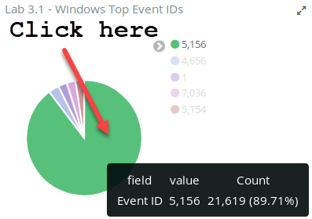

    Looking at the **Windows Events by Category** table shows that this Event ID is related to Windows Firewall.  

    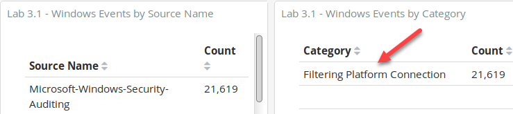  

    Scroll down to the saved search area and expand the first log shows that not only is it related to Windows Firewall events, but specifically it is for an allowed connection. Ironically, most of these logs are from **NXLog**, which is the log agent collecting logs and shipping them off. This can cause a log loop as the log agent will collect this Firewall log and then turn around and ship it off, which then causes a new firewall log to be cut. The Windows Firewall "allowed connection" logs either need to be disabled or tuned.  

    !!! note
        Logging "allowed connections" with Windows Firewall can be disabled with group policy. Alternatively, **NXLog** could be configured to collect these events but ignore any with an Application Name containing nxlog.  

    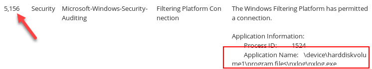  

    The assumption at this point is these allowed connections will later be tuned or filtered. Now on to find what else can be filtered. On the search bar, flip the filter of **event\_id:5156** to an exclude by hovering over it and clicking on the magnifying glass with a **minus** sign.  

    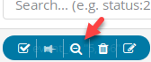

    After excluding Event ID **5156,** the **Windows Events by Category** still shows a decent amount of Windows Firewall related events. Go ahead and click on **Filtering Platform Connection** to see what these are.  

    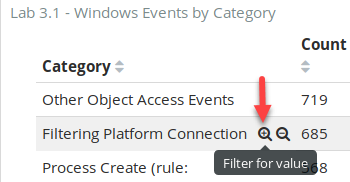  

    Three Event IDs outside of **5156** are found that are related to Windows Firewall. Look at each of these by clicking on them in the pie chart. Go from largest to smallest. Start by clicking on **5154**.  

    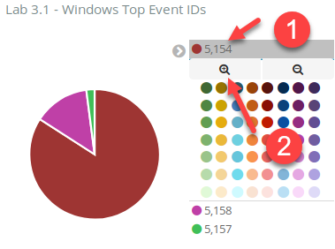  

    After this new search filter is applied, scroll down and look at the logs. The first two logs show:  

    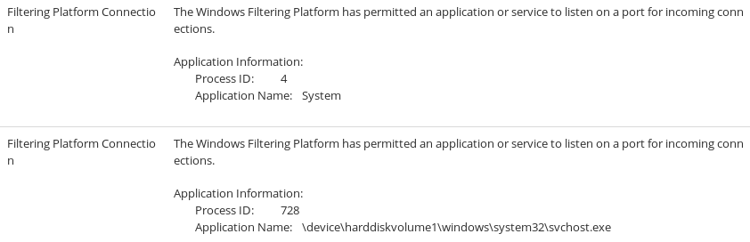

    Event ID **5154** corresponds to the Windows Firewall allowing a process to listen on a network port. These should be filtered entirely or tuned to only look for new processes or ports (recommended). Change the filter for **5154** to an exclusion by hovering over it and clicking on the **magnifying glass**.  

    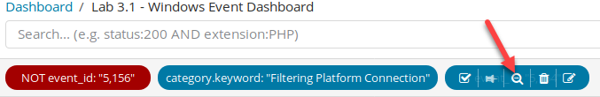  

    Two events are now left that are related to the Windows Firewall. They are **5158** and **5157**. You can either narrow down to each event like you did for event **5154** or you can simply scroll to the bottom and look at the logs. You should quickly see Event ID **5158** followed by **5157**.  

    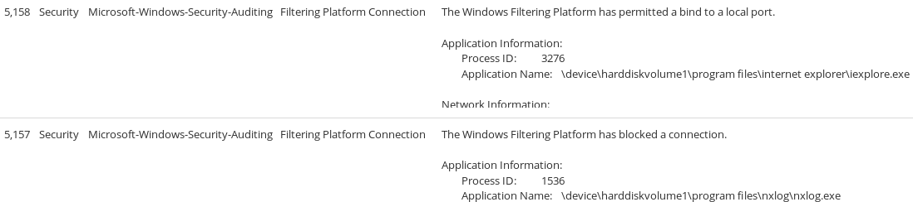  

    Event ID **5158** relates to the Windows Firewall allowing an application to bind to a local port. Again, this is an event that either needs to be filtered out entirely or tuned to ignore most applications.  

    !!! note
        Binding to a local port is not the same as listening. For example, the log above pertains to Internet Explorer binding to a local port to access a web server. Internet Explorer is using an ephemeral port on 64855 and is not listening for connections.  

    Event ID **5157** relates to Windows Firewall blocking a connection. In this case, it shows it blocked nxlog.exe which is the log agent. This is a misconfiguration on the system administrator's part. While logs could still be received, nxlog.exe was being denied from making a local connection. Event ID **5157** is something you want to monitor, but filtering is still important. This could be done by changing system configurations or filtering out specific applications.  

    So at this point, you have identified that all **Filtering Platform Connection** events need some level of filtering.

### Top remaining two events

Filter out Windows firewall events. Then find out what are the top two **event\_id** values remaining that are from the **channel** with the MOST events.

??? tip "Solution"
    Switch the **Filtering Platform Connection** to an exclude filter by hovering over it and clicking on the magnifying glass.  

    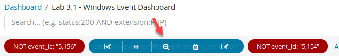  

    Then remove all other filters by hovering over them and clicking on the trash can icon.  

    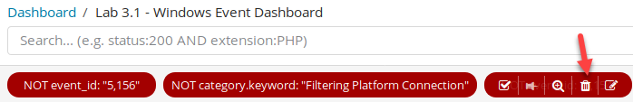  

    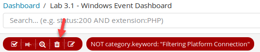  

    Your search filter should now look like this:  

    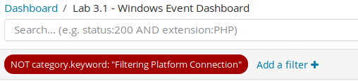  

    **Answer**: The top two remaining Event IDs are **4656** and **1**.

    Click on Event ID **4656** in the pie chart.  

    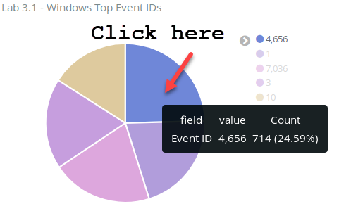  

    A drill-down on Event ID **4656** shows that it is related to object access.  

      

    This is verbose data that likely provides little value. It is something that could be filtered out at an aggregator, an agent, or could be disabled by adjusting the audit policy using group policy.  

    Filter out Event ID **4656** by hovering over the search filter and clicking on the magnifying glass with a minus sign.  

    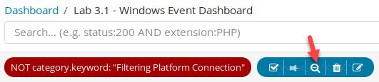

    Then click on the largest **event\_id** field in the pie chart, which is for Event ID **1**.  

      

    The end search filter should look like this:  

    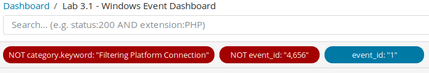  
      
    Scroll to the bottom and look at the logs. The first log looks like this:  

      

    This is a Sysmon process creation event. This is used to log details about each process that is started. This can be rather verbose. Multiple options exist to limit these logs. Probably the best method is to configure Sysmon to limit what it logs. This minimizes resource usage on the end system as well as how much logs are sent over the network. Alternatively, logs could be filtered at a log agent or an aggregator. However, if you are going to take the time to change log agent settings on thousands of machines, it makes more sense to change Sysmon instead. However, being able to filter things out at an aggregator quickly may make sense, especially during the interim where Sysmon settings are being updated.

### Sysmon

**Sysmon** is installed on the systems from this lab. However, it is generating too many logs. Find common locations such as C:\\Program Files that standard users should not have access to and filter them out.

- How many logs are remaining?

- What percentage of logs would this eliminate?

- Where should this type of filtering be done?

??? tip "Solution"
    Since Event ID 1 is part of the **Microsoft-Windows-Sysmon source name,** filter in on it within the **Lab 3.1 - Windows Events by Source Name**. To do this, hover over **Microsoft-Windows-Sysmon** under **Windows Events by Source Name** table and click on the magnifying glass with the plus sign.  

    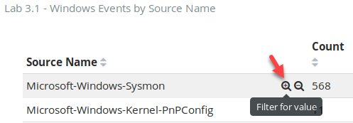

    Next, remove the **event\_id:"1"** filter so that you can see all Sysmon-related events.  

    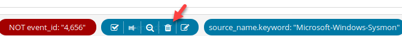  

    Filtering on **Microsoft-Windows-Sysmon source\_name** shows multiple categories.  

    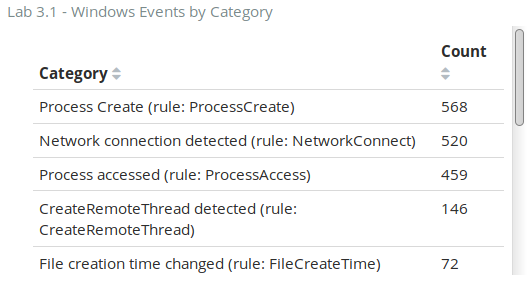  

    These events can be overly verbose. If you are trying to minimalize events while remaining tactical, special filtering will need to be applied. For example, typically processes created from **C:\\Program Files, C:\\Program Files (x86)**, and **C:\\Windows\\System32** are benign. This is because binaries typically cannot be saved to these locations without Administrator access. While this is not always true, it is a good start for organizations not previously gathering Sysmon.

    In the search bar, filter out events related to these folders by adding this search filter:  

    ```bash
    -image:"C:\\Program Files\\*" -image:"C:\\Program Files (x86)\\*" -image:"C:\\Windows\\System32\\*" -sourceimage:"C:\\Windows\\system32\\*"  -currentdirectory:"C:\\Windows\\system32\\*"
    ```

    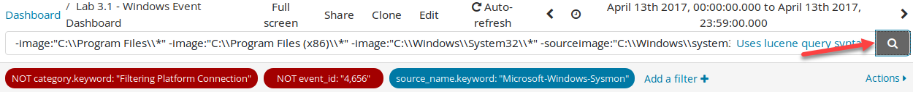 

    The resulting display should look like below.

    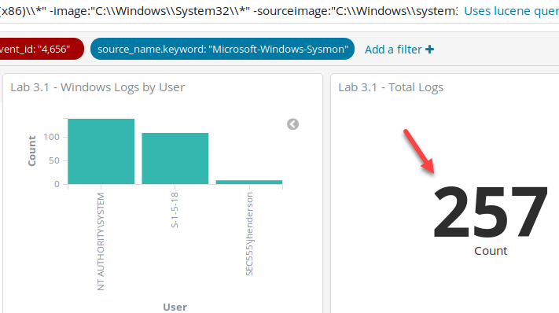

    This simple filter eliminates a majority of these logs.  

    !!! note
        This search filters on three fields: **image**, **sourceimage**, and **currentdirectory**. Also, note this will filter out things you may want such as the use of cscript.exe, wscript.exe, cmd.exe, and powershell.exe. However, this filter is not to exclude these but to roughly show how many logs can be filtered out. Again, exclusions for Sysmon are best performed with Sysmon. The folders above could be filtered out except for command line or script utilities or any other potentially dangerous executables.  

    **Answer**: By filtering out processes started in directories such as **C:\\Program Files**, **C:\\Program Files (x86)**, and **C:\\Windows\\System32** that require Administrative access to add new binaries, the event count has been reduced from **1,852** down to **257**. This is an **86.1%** reduction in logs.

    !!! note
        If you were to continue filtering out logs and wanted to find items that were not **category.keyword:"Windows Filtering Platform"**, **event\_id:"4656"**, or **source\_name.keyword:"Microsoft-Windows-Sysmon"** that was from the directories above, you would have to change the filtering. To do this, you would need to remove the **source\_name.keyword** filter and move it to the search bar. The search in the search bar would then need to be updated to reflect the below search. This is because you do not want to accidentally eliminate other Event IDs that may reference these folder structures using the same field names. 

        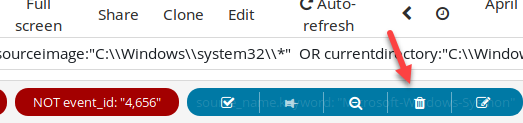  

        Then change the search filter to what is below.  

        ```bash
        -(source_name.keyword:"Microsoft-Windows-Sysmon" AND (image:"C:\\Program Files\\*" OR image:"C:\\Program Files (x86)\\*" OR image:"C:\\Windows\\System32\\*" OR sourceimage:"C:\\Windows\\system32\\*"  OR currentdirectory:"C:\\Windows\\system32\\*"))
        ```  

        This would exclude only Sysmon events that match the folder criteria previously mentioned.

### Filter special accounts

Many logon events (Event ID **4624**) are not for actual end users. Filter these out.

- How many login events are remaining?

- If you were to filter these special logons out what percentage of logs would be eliminated?

??? tip "Solution"
    Most Windows logons are not actually tied to a standard user. For example, computer accounts show up as the computer name followed by a dollar sign like IT01$. Logons associated with computer accounts or built-in service accounts such as Local Service tend to be high volume and low value.  

    Begin by finding the number of events that have a **user** field. First, remove all previous filters by clicking on **Actions** and then **Remove**.  

    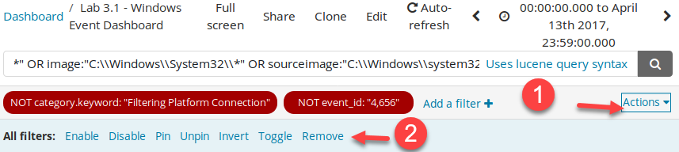  

    Then replace the search filter bar with "**event\_id:4624**" to find all login-related events.  

    ```bash
    event_id:4624
    ```  

      

    The total number of events is **382**. Update the search to be "**event\_id:4624 -tags:machine**". This will eliminate all logs that are from a computer being used as the **user** account.  

    ```bash
    event_id:4624 -tags:machine
    ```

    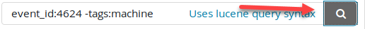  

    This reduces the total events from **382** to **139**. However, looking at the **Windows Logs by User** bar chart shows that there are multiple service accounts in use.  

    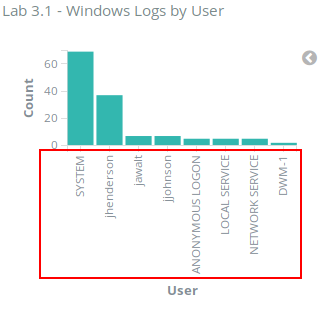  

    Filter out service accounts by changing the search to "**event\_id:4624 -tags:machine -tags:service\_account**".  

    ```bash
    event_id:4624 -tags:machine -tags:service_account
    ```
    
      

    This further reduces the total count of events left to **58**.  

    !!! note
        In this example, the tag **service\_account** includes SYSTEM. While many of the built-in service accounts are likely noise, you may still want to log events associated with SYSTEM. This is because SYSTEM has more access than even a domain administrator or enterprise administrator on a local computer.

    Looking at the remaining accounts on the Windows Logs by User graph shows that there are multiple events associated with ANONYMOUS LOGON. In most environments, this ends up being noise.  

    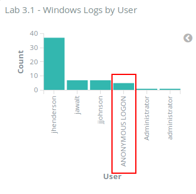  

    Click on **ANONYMOUS LOGON**.

    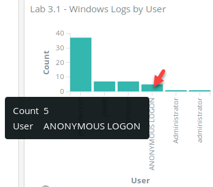  

    Then change the search filter to an exclusion by clicking on the magnifying glass icon after hovering over **user:"ANONYMOUS LOGON"** in the search bar.  

    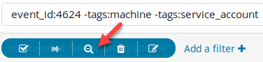  

    After filtering out computer accounts, service accounts, and anonymous logins, there are **53** remaining events.  

    **Answer**: **53** logs remain, which is an **86.1%** reduction.

### Other filters

Extra credit: Look at remaining log channels. Are there any that are unnecessary to collect? This is an open-ended question. There is no right answer to this question. Different organizations have different needs, plus risk appetite greatly affects an organization's decision.

??? tip "Solution"
    Click on **Dashboard** in the top-left corner.  

    

    Type **3.1** and then click on **Lab 3.1 - Windows Event Dashboard with Filters**.  

    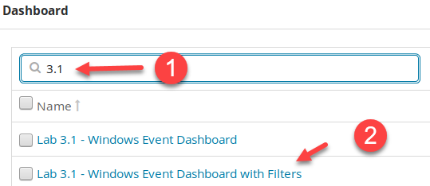  

    This will load a saved dashboard that contains the aggregate filter of steps 1 – 4. Notice the number of events is down to **4,077** from **29,020**, which is an **85.9%** reduction in events. Yet more could be filtered out. How much more gets filtered depends on your level of acceptance. For example, this dashboard shows that there are **1,173** remaining **Microsoft-Windows-Security-Auditing** events. Likely, this could be investigated, and more could be filtered out.

    Consider the data populated in the **Source Name** and **Category** fields below. As you browse through them, think about if the logs are of any value to your organizations. This could be for security or operational purposes. There is no right or wrong. However, if no valid use case comes to mind, then likely you can eliminate the log.  

    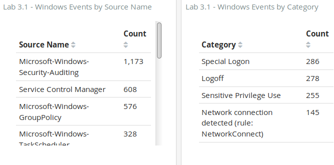

<h2 id="video"> Step-by-Step Video Instructions </h2>

<iframe class="tscplayer_inline" id="embeddedSmartPlayerInstance" src="../../../../Videos/555_3/1/lab3.1_player.html?embedIFrameId=embeddedSmartPlayerInstance" scrolling="no" frameborder="0" webkitAllowFullScreen mozallowfullscreen allowFullScreen></iframe>

## Lab Conclusion

In this lab, you have learned how to analyze a log source to identify events that can and should be filtered out. Filtering, or not collecting logs, is one of the most beneficial and tactical processes for maintaining a healthy SIEM. This includes:

- Building out dashboards that help you understand your log sources

- Analyzing logs to find out if they are necessary or worth the cost/performance trade-off of collecting and storing them

- Using an interactive dashboard to test out filters or changes before making them

- Identifying if log sources can be filtered by disabling the log, filtering with a log agent, or modifying the software that generates a given log

**Lab 3.1 is now complete**\!

<link href="../../../../Videos/555_3/1/skins/remix/techsmith-smart-player.min.css" rel="stylesheet" type="text/css" />
<link href="../../../../Videos/555_3/1/lab3.1_embed.css" rel="stylesheet" type="text/css">