# Lab 3.2 - Catching Evil with Windows Logs

## Objectives

- Understand the value of monitoring Windows logs (even on desktops)

- Understand common adversary tactics

- Gain knowledge in investigating alerts

- Become familiar with key Windows logs

- Find evidence of malice in standard Windows logs

## Exercise Preparation

Log into the Sec-555 VM

- Username: student

- Password: sec555

Open **Firefox** by **clicking** on the **Firefox** **icon** in the top-left corner of your student VM.  

  

Then **click** on the **Kibana** bookmark in **Firefox**.

  
  
Next, change to **Discover** and select the **lab3.2-complete** index.  

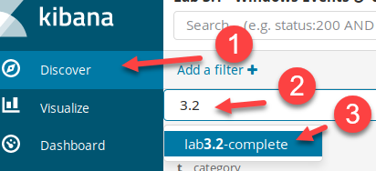

This lab deals with events that occurred on April 21<sup>st</sup>, 2017. To perform this lab, you need to filter down to a specific time. To do this, click on the time picker, select **Absolute**, and set **From** to **2017-04-21 00:00:00** and **To** to **2017-04-23 23:59:00**. Then click on **Go**.  

```bash
2017-04-21 00:00:00
```

```bash
2017-04-23 23:59:00
```

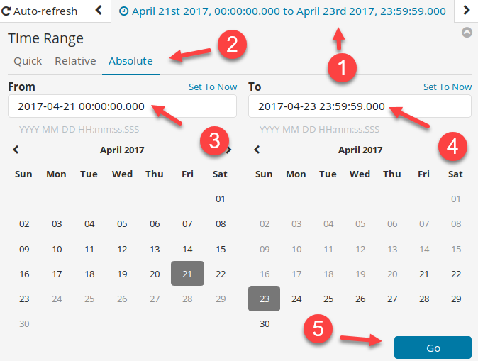

There is a pre-built dashboard available for this lab called **Lab 3.2 - Windows Events to Monitor**.

## Exercises

Start by loading the pre-built dashboard. First, switch to the Dashboard section.  

  

If a dashboard that was previously selected appears, **click** on the **Dashboard** link in the top-left corner.  

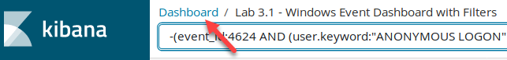  

Then type in **3.2** in the **Search** filter, and **click** on **Lab 3.2 - Windows Events to Monitor**.  

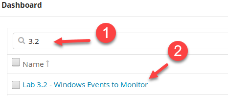

### Map users to SIDs

There are **four** unique Security Identifiers (SIDs) on the dashboard. Find out which user account each belongs to.

<ol type="a"><li>Which user account is associated with <b>S-1-5-18</b>?</li>
<li>Which user account is associated with <b>S-1-5-21-4122792944-3018364698-3069667417-1001</b>?</li>
<li>Which user account is associated with <b>S-1-5-21-4122792944-3018364698-3069667417-1115</b>?</li>
<li>Which user account is associated with <b>S-1-5-21-1728717204-2435353077-2302105707-1007</b>?</li></ol>

??? tip "Solution"
    !!!note
        Depending on your log agent, the user SIDs may or may not automatically translate. For this lab, the community edition of **NXLog** was used. It does not natively translate SID to user accounts. For this feature, either the commercial agent is necessary, or a script needs to be invoked during log processing to perform the translation. Another option would be to export Active Directory accounts using a script. Then have **Logstash** use this with the **translate** plugin. Using **translate** would allow for Active Directory user to SID translation, but it would not work for local user accounts. However, you should not have local user accounts outside of the built-in Administrator account.  

    An easy method to translate a SID to the username is to copy the SID and look for a log containing both the SID and the username. Try this by double-clicking on the SID **S-1-5-21-4122792944-3018364698-3069667417-1001** from the **Lab 3.2 - New Service Creation** visualization. Then right-click on it and select copy.  

    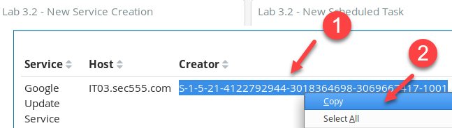  

    Next, **paste** the SID in the search field and search for it within the message field. Your search filter should look like **message:"S-1-5-21-4122792944-3018364698-3069667417-1001"**. Then click on the **search icon**.  

    ```bash
    message:"S-1-5-21-4122792944-3018364698-3069667417-1001"
    ```

    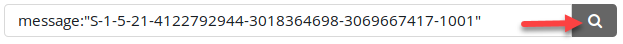  

    Look at the first log in the saved search. It shows that **SEC555\\jhenderson** belongs to the SID that was searched.  

    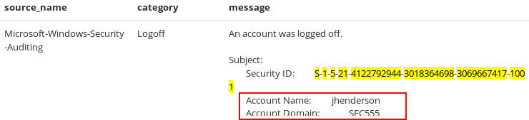

    Therefore, **S-1-5-21-4122792944-3018364698-3069667417-1001** is associated with the **SEC555** domain username of **jhenderson**. Now remove the search filter and then click the search icon.  

    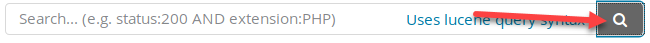  

    Copy the SID **S-1-5-21-4122792944-3018364698-3069667417-1115** from the **Lab 3.2 - New Service Creation** visualization.  

    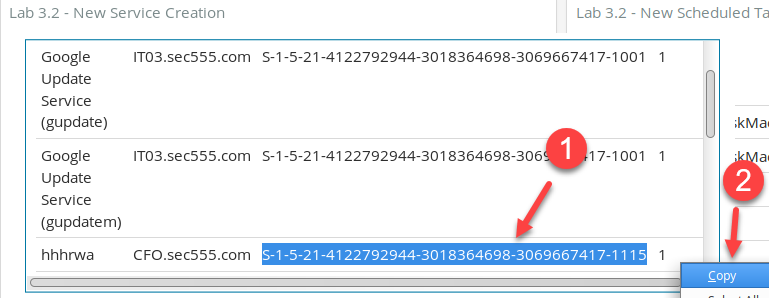  

    Copy and paste the SID into the search bar and search for it within the message field again. Your search should look like **message:"S-1-5-21-4122792944-3018364698-3069667417-1115"**. Then click **search**.  

    ```bash
    message:"S-1-5-21-4122792944-3018364698-3069667417-1115"
    ```

    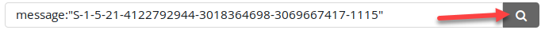  

    Look at the second event in the saved search. It shows the SID of **S-1-5-21-4122792944-3018364698-3069667417-1115** is associated with the **SEC555** domain account of **pdodson**.  

    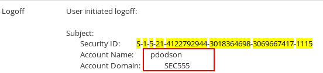  

    Now remove the search filter and then click the search icon.  

    

    This time, copy the SID **S-1-5-18** from the **Lab 3.2 - Cleared Logs** visualization.  

    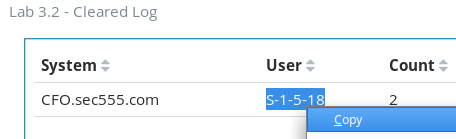  

    Copy and paste the SID into the search bar and search for **message:"S-1-5-18"**.  

    ```bash
    message:"S-1-5-18"
    ```

    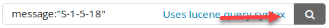  

    Look at the first event in the saved search. It shows the SID of **S-1-5-18** is associated with the **SEC555** domain account of **DC01$**. However, **DC01$** is not a user account. It is a computer account.

    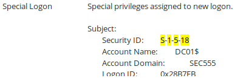

    What is going on? The **S-1-5-18** SID is for the built-in **SYSTEM** account on all Windows operating systems. It is the account with the highest privileges on a local system. Therefore, you see it on multiple computers. The reason it shows up on **DC01.sec555.com** with a domain of **SEC555** is that domain controllers do not use a local account Security Accounts Manager (SAM) database. Yet **SYSTEM** still exists on domain controllers.  

    Now remove the search filter and then click the search icon.  

    

    Copy the SID **S-1-5-21-1728717204-2435353077-2302105707-1007** from the **Lab 3.2 - Member Added to Local Group** visualization.  

    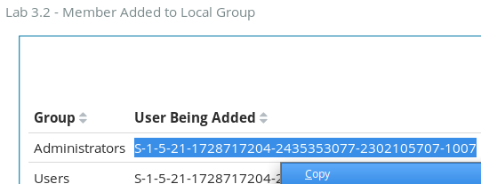  

    Paste this SID into the search bar and use it to search the message field using **message:" S-1-5-21-1728717204-2435353077-2302105707-1007"**.  

    ```bash
    message:"S-1-5-21-1728717204-2435353077-2302105707-1007"
    ```

      

    Look at the third event in the saved search. It shows the SID of **S-1-5-21-1728717204-2435353077-2302105707-1007** is associated with the CFO account domain and the username of **HelpDesk31337**.  

    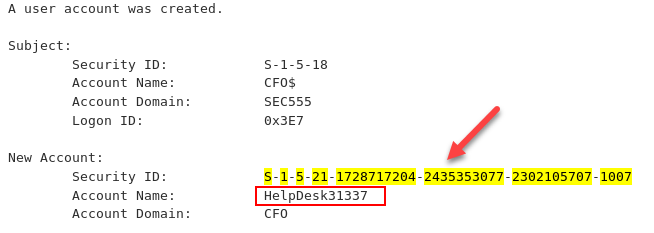  

    !!! note
        The account domain of CFO is not actually for an Active Directory domain. It simply means the local computer. You can tell this if the account domain matches the computer name.

    **Answer**: The SID to username mappings are below:  

    | **SID**                                        | **Username**         |
    |------------------------------------------------|----------------------|
    | S-1-5-21-4122792944-3018364698-3069667417-1001 | SEC555\\jhenderson   | 
    | S-1-5-21-4122792944-3018364698-3069667417-1115 | SEC555\\pdodson      | 
    | S-1-5-18                                       | NT AUTHORITY\\SYSTEM |
    | S-1-5-21-1728717204-2435353077-2302105707-1007 | CFO\\HelpDesk31337   |

    Now remove the search filter and then click the search icon.  

    

### Identify compromised host

Identify which host has been compromised.

<ol type="a"><li>Does the attacker have administrative access?</li>
<li>Which user was compromised?</li></ol>

??? tip "Solution"
    Analyze the data on the dashboard to answer this question. Looking at the pie chart shows that two machines have events of interest. These are CFO.sec555.com and IT03.sec555.com.  

    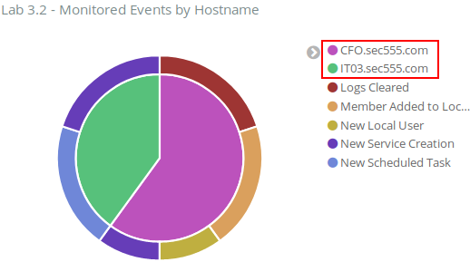

    **IT03.sec555.com** is the smaller inner slice. Hovering over the outer pieces attached to the slice shows it has events for **New Service Creation** and **New Scheduled Task**.  

    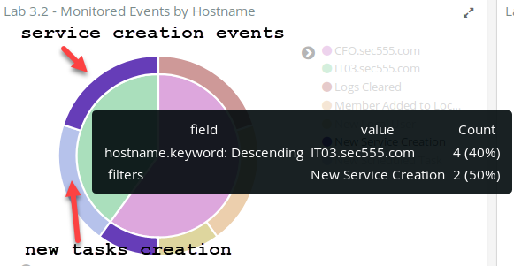  

    These correspond to the events for **IT03.sec555.com** in the **Lab 3.2 - New Service Creation** and **Lab 3.2 New Schedule Task** visualizations. These events are related to Google Update. While technically malware could mimic these service names or task names, it is uncommon. Also, if you were to investigate these events, all would correspond to executables in **C:\\Program Files\\Google**. Most likely these are related to an installation of a **Google** product such as **Google Chrome** and should be filtered out moving forward.  

    !!! note
        If you want to verify this, click on either **Google Update Service (gupdate)** in the **Lab 3.2 - New Service Creation** or **\\GoogleUpdateTaskMachineCore** in the **Lab 3.2 - New Schedule Task** visualizations. Then look at the logs, and you will find they reference an executable in **C:\\Program Files\\Google**.  

    Looking back at the pie chart shows the **CFO** computer has events related to logs being cleared, a new local user being created, a member is added to a local group, and new service creation. These events are all displayed on different visualizations in the dashboard. The **Lab 3.2 - Cleared Logs** shows that the **SYSTEM** account was used to clear logs.  

    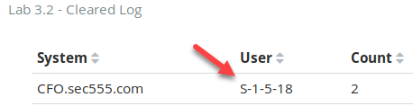

    First off, clearing logs is an abnormal event although occasionally someone, such as an IT staff member, may manually clear the logs. However, **SYSTEM** should never be clearing logs. This alone acts as proof that **CFO.sec555.com** is the compromised host. This means that the adversary has full administrative access to **CFO.sec555.com**. The question then is which account initially was compromised. Looking at the **Lab 3.2 - New Service Creation** shows a new service called **hhhrwa** was created by **pdodson**. Likely, this is the user account that was initially compromised.  

    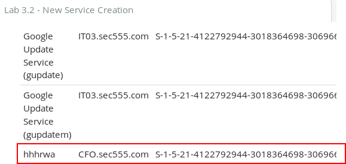  

    While the service name is odd and suspicious, it is not 100% proof that this is the account that was compromised. One method to verify which account was compromised is to create a quick visualization. Click on the **Visualize** tab, and then click on the **New Visualization** icon.  

    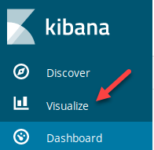  

    If a visualization is loaded, click on **Visualize**.  

    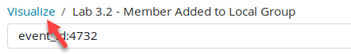

    Next, **click** on the **plus sign** to create a new visualization.  

    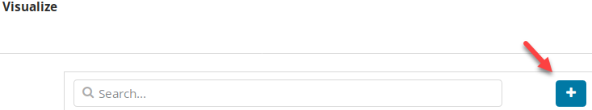  

    **Click** on **Data Table**.  

    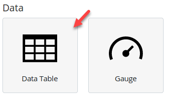  

    Next, type in **3.2** in the Filter area and then click on **lab3.2-complete**.  

    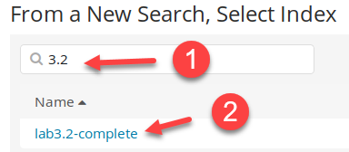  

    For **bucket type**, select **Split Rows**.  

    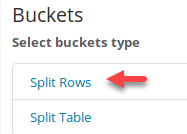

    Then set **Aggregation** to **Terms**, **Field** to **user.keyword**, **Size** to **10** and then, click the play button.  

    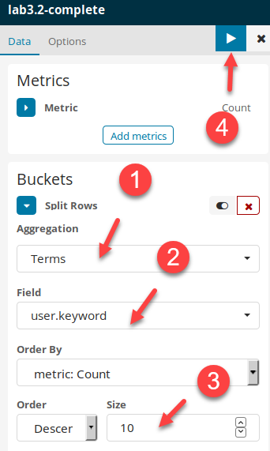  

    Because you are only interested in user activity from **CFO.sec555.com**, search for **hostname.keyword:"CFO.sec555.com" -tags:machine -tags:service\_account**.  

    ```bash
    hostname.keyword:"CFO.sec555.com" -tags:machine -tags:service_account
    ```

    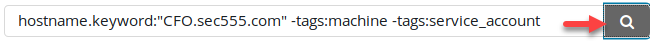

    Because this search is not filtered on specific event IDs, it shows the user field for all events. Because of how Windows logs, this includes groups, as group names are often referenced in the Windows user field. However, looking at the results shows that most events come from the built-in **SYSTEM** account or **pdodson**.  

    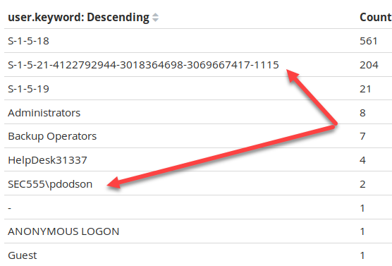  

    !!! note
        Remember that the SID **S-1-5-21-4122792944-3018364698-3069667417-1115** is the same account as the **SEC555\\pdodson** account. Also, for reference**, S-1-5-19** is the **NT AUTHORITY\\Local Service** built-in account. It is normal to see events from this as well as **SYSTEM**.  

    This data helps confirm that **pdodson** is most likely the account that was compromised. However, it is possible that a server-side exploit was used and that the attacker immediately compromised the host and became the **SYSTEM** account. Go back to the dashboard by clicking on the **Dashboard** section.  

    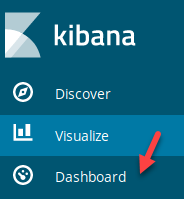

    Then filter in on the **hhhrwa** service, which is in the **Lab 3.2 - New Service Creation** visualization.  

    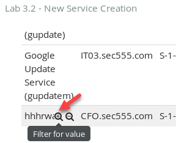  

    Then **click** on the **New Service Creation** event in the **Lab 3.2 - Monitored Events by Hostname**.  

    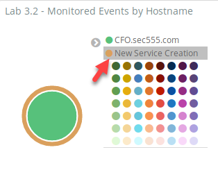  

    Looking at the first log shows the new service created is for **cmd.exe /c echo hhhrwa \> \\\\.\\pipe\\hhhrwa**.  

    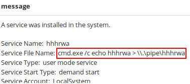

    This is what is known as a named pipe privilege escalation. This provides strong proof that the initial compromise gave the adversary access with the **pdodson** account. Go ahead and remove the **service\_name** filter by hovering over it and clicking on the garbage can icon.  

    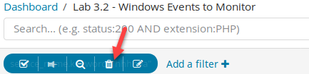  

    **Answer**: **CFO.sec555.com** is the compromised system. Evidence shows that the attacker initially had access to the **pdodson** account and then used privilege escalation to gain full administrative access to the SYSTEM account successfully.

The attacker initially did not have administrator level access. He or she used a **named pipe privilege escalation** technique to escalate privileges. What command was used for this attack?

??? tip "Solution"
    **Answer**: The last step in step 2 shows that the command involved with a named pipe privilege escalation technique is **cmd.exe /c echo hhhrwa \> \\\\.\\pipe\\hhhrwa**

### Find new local admin

The attacker created a **local administrator account**.

<ol type="a"><li>What is the name of this account?</li>
<li>What evidence shows this account was created by the attacker?</li></ol>

??? tip "Solution"
    Looking at the **Lab 3.2 - New Local User(s)** visualization shows only one local account was created on **CFO.sec555.com**. This account was the **HelpDesk31337** account. Also, the **creator** of this local account was **SYSTEM**. This is evidence that the attacker created the local account as **SYSTEM** should not be used to create accounts.  

    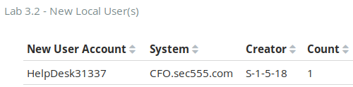  

    Also, the SID **S-1-5-21-1728717204-2435353077-2302105707-1007** was verified in step 1 as being the **HelpDesk31337** account. This corresponds to the events in the **Lab 3.2 - Member Added to Local Group** visualization. In it, the **HelpDesk31337** account is added to the **Administrators** and **Users** group.

    !!! note
        Creation of local accounts is an abnormal event, especially on systems, joined to a domain. While it is possible a local account is created to be used as a service account, this can be easily combated. The easiest way would be to use a suffix, or prefix on all service accounts created such as SVC\_VulnScanner. Another alternative is to use SYSTEM, Local Service, or Network Service as your service account. These are built-in local accounts that can be used to run services or scheduled tasks. SYSTEM and Network Service can even be used for service accounts that need basic access to resources across the network. Also, domain user accounts could be created even if for a single system.  

    **Answer**: The local account created during the compromise is the **HelpDesk31337** account, and it was added to the local **Administrators** group on **CFO.sec555.com**.

<h2 id="video"> Step-by-Step Video Instructions </h2>

<iframe class="tscplayer_inline" id="embeddedSmartPlayerInstance" src="../../../../Videos/555_3/2/lab3.2_player.html?embedIFrameId=embeddedSmartPlayerInstance" scrolling="no" frameborder="0" webkitAllowFullScreen mozallowfullscreen allowFullScreen></iframe>

## Lab Conclusion

In this lab, you utilized Windows logs to find abnormal events. This included:

- Learning how to fill in gaps in context such as having a SID instead of a username

- Analyzing abnormal events to identify if they are suspicious, malicious, or benign

- Identifying unique ways to represent abnormalities

- Investigating events of interest

**Lab 3.2 is now complete**\!

<link href="../../../../Videos/555_3/2/skins/remix/techsmith-smart-player.min.css" rel="stylesheet" type="text/css" />
<link href="../../../../Videos/555_3/2/lab3.2_embed.css" rel="stylesheet" type="text/css">