# Lab 3.3 - Login Monitoring

## Objectives

- Identify normal vs. abnormal login behavior

- Correlate Windows events to identify

- Gain knowledge in investigating alerts

- Become familiar with how Windows records login events

- Find evidence of malice in standard Windows logs

## Exercise Preparation

Log into the Sec-555 VM

- Username: student

- Password: sec555

Open **Firefox** by **clicking** on the **Firefox** **icon** in the top-left corner of your student VM.  

  

Then **click** on the **Kibana** bookmark in **Firefox**.

  
 
Switch to the **Dashboard** section.  

  

If a dashboard that was previously selected appears, **click** on the **Dashboard** link in the top-left corner.  

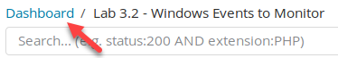  

Then type in **3.3** in the **Search** filter, and **click** on **Lab 3.3 - Login Dashboard**.  

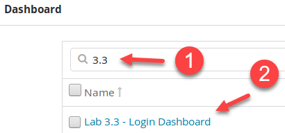

This will load the dashboard built for this lab and will also adjust the date/time so that it is set properly for this lab.  

!!! note
    If the **Lab 3.3 - User Login Map** does not display when the dashboard is loaded, click inside the visualization, and it will load. This visualization is using an open source community Kibana plugin to emulate the X-Pack commercial **Graph** plugin.  

!!! warning "README"
    Timeframes recorded during the walkthrough are in **Pacific Time**. If you change the time zone of the Sec555 virtual machine or are accessing **Kibana** from your host system, the times will be based on your time zone. **Kibana** automatically translates UTC time to the time zone of the analyst's machine.

## Exercises

!!! note
    The visualizations built in the **Lab 3.3 - Login Dashboard** are based on logons that have an impersonation level of **Delegate**. Delegate means the login has rights both locally and over the network and is associated with a traditional login. The key to monitoring and investigation Windows logons is understanding how Windows handles logins. You need to understand login types, authentication types, and impersonation levels. (Optional) Feel free to click the **edit** button on a visualization to see how it is set up.  

Open **Firefox** by **clicking** on the **Firefox** **icon** in the top-left corner of your student VM.  

  

Then **click** on the **Kibana** bookmark in **Firefox**.

  
  
Switch to the **Dashboard** section.  

  

If a dashboard that was previously selected appears, **click** on the **Dashboard** link in the top-left corner.  


Then type in **3.3** in the **Search** filter, and **click** on **Lab 3.3 - Login Dashboard**.  


This will load the dashboard built for this lab and will also adjust the date/time so that it is set properly for this lab.  

!!! note
    If the **Lab 3.3 - User Login Map** does not display when the dashboard is loaded, click inside the visualization, and it will load. This visualization is using an open source community Kibana plugin to emulate the X-Pack commercial **Graph** plugin.  

!!! warning
    **If you did not read the README in the Exercise Preparation above… DO NOT CONTINUE.**

### Login failures

Which two user accounts have abnormally large amounts of failed logins?

<ol type="a"><li>Are they user error or malicious?</li>
<li>What system or system(s) are these failed login attempts related to?</li></ol>

??? tip "Solution"
    If you look at the **Lab 3.3 - Failed Logons visualization**, you will see that **lchancello** and **Administrator** are the two accounts with the most failed logins. Also, if you hover over each account, you will discover that both are login failures against **FS01.sec555.com**.  

    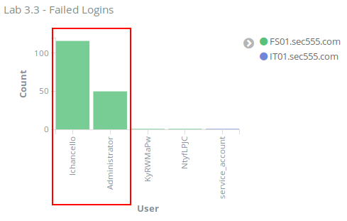

    The question is whether these are malicious. Looking at the **Lab 3.3 - Failed Logons over Time** shows that both accounts experienced a rapid number of failed logins within approximately a five-minute period.  

    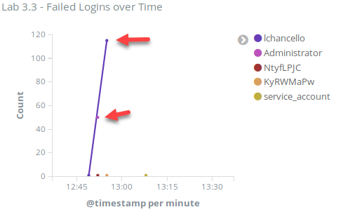  

    Considering that **fs01.sec555.com** is a file server, these logon events are <span class="underline">likely</span> malicious. This is because they happen rapidly over a short period and then stop. If this was caused by a password change and an application attempting to use the previous password, then the failed logins would keep occurring.  

    !!! note
        It is common to have repetitive login failures due to misconfigured software. However, they typically have a low volume count that constantly repeats itself. This is common for things such as smartphones that connect to Microsoft ActiveSync to check email. When a user changes his or her password, the smartphone will regularly fail to log in to the email system.

    The failed logins can be analyzed for more evidence. Click on **lchancello** in the **Lab 3.3 - Failed Logons** visualization.  

    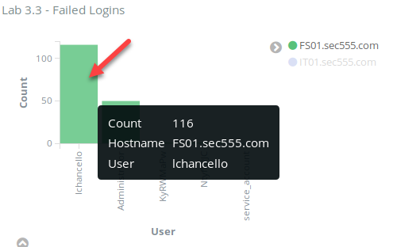  

    Then click on **Apply Now** for the search filters it adds.  

    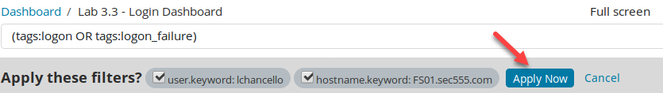  

    Looking at the message field of the first log shows a successful login. However, it is a **type 3 network login** and only grants an impersonation level of **Impersonation**. This could mean that the attacker has successfully brute forced **FS01.sec555.com** or it could mean the user browsed a file server (or a mapped drive). The other items to note are that the **workstation name** field is **empty** and the **authentication type** is **Kerberos**.  

      

      

    Next, scroll down and look at the **second** log. Looking at the message field, you will see this section:  

      

    This log displayed above is one of the failed logins. However, there is what looks to be a **randomly** **generated** **workstation name** and the authentication type is **NTLM** instead of **Kerberos**. This likely means the most recent log that was a successful Kerberos login is not related to the failed logins. Also, the inconsistency and the random workstation name is a strong indicator that the failed logins are from a brute force login attack. If you were to look at the third log, you would see the Workstation Name field is randomly generated per each login attempt.  

    

    These failed logins are related to **lchancello**. The question now is if the failed logins for **Administrator** are the same. To change the current filter from **lchancello** to **Administrator** hover over the **user:"lchancello"** filter and click on the **edit icon**.  

    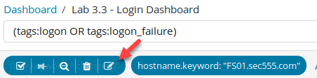  

    Then change the user field from **lchancello"** to **Administrator** and click on **Save**.  

    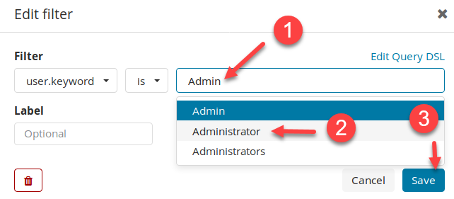

    Looking at the first log message shows a failed login with a randomly generated workstation name using NTLM authentication. Therefore, the Administrator account is also likely being brute forced.  

    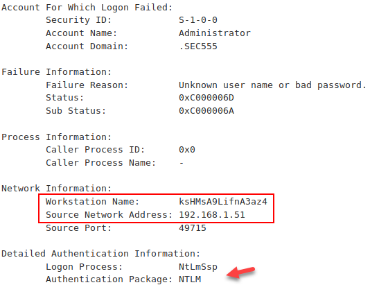  

    **Answer**: The top two user accounts that are generating failed login attempts are **lchancello** and **Administrator**. These accounts are being brute forced from **192.168.1.51** against **FS01.sec555.com**. This attack is malicious. The brute force attack occurred between **12:49 and 12:55 PM PDT**. There are no successful NTLM logons for these accounts.  

    Clear your filter by clicking on **Actions** and then clicking on **Remove**.  

    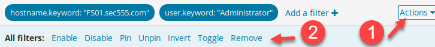

### Pass-the-hash

Which local user account was used successfully for pass-the-hash?

??? tip "Solution"
    Logons from workstation to workstation using local accounts is almost exclusively malicious in nature. This is an attacker favorite as many organizations have a local administrator account on each box with the same password. This allows for pass-the-hash using the local administrator account to log in to other systems with the same local administrator username and password. To find this, search for successful logins not using the Active Directory domain. To do this, change the search filter to **tags:logon -target\_domain\_name:SEC555**.

    ```bash
    tags:logon -target_domain_name:SEC555
    ```

    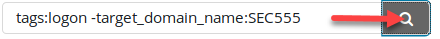

    Next, look at the **Lab 3.3 Successful Logons** visualization. The only account shown is **Administrator**. The legend shows it was used on **IT01.sec555.com** and **IT02.sec555.com**.  

    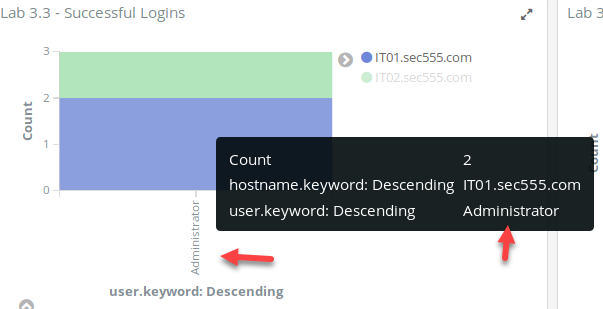  

    Within the legend, click on **IT01.sec555.com** and then the magnifying glass icon with the **+** sign to apply it as a search filter.  

    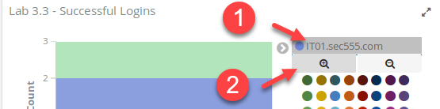

    Look at the first log. The log message shows the **Administrator** login occurred from **192.168.1.51** using NTLM. It also shows a **randomly generated computer name**. This occurred at **13:14 PM PDT**. This occurred after the brute force attack in step 1.  

      

    Change the search filter of **hostname.keyword:"IT01.sec555.com"** to **hostname.keyword:"IT02.sec555.com"** by hovering over it and clicking on the **edit icon**.  

    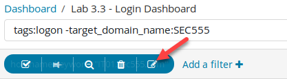

    Change the **hostname** from **IT01.sec555.com** to **IT02.sec555.com** and then click on **Save**.  

      

    Look at the login that uses the **Administrator** account on **IT02.sec555.com**. This is the eighth log in the saved search. Again, it shows a randomly generated workstation name logging in from **192.168.1.51** using **NTLM** authentication.  

      

    One thing is odd, though. The login time for this was **12:43 PM PDT**. This was <span class="underline">before</span> the brute force attack. A working hypothesis may be that **IT02.sec555.com** did not have credentials or access the attacker wanted.  

    **Answer**: The local account used successfully for pass-the-hash was the local Administrator account found on **192.168.1.51**. Since this worked, it means that **IT01.sec555.com** and **IT02.sec555.com** have the same local administrator account and password as **192.168.1.51**.  

    Change the filters back to the default dashboard settings by clicking on the **Dashboard** in the top-left corner.  

    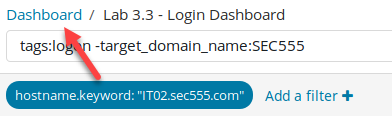  

    Then type **3.3** in the **Search** filter and select **Lab 3.3 - Login Dashboard**.  

      

    At this point, **192.168.1.51** has shown up multiple times. It may make sense to find out what system this is as it is most likely compromised. To do this, change the search filter in the dashboard to **host.keyword:192.168.1.51**.  

    ```bash
    host.keyword:192.168.1.51
    ```

      

    Then look at the first log. It shows that **192.168.1.51** has a hostname of **IT03.sec555.com**.  

    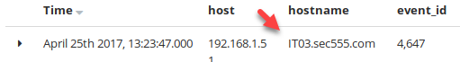  

    Change the search filter back to the default dashboard filter by settings it back to **(tags:logon OR tags:logon\_failure)** or reload the dashboard.

    ```bash
    (tags:logon OR tags:logon_failure)
    ```

    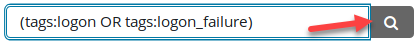

### Abnormal logins

Which two user accounts have a high number of successful logins?

<ol type="a"><li>Are these logons malicious in nature?</li>
<li>What evidence backs up your hypothesis?</li>
<li>If an account was used maliciously, which systems was it used to access?</li></ol>

??? tip "Solution"
    If you look at the **Lab 3.3 - Successful Logins visualization**, you will see that **jhenderson** and **fraynor** are the two accounts with the most successful logons. Hovering over them or looking at the multiple colors shows that each has logged into **at least five** systems.  

    !!! note
        This visualization is limited to the top five systems, so it only shows a max of five systems.  

    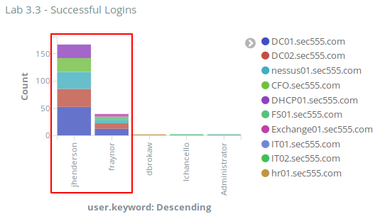  

    Looking at the **Lab 3.3 - Successful Logins over Time** visualization shows both **jhenderson** and **fraynor** have had spikes in logons, although **jhenderson** has had much more.  

    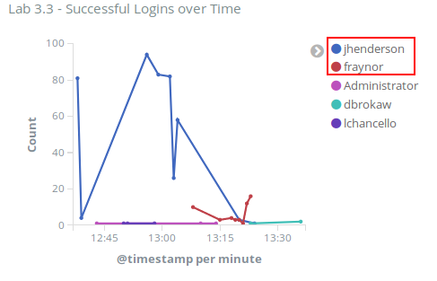

    First, investigate **jhenderson** by clicking on **jhenderson** in **the Lab 3.3 - Successful Logins over Time** visualization and then clicking on the magnifying glass with the **+** sign.  

    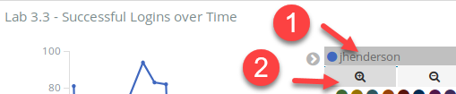  
      
    The results show the **jhenderson** account logging into multiple systems. When trying to figure out if this is malicious or not, it sometimes helps to focus in on a single host. In this case, focus in on **DHCP01**. Do this by clicking on **DHCP01.sec555.com** in the **Lab 3.3 - Successful Logins** visualization and then clicking on the magnifying glass with the **+** sign.  

    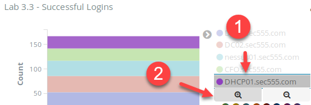  

    !!! note
        When dealing with multiple systems, you typically want to pick one that is least likely to generate a lot of noise. For instance, domain controllers commonly generate many logs, which are why **DC01** or **DC02** were not picked.

    Looking at the logs in the saved search shows only logs dealing with successful Kerberos logins.  

    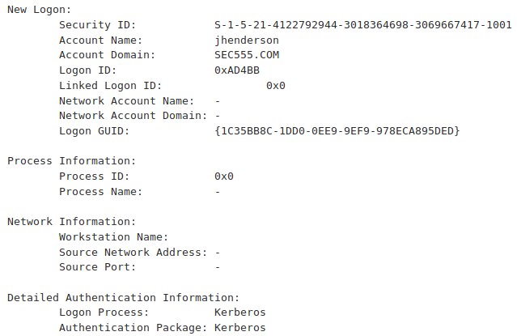  

    This is because the filter is too narrow. Sometimes, Windows uses different field names or only has usernames in the message field. To expand the search to anything dealing with **jhenderson** and **DHCP01**, first remove the current search filters by clicking on **Actions** and then clicking on **Remove**.  

    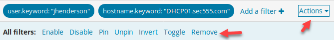  

    Then change the search filter to **message:"jhenderson" AND message:"DHCP01"**.  

    ```bash
    message:"jhenderson" AND message:"DHCP01"
    ```

    

    Looking at these logs shows they are related to PowerShell events. Expanding the first log shows that the **SEC555\\jhenderson** account is being used to launch a command on **DC01**.  

    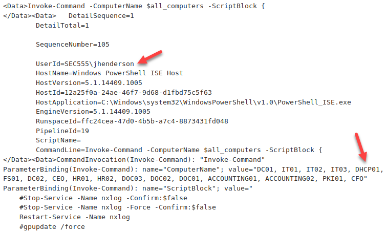  

    This shows that a PowerShell script is being run on **DC01** to restart the NXLog agent on multiple systems that are causing a large number of successful logins. Therefore, the **jhenderson** account is likely not being used maliciously, but instead is being used for remote administration purposes.  

    Knowing that the **Lab 3.3 - Successful Logins** showed similar results with **fraynor,** change the search filter to **fraynor** and **DHCP01**.  

      

    This time, the logs look a little different. The first three logs show **powershell.exe** connecting from **IT01.sec555.com (192.168.1.81)** to **DHCP01.sec555.com (10.5.55.49)**. These are recorded as part of Sysmon network connection logging.  

      

    The **4<sup>th</sup>** log in this search shows what is happening. At **1:23 PM PDT**, **powershell.exe** was used on **IT01** to establish a PowerShell remote session to **DHCP01**. This would grant remote access to **DHCP01** as the user **fraynor**.  

    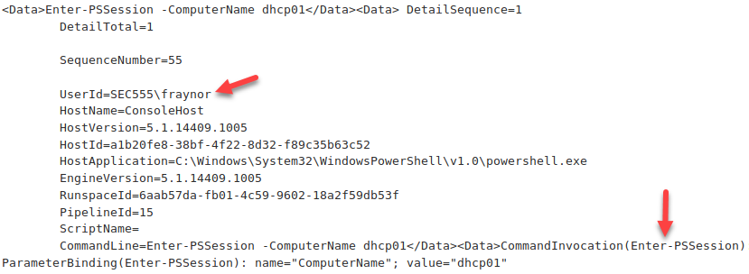  

    Click on the magnifying glass with the **+** sign next **to event\_id 800**.  

      

    Then click on the magnifying glass with the **+** sign next to **host 192.168.1.81**.  

    

    This narrows the logs to look for other PowerShell sessions from **IT01**. Before this works, you need to remove **AND DHCP01** from the search filter so that it only contains **fraynor**.  

      

    If you were to look at the logs, you would find that the **fraynor** accounts were used on **IT01** to launch remote PowerShell sessions to **DC01**, **DC02**, **WSUS01**, **FS01**, **EXCHANGE01**, and **DHCP01**. These occur between **1:18** and **1:23 PM PDT**. No PowerShell commands are recorded after these sessions are established. This is suspicious as normally IT staff would enter a remote session and run administrative tasks. While suspicious, there is not enough evidence to guarantee this is malicious.  

    !!! note
        You can update your search filter to **message:"fraynor" AND message:"enter-pssession -Computername"** to eliminate some of the noise and narrow down on which systems the **enter-pssession** command was run.  

    ```bash
    message:"fraynor" AND message:"enter-pssession -Computername"
    ```

    **Answer**: The user accounts of **jhenderson** and **fraynor** had the most successful logons. The **jhenderson** account is being used to perform remote tasks and is **benign**. The **fraynor** account is being used from **IT01.sec555.com** to enter remote PowerShell sessions to **DC01**, **DC02**, **WSUS01**, **FS01**, **EXCHANGE01**, and **DHCP01**. Considering that **IT03.sec555.com** was previously compromised by pass-the-hash at **3:14 PM PDT**, this is most likely malicious.
     
    Change the filters back to the default dashboard settings by clicking on **Dashboard** in the top-left corner.  

    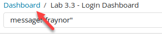  

    Then type **3.3** in the search area. Then click on **Lab 3.3 - Login Dashboard**.  

    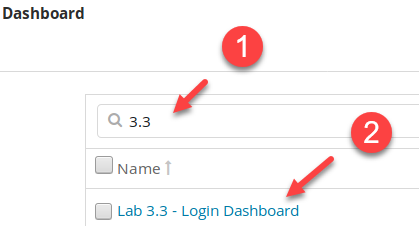

### Improper service account use

The vulnerability scanner service user **SVC\_VulnScan** is being used outside of policy.

<ol type="a"><li>Which computer is it being used from?</li>
<li>Which computer is it being used to access?</li></ol>

??? tip "Solution"
    Service credentials are typically used only **from** specific systems. In this case, SVC\_VulnScan logons should only come from the vulnerability scanner. Looking at the **Lab 3.3 - Successful Logins**, you can see the hostname **nessus01.sec555.com**. This is the vulnerability scanner so the SVC\_VulnScan accounts should only be used **from** it. Click on **nessus01.sec555.com** in the **Lab 3.3 - Successful Logins** visualizations and then click on the magnifying glass with the **-** sign.  

    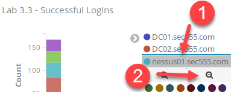  

    Now update the search to look for logins from **SVC\_VulnScan** by changing it to **tags:logon AND user.keyword:SVC\_VulnScan**.  

    ```bash
    tags:logon AND user.keyword:SVC_VulnScan
    ```

    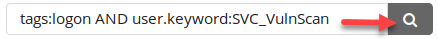

    There are many logs shows. However, if you look closely, the two logs are related to **192.168.3.50 (hr01.sec555.com)**. After that, all the remaining logs contain a **client\_ip** of **172.16.0.2**. **172.16.0.2** is the **nessus01.sec555.com's** IP address. Also, there are two logins to **DC02** with a login type of **10.** Logon type 10 is related to an RDP login.  

    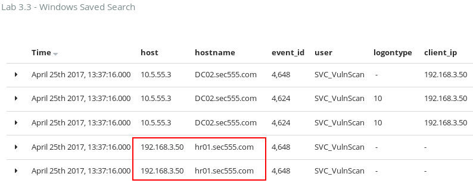  

    The 2<sup>nd</sup> and 3<sup>rd</sup> logs shown with a logon type value of **10** shows it is for an **RDP** login sourcing from **192.168.3.50** to **DC02** using the **SVC\_VulnScan** account.

    **Answer**: The **SVC\_VulnScan** account was used from the **hr01.sec555.com (192.168.3.50)** workstation to log in to **DC02 (10.5.55.3)**.  

    !!! note
        The **Lab 3.3 - User Login Map** was not used in this lab but is very helpful. It visually graphs out any user account that has 2 or more successful logons that result in delegation tokens. In this case, **jhenderson** and **fraynor** are shown. The **-** means the log is local such as from a domain controller authenticating itself.  

        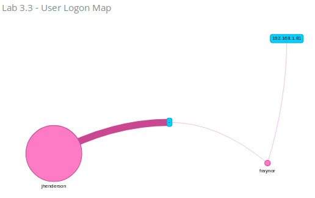

<h2 id="video"> Step-by-Step Video Instructions </h2>

<iframe class="tscplayer_inline" id="embeddedSmartPlayerInstance" src="../../../../Videos/555_3/3/lab3.3_player.html?embedIFrameId=embeddedSmartPlayerInstance" scrolling="no" frameborder="0" webkitAllowFullScreen mozallowfullscreen allowFullScreen></iframe>

## Lab Conclusion

In this lab, you investigated login events. This included:

- Finding brute force login attempts

- Identifying if a user account with too many logins is malicious or benign

- Looking for service accounts used improperly

- Correlating events against a timeline to add context

**Lab 3.3 is now complete**\!

<link href="../../../../Videos/555_3/3/skins/remix/techsmith-smart-player.min.css" rel="stylesheet" type="text/css" />
<link href="../../../../Videos/555_3/3/lab3.3_embed.css" rel="stylesheet" type="text/css">