# Lab 4.1 - Master Inventory

## Objectives

- Discover how to correlate and use both active and passive asset information

- Apply process for identifying authorized assets

- Combine logic and credentialed scans to develop a master asset list

- Become familiar with multiple sources of asset information

- Identify misconfigured graphs and fix them

## Exercise Preparation

Log into the Sec-555 VM

- Username: student

Password: sec555  

Open **Firefox** by **clicking** on the **Firefox** **icon** in the top-left corner of your student VM.  

  

Then **click** on the **Kibana** bookmark in **Firefox**.

  

A dashboard called **Lab 4.1 - Asset Dashboard** has been created for this lab. Loading this dashboard will also set the proper time range for this lab. To access it, switch to the **Dashboard** section.  

  

If a dashboard that was previously selected appears, **click** on the **Dashboard** link in the top-left corner.  

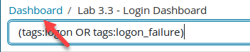  

Then type in **4.1** in the **Search** filter, and **click** on **Lab 4.1 - Asset Dashboard**.  

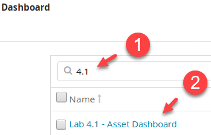**  

The high-level asset information for this lab is as follows:

- The internal domain is **sec555.com**

- **IT workstations** are on the **192.168.1.0/24** subnet

- The **HIPAA desktop subnet** used for patient data are on the **192.168.4.0/24** subnet

- The main **server subnet** is **10.5.55.0/24** and is in a <span class="underline">physically secured data center</span>

- **Domain controllers** are at **10.5.55.2** and **10.5.55.3**

- A vulnerability scanner is using **172.16.0.2** and is named **Nessus01**

- All systems are supposed to use internal time servers

## Exercises

The goal of this lab is to identify all authorized vs. unauthorized systems. Keep in mind that the steps you take to complete this lab likely can be automated with a SIEM.

Sometimes, an analyst has a lot of data to analyze. However, data without context is meaningless. This lab presents a lot of data directly to the analyst with the goal being to piece it all together in a logical fashion. This logic is necessary to repeat investigations or for automation.

### Default time servers

Which system(s) are using unauthorized time servers?

??? tip "Solution"
    There are two visualizations specific to time. One is the **Lab 4.1 - Default Time Severs**. This visualization shows IP addresses that are using default time servers such as **time.windows.com**.  

    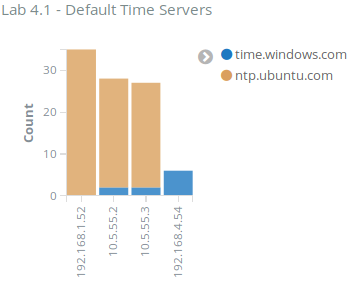  

    This graph shows **4** systems using either **time.windows.com** or **ntp.ubuntu.com**. This is odd as **10.5.55.2** and **10.5.55.3** are domain controllers as stated in the lab **Exercise Preparation** section. To investigate this, start by searching for the internal NTP servers. You can do this by searching **destination\_port:123 AND tags:internal\_destination**

    ```bash
    destination_port:123 AND tags:internal_destination
    ```

    

    The entire first page of logs within the **Lab 4.1 - Search** logs shows the internal time servers are either **10.5.55.2** or **10.5.55.3**. This means the domain controllers are the default time servers.  

    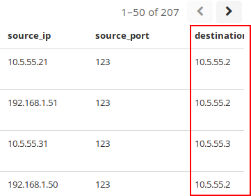  

    !!! note
        This is the default behavior of an Active Directory environment.  

    Next, verify there are no other internal NTP servers by changing the search to **destination\_port:123 AND tags:internal\_destination -destination\_ip:10.5.55.2 -destination\_ip:10.5.55.3**  

    ```bash
    destination_port:123 AND tags:internal_destination -destination_ip:10.5.55.2 -destination_ip:10.5.55.3
    ```

      

    There are no results. This means that the only internal time servers are the domain controllers. However, the **Lab 4.1 - Default Time Servers** shows the domain controllers. This is likely not the intended results of the graph. In this case, **10.5.55.2** and **10.5.55.3** are acting as time servers internally but are synchronizing time using **time.windows.com**. However, this is by design. Clear the search filter.  

      

    To update this visualization, **click** on the **Edit** button at the top of the Dashboard.  

    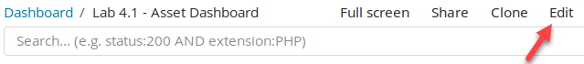

    Then click on the **gear** for the **Lab 4.1 - Default Time Server** and then click on **Edit visualization**.  

    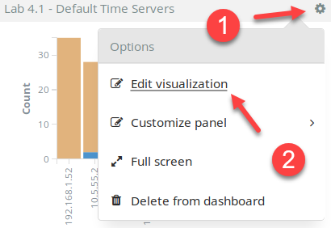  

    Looking at the visualization settings, you will find the search filter for it is set to **(query.keyword:time.windows.com OR query.keyword:ntp.ubuntu.com)**. This means it is flagging on any system that makes a DNS query to a default time server.  

    !!! note
        The reason the domain controllers are showing up is due to DNS recursion. For instance, 192.168.1.52 asks for the IP address associated with ntp.ubuntu.com. This goes to one of the domain controllers because they are the DNS servers specified in DHCP. They are not authoritative for ntp.ubuntu.com, so they perform recursion and pass the DNS request off to an internet DNS server.  

    Modify the search filter to only look for DNS queries made internally. Do this by changing the query to **(query.keyword:time.windows.com OR query.keyword:ntp.ubuntu.com) AND tags:internal\_destination**  

    ```bash
    (query.keyword:time.windows.com OR query.keyword:ntp.ubuntu.com) AND tags:internal_destination
    ```

      

    Now the graph only shows two systems using default time servers. These are **192.168.1.52** and **192.168.4.54**.

    Click on the **Save** and then click on **Save**.  

    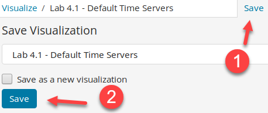  

    **Answer**: There are two systems that are using an unauthorized time server. They are **192.168.1.52** and **192.168.4.54**.  

    Switch back to the **Dashboard** tab.  

    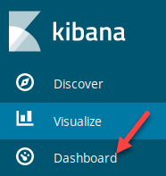

### Unauthorized server

There is one system within the server subnet that was not authenticated by the vulnerability scan.

<ol type="a"><li>Is this an authorized system?</li>
<li>What evidence proves or disproves this?</li></ol>

??? tip "Solution"
    The **Lab 4.1 - Asset Dashboard** has a table that lists all assets. This is the **Lab 4.1 - All Internal Systems** visualization. Compare all the IP addresses in the 10.5.55.0/24 subnet to those in the list from the **Lab 4.1 - Scanned with Credentials table**. This table is a list of all systems that have been scanned successfully with service credentials.  

    !!! note
        Successfully logging into a system is strong proof that it is an authorized asset.  

    You can sort the IP addresses by clicking on the arrows next to System.  

    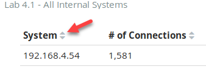  

    The **10.5.55.21** system is the only system in the server subnet that has not been logged into during a credentialed vulnerability scan.  

    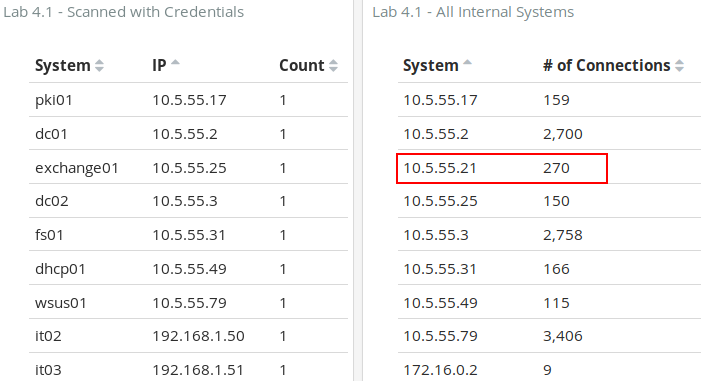  

    The next part of this is figuring out if it is an unauthorized asset. To do this, search for **message:10.5.55.21**.  

    ```bash
    message:10.5.55.21
    ```

      

    If you look at the **Lab 4.1 - Search** table, you will see what this asset is.  

    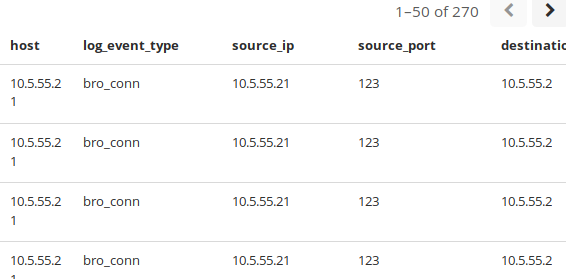  

    **10.5.55.21** is the source of logs for Zeek data. The reason it failed a credentialed scan is likely because it is a Linux system. Specific Zeek logs contain the hostname of this sensor. For instance, if you expand the 1<sup>st</sup> log entry, you will find a log with a **log\_event\_type** of **bro\_conn**. This type of log always stores a field with the sensor's name. Expand it, and you will find this:  

    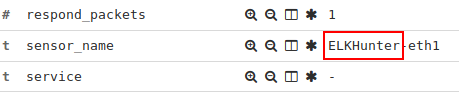  

    The value before the dash is the name of the sensor. In this case, **10.5.55.21** has a name of **ELKHunter**. The value after the dash is the interface the connection was seen on.  

    **Answer**: **10.5.55.21** is the only system within the server subnet has not been successfully logged into during a credentialed scan. This is most likely because it is a Linux system providing Zeek data to the SIEM. It is an **authorized** device.  

    Remove your search filter before moving on.  

    

### Identify all unauthorized systems

Which systems are authorized?

??? tip "Solution"
    The logic for classifying systems as authorized can be handled various ways. However, this lab demonstrates an easy method of doing so. First, any system that has been vulnerability scanned successfully with service credentials is authorized. This means every system in the **Lab 4.1 - Scanned with Credentials** table is authorized.  

    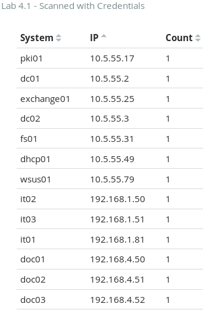  

    We also know from **step 3** that **10.5.55.21 (ELKHunter)** is a Zeek sensor feeding the SIEM. Therefore, **10.5.55.21** is also authorized. Also, the Exercise Preparation section states that **172.16.0.2** is called **Nessus01**. This leaves only the two systems that are using default time servers: **192.168.1.52** and **192.168.4.54**.

    Looking at **Lab 4.1 - DHCP Logs** shows the system names for these IP addresses.  

    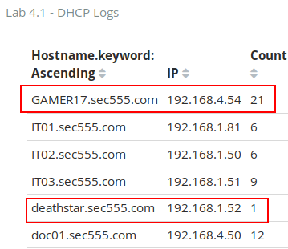  

    Having the wrong time server could be a misconfiguration. However, the computer names are vastly different from corporate assets. Thus, they are likely not authorized devices.  

    **Answer:** The following systems are authorized systems:  

    - dc01 10.5.55.2
    - dc02 10.5.55.3
    - dhcp01 10.5.55.49
    - doc01 192.168.4.50
    - doc02 192.168.4.51
    - doc03 192.168.4.52
    - elkhunter 10.5.55.21
    - exchange01 10.5.55.25
    - fs01 10.5.55.31
    - it01 192.168.1.81
    - it02 192.168.1.50
    - it03 192.168.1.51
    - pki01 10.5.55.17
    - nessus01 172.16.0.2
    - wsus01 10.5.55.79

Which systems are not authorized?

??? tip "Solution"
    Based on previous steps, the two unauthorized systems are **192.168.4.54 (GAMER17)** and **192.168.1.52 (deathstar)**. These do not follow the standard naming convention and are using default time servers.  

    **Answer**: **192.168.4.54 (GAMER17)** and **192.168.1.52 (deathstar)** are unauthorized systems. Based on their traffic usage, they are most likely **policy violations** rather than malicious.

<h2 id="video"> Step-by-Step Video Instructions </h2>

<iframe class="tscplayer_inline" id="embeddedSmartPlayerInstance" src="../../../../Videos/555_4/1/lab4.1_player.html?embedIFrameId=embeddedSmartPlayerInstance" scrolling="no" frameborder="0" webkitAllowFullScreen mozallowfullscreen allowFullScreen></iframe>

## Lab Conclusion

In this lab, you utilized active and passive log data to identify authorized and unauthorized systems. This included:

- Using vulnerability scans to identify systems that pass a credential check

- Using DNS logs to identify systems reaching out to default time servers

- Using DHCP logs to identify names associated with unknown IP addresses

- Correlating events against a timeline to add context

- Applying business logic to rule out false positives

**Lab 4.1 is now complete**\!

<link href="../../../../Videos/555_4/1/skins/remix/techsmith-smart-player.min.css" rel="stylesheet" type="text/css" />
<link href="../../../../Videos/555_4/1/lab4.1_embed.css" rel="stylesheet" type="text/css">