# Lab 4.2 - PowerShell Compromise

## Objectives

- Learn how to whitelist PowerShell cmdlets

- Differentiate between normal and abnormal PowerShell use

- Identify PowerShell command and control beaconing

- Identify the use of long PowerShell commands

- Turn attacker obfuscation techniques into detection techniques

## Exercise Preparation

Log into the Sec-555 VM

- Username: student

- Password: sec555

Sometimes, an analyst has a lot of data to analyze. However, data without context is meaningless. This lab presents a lot of data directly to the analyst with the goal being able to piece it all together in a logical fashion. This logic is necessary to repeat investigations or to automate detection of abnormal PowerShell events.  

Open **Firefox** by **clicking** on the **Firefox** **icon** in the top-left corner of your student VM.  

  

Then **click** on the **Kibana** bookmark in **Firefox**.

  

A dashboard called **Lab 4.2 - PowerShell Dashboard** has been created for this lab. Loading this dashboard will also set the proper time range for this lab. Access it by switching to the **Dashboard** section.  

  

If a dashboard that was previously selected appears, **click** on the **Dashboard** link in the top-left corner.  

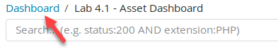  

Then type in **4.2** in the **Search** filter, and **click** on **Lab 4.2 - PowerShell Dashboard**.  

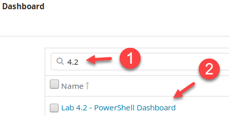

!!! warning "README BEFORE CONTINUING"
    Individual logs in this lab are large. In fact, they can be between 10 and 500 times larger than traditional logs. This means that searching will take longer than previous labs.

    This lab is based on Event IDs 4103 and 4104.

## Exercises

The goal of this lab is to identify all authorized vs. unauthorized systems. Keep in mind the process being applied as the goal in production would be to automate your logic to find post-compromise activities.

### High PowerShell log count

Discover any systems generating significantly more PowerShell events than others.

??? tip "Solution"
    Looking at the **Lab 4.2 - PowerShell Commands by Host** clearly shows that **IT02.sec555.com** is generating a ton of PowerShell logs.  

    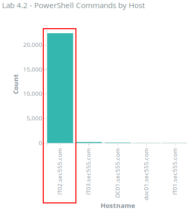  

    The number of logs from this host range in the **10s of thousands** where the next closest host only has **209** logs. This alone does not mean something malicious is going on. **IT02** is an IT computer and IT staff regularly use PowerShell. The investigation into **IT02** would be warranted, though.

    **Answer: IT02** is generating **22,411** events, which are significantly higher than other systems. The next highest system only has **209** events.

### Find base64 encoding

Identify all logs tagged with **possible\_base64\_encoding**.

<ol type="a"><li>What is the total count?</li>
<li>How many systems were using base64 encoded commands?</li></ol>

??? tip "Solution"
    Encoding is a technique used by attackers to evade security controls. Log aggregators can detect this during log ingestion. In this case, logs that look like they may contain base64 encoded were tagged with **possible\_base64\_encoding**. To search for these logs, search for **tags:possible\_base64\_encoding**.  

    ```bash
    tags:possible_base64_encoding
    ```

    

    The results show that there are **560** related script block logs and **492** related module logs for a total of **1,052**.  

    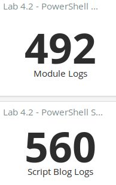  

    Looking at the **Lab 4.2 - PowerShell Commands by Host** graph shows that **IT02.sec555.com** is the only host using PowerShell with base64 encoding.  

    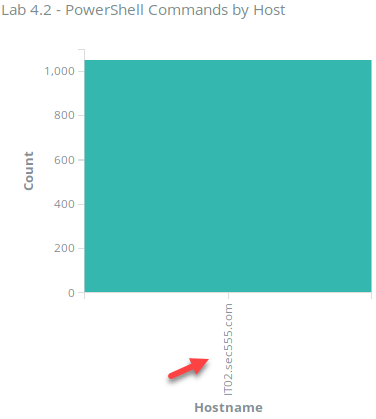  

    This makes **IT02** highly suspicious given it has base64 encoding and is generating a ton of PowerShell logs.  

    **Answer**: There are **1,052** events tagged with **possible\_base64\_encoding**. These came from **IT02.sec555.com**.  

    Keep your search filter for **step 3**.

### Find compromised system

Which system was compromised?

??? tip "Solution"
    Having base64 encoding in PowerShell is highly suspicious. A next step could be to investigate the base64 commands by decoding them. Again, this is something a log aggregator should be able to do on the fly. The saved search called **Lab 4.2 - PowerShell with base64** **encoding** shows the decoded base64 strings in the field called **base64\_decoded**.  

    !!! note
        The **Lab 4.2 - PowerShell with base64 encoding** and the **Lab 4.2 - PowerShell Script Block Logs** saved searches are saved so that logs show oldest to newest. This is helpful when analyzing events over a timeline.  

    Expand the first log in this saved search.  

    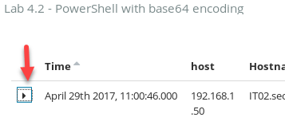  

    Then look at the full **base64\_decoded** field.  

    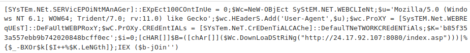  

    There are multiple things wrong with this. First off, it originally was **base64 encoded**. Second, letters use an **improper mix of upper case** and **lower case letters,** and it looks like upper case or lower case letters are used with a random interval. At a minimum, it is not grammatically correct. Third, it is making a call out to the internet. Fourth, the call is to a **naked IP address**. Looking at the second and third logs show the **base64\_decoded** field is identical.

    Scrolling down shows multiple functions being repeatedly called. Some are the same function for the same event.  

    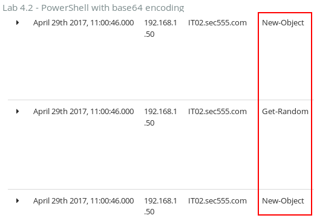  
      
    !!! note
        This is because of the way module logging works. These are related to the same command, but module logging is breaking out each module that is being invoked.

    Next, look at the **Lab 4.2 - Module Use over Time**.  

    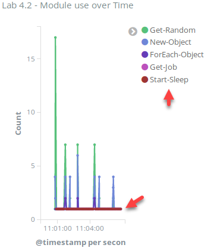  

    While there are spikes in use of certain cmdlets such as **Get-Random,** there is a constant repetition of the use of **Start-Sleep**. You can see this by hovering over the dots associated with Start-Sleep.  

    !!! note
        These will be the same color as Start-Sleep in the legend. In this diagram, the legend for Start-Sleep is red. You can also find these by simply hovering over the many dots on the X-axis.  

    To make this easier to see, click on Start-Sleep and then click on the magnifying glass with the plus sign.  

    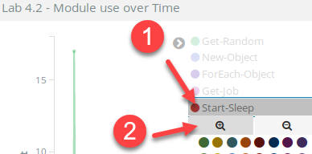

    You should now see the following graph:  

    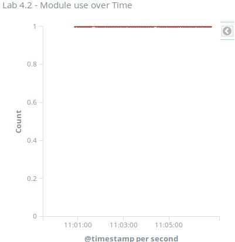  

    With so many data points close together, it is easier to analyze the time of events in a table. You can do this by clicking on the up arrow found at the bottom of the graph.  

    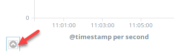

    This will then display additional information about the graph. The default view is a table view with timestamps. Notice the timestamps are typically **5 seconds apart**.  

    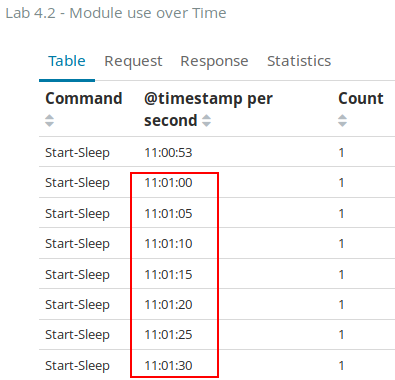  

    While not always exactly 5 seconds apart, it is close to this. This can be a form of command and control beaconing. The times where things are not exactly 5 seconds apart are likely points where commands were issued from the command and control server.  

    !!! note
        The time reflected on your system may be different depending on what time zone the system is that is using **Kibana**.  

    Remove the filter for **command\_name.keyword:"Start-Sleep"** by hovering over it and clicking on the garbage can icon.  

    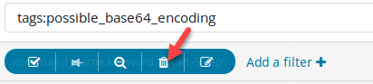  

    Next, see if there are other base64 encoded commands. You can do this by expanding the first log in **Lab 4.2 - PowerShell with base64 encoding** visualization and then clicking on the magnifying glass with the minus sign on the **shell\_host\_application\_length** field with the value of **1,378**.  

      

    The remaining logs are a mostly garbled mess. This is typically due to encryption or the contents being binary. However, the top two logs have some cleartext.  

      

    The first log looks like the contents of a default web page. The second log represents a binary executable being transferred. This is highly abnormal. Executables transferred to a system by hiding the binary in base64 encoding is highly suspicious and common for malware. This is often associated with a stage two download. Given all the evidence found so far, **IT02** is likely compromised.  

    !!! note
        The MZ character at the beginning stands for **Mark Zbikowski**. This is the magic byte signifying a file is an EXE file. **This program cannot be run in DOS mode** is another indication that this is an EXE.  

    **Answer**: Evidence suggests that **IT02** is compromised.  

    Keep the current search filters until the end of **step 5**.

### Identify command and control server

What is the IP address of the command and control server?

??? tip "Solution"
    This was previously discovered in **step 3**. When analyzing the base64\_decoded field, you see that IT02 is making web calls out to **24.17.92.107**.  

      

    **Answer**: The command and control server is at **24.17.92.107**.

### Find base64 in ScriptBlock logs

Event ID **4104**, which is for Script Block logging, logs commands as they are executed. These commands are logged at the time of execution, so they are decoded in the logs. Why do some logs contain base64 in the **ScriptBlockText** field?

??? tip "Solution"
    The content of the **ScriptBlockText** field contains only executed PowerShell code. This means it is the code executed at runtime. However, some of the logs contain what looks to be base64 encoded data in this field. For example, the third log looks like the **ScriptBlockText** field contains nothing but base64 contents. You can see this in the **Lab 4.2 - PowerShell Script Block Logs** saved search.  

    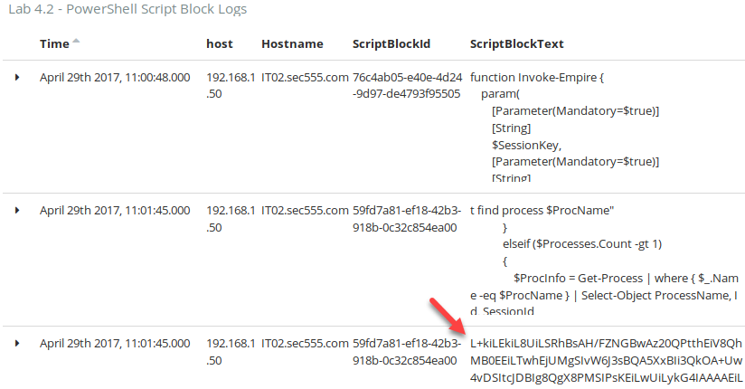

    The **ScriptBlockId** field is the unique ID generated per block of executed code. When multiple logs share the same **ScriptBlockId,** it means they are part of the same block of code being run. This happens if the code being executed is so long it cannot fit in one event log. In this case, the second and third log displayed are part of the same code block.  

    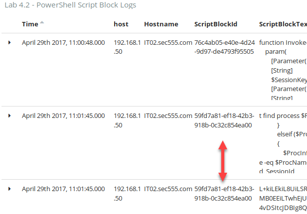

    Using the scroll bar at the bottom of the Lab 4.2 - PowerShell Script Block Logs reveals some additional fields.  

    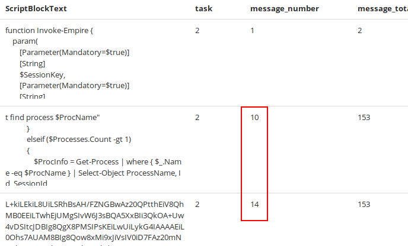  


    As you can see, the 2<sup>nd</sup> log is the 10<sup>th</sup> log in **ScriptBlockId** **59fd7a81-ef18-42b3-918b-0c32c854ea00**. The 3<sup>rd</sup> log is the 14<sup>th</sup> log in **ScriptBlockId 59fd7a81-ef18-42b3-918b-0c32c854ea00**.  

    !!! note
        Sometimes, the **message\_number** field is out of sequence. This is because the time collected is not in milliseconds.  

    Knowing this, expand the 2<sup>nd</sup> log and look at the ScriptBlockText section to find out what commands are running before the base64 content in the 3<sup>rd</sup> log.  

      

    This shows that the base64 string is being loaded into a variable called **$PEBytes64**. While still on the 2<sup>nd</sup> log, scroll down further and look at the base64\_decoded field.  

      

    This shows that a binary executable is being stored into **$PEBytes64**. This is a common technique used to bypass certain antivirus and application whitelisting products. By loading an executable into a variable and then calling it, the contents never are written to disk.  

    **Answer**: The base64 strings found in the **ScriptBlockText** field are properly being rendered. This base64 string was part of the executed code being run. In this case, a base64 encoded executable is being stored into **$PEBytes64**.  

    Undo all search filters by reloading the dashboard. First, click on **Dashboard**.  

    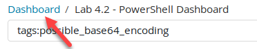  

    Then type **4.2** in the Search filter and then click on **Lab 4.2 - PowerShell Dashboard**.  

    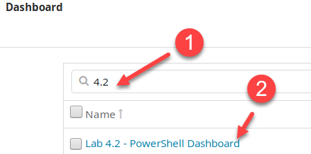

### Export cmdlets

Using only logs from the non-compromised systems export a list of trusted cmdlets used.

??? tip "Solution"
    One technique that works well for monitoring for abnormal PowerShell as well as filtering noisy PowerShell logs is whitelisting trusted cmdlets. This can be done by monitoring systems under "trusted conditions" and then exporting the list of all cmdlets used.  

    !!! note
        Some cmdlets should only be trusted by subnet. For example, IT staff will likely use cmdlets that should never be seen on standard systems.  

    The **Lab 4.2 - cmdlets** visualization provides a list of all cmdlets used. However, it contains cmdlets from **IT02.sec555.com** which is compromised. To list only cmdlets used on non-compromised systems, search for **-Hostname.keyword:"IT02.sec555.com".**  

    ```bash
    -Hostname.keyword:"IT02.sec555.com"
    ```

      

    Then click on either **Raw** or **Formatted** in the **Lab 4.2 - cmdlets visualization** to export the list of cmdlets used.  

    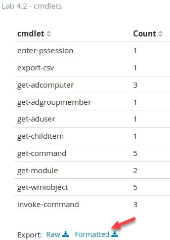  

    **Answer**: To export a list of trusted cmdlets to use as a starting point for whitelisting cmdlets, filter out **IT02.sec555.com** and then click on **Formatted** in the **Lab 4.2 - cmdlets** visualization. This will provide a CSV file with all the trusted cmdlets.

<h2 id="video"> Step-by-Step Video Instructions </h2>

<iframe class="tscplayer_inline" id="embeddedSmartPlayerInstance" src="../../../../Videos/555_4/2/lab4.2_player.html?embedIFrameId=embeddedSmartPlayerInstance" scrolling="no" frameborder="0" webkitAllowFullScreen mozallowfullscreen allowFullScreen></iframe>

## Lab Conclusion

In this lab, you analyzed PowerShell logs looking for abnormal PowerShell use. This included:

- Analyzing PowerShell command length

- Looking for command obfuscation such as base64 encoding

- Identifying odd command issuances such as the abnormal use of uppercase and lowercase letters

- Analyzing the amount of PowerShell commands being issued from a single user or host

- Generating a cmdlet whitelist

**Lab 4.2 is now complete**\!

<link href="../../../../Videos/555_4/2/skins/remix/techsmith-smart-player.min.css" rel="stylesheet" type="text/css" />
<link href="../../../../Videos/555_4/2/lab4.2_embed.css" rel="stylesheet" type="text/css">