# Lab 4.3 - NetFlow Detection

## Objectives

- Understand the importance of low-cost NetFlow data

- Identify encrypted command and control using NetFlow

- Discover policy violations involving user bypass of internal security controls

- Identify and filter out authorized traffic from unauthorized

- Use enriched NetFlow data to analyze the data flow of connections

## Exercise Preparation

Log into the Sec-555 VM

- Username: student

- Password: sec555

Open **Firefox** by **clicking** on the **Firefox** **icon** in the top-left corner of your student VM.  

  

Then **click** on the **Kibana** bookmark in **Firefox**.

  
  
A dashboard called **Lab 4.3 - NetFlow Dashboard** has been created for this lab. Loading this dashboard will also set the proper time range for this lab. To access it, switch to the **Dashboard** section.  

  

If a dashboard that was previously selected appears, **click** on the **Dashboard** link in the top-left corner.  

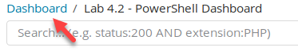  

Then type in **4.3** in the **Search** filter, and **click** on **Lab 4.3 - NetFlow Dashboard**.  

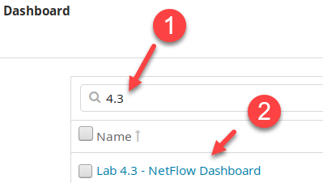  

For the purposes of this lab, any systems in 10.5.55.0/24, 172.16.0.0/24, and 10.0.0.0/24 are server subnets. All other private IP addresses are client subnets.  

The goal of this lab is to identify abnormal connections using only flow data. Analysis of flow data focuses on finding abnormalities such as high connection counts, long-lasting sessions, large uploads or downloads, or things like protocol upload/download ratios being outside of the norm. While flow data cannot prove what a connection is for, it can point out that it needs to be investigated.

## Exercises

There is more than one way to answer these questions.

### Analyze traffic

There are **3** internal systems that are likely being controlled via encrypted command and control.

<ol type="a"><li>Which three systems are these?</li>
<li>What port are they being controlled from?</li></ol>

??? tip "Solution"
    !!! note
        This lab can be done in multiple ways and is subject to the logic of the analyst. This walkthrough is just one way of going through flow data. The key is to prioritize based on the greatest likelihood of suspicion.  

    Start by first looking at the initial dashboard. Looking at **Lab 4.3 - Connections by Duration** shows multiple systems with connections lasting over **3 hours or more**.  

    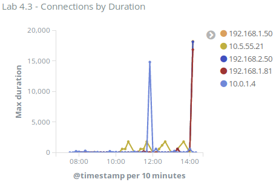  

    Also, you can see that **192.168.1.50** is an internal system that has generated the most uploads and the most downloads. This is displayed in **Lab 4.3 - Hosts with Most Bytes Uploaded** and **Lab 4.3 - Hosts with Most Bytes Downloaded**.  

    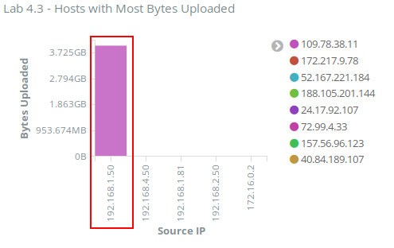  

    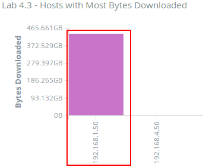  

    Looking at **Lab 4.3 - Outbound Connections by Port** shows the client **192.168.4.50** has the most outbound connections. Furthermore, it shows that the client has generated **44,120** outbound DNS requests to **188.105.201.144**.  

    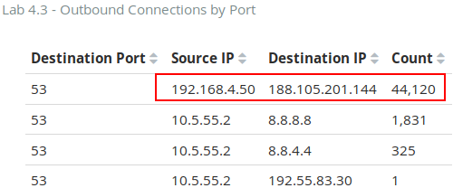

    The last graph, **Lab 4.3 - Top Talkers by \# of Connections** shows that the client **192.168.4.50** has made the most connections by far over other systems.  

    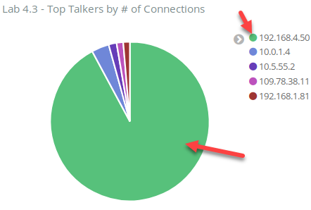  

    From looking at these graphs, the most suspicious system is **192.168.4.50**. A client system should not be generating that much DNS traffic. Had this been a domain controller talking to an external DNS server, this could have been normal traffic, but from a client system, it is abnormal and highly suspicious.  

    Start by drilling down into **192.168.4.50** by clicking on the IP address in **Lab 4.3 - Top Talkers by \# of Connections**. Then click on the magnifying glass with the **+** sign.  

    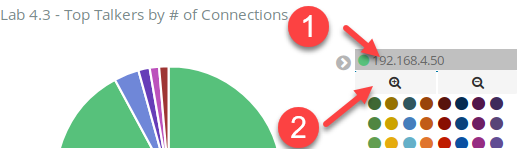

    Notice, when the dashboard updates, that **192.168.4.50** only has a few connections outbound to port **80** or **443**. However, the majority of its traffic is port **53** outbound to **188.105.201.144**.  

    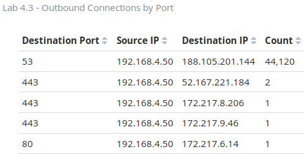  

    Based on this information, an analyst can work with the assumption that **192.168.4.50** is compromised and is talking to **188.105.201.144** using port **53**.  

    !!! note
        The high volume of traffic over port **53** is indicative of DNS tunneling.  

    Switch the search filter for **192.168.4.50** to an exclusion filter by hovering over it and clicking on the magnifying glass with the **-** sign.  

    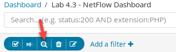  

    The dashboard now shows connections not sourcing from **192.168.4.50**. The current graphs do not explicitly point out a compromised system. However, it is a good practice to investigate client systems making outbound connections that last more than **3** hours.  

    !!! note
        While **192.168.1.50** still has the largest amount of upload activity at approximately 4 GB and it also has the largest amount of download activity at approximately 450 GB, this is not that suspicious. This type of activity over a six-hour period is not uncommon for a power user. What does make it suspicious is that it also has the longest running connection at a little over **5** hours.

    Start by clicking on **192.168.1.50** in the **Lab 4.3 - Connections by Duration** visualizations. Then click on the magnifying glass with the **+** sign.  

    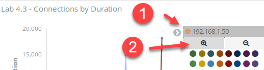  

    Looking at the **Lab 4.3 - Outbound Connections by Port** shows this system only made a few connections outbound to ports **80** and **443**. It also made one outbound port **22** connection.

    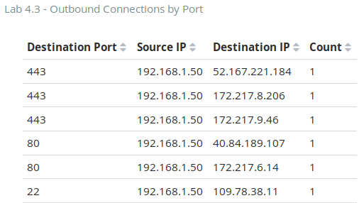  

    The outbound port **22** connection is interesting, so click on it to apply it as a filter.  

    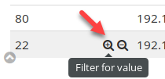

    The results show that a large amount of upload and download is related to this connection. The **Lab 4.3 - Connections by Duration** shows this port **22** connection lasted a little over **5** hours.  

    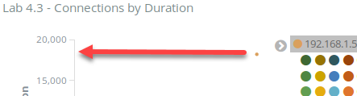  

    The **Lab 4.3 - Hosts with Most Bytes Uploaded** shows **3.987 GB** of data was uploaded from **192.168.1.50 to 109.78.38.11**. This is quite a bit of data. On its own, this would not necessarily be suspicious, but since it is over port **22**, which is commonly SSH, and was done over a session lasting over **5** hours, this is alarming.  

    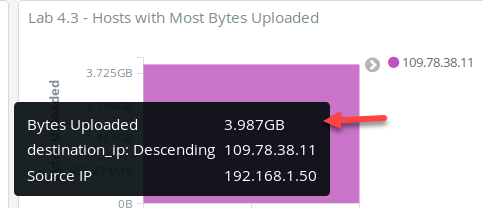  

    However, the odd thing is that **Lab 4.3 - Hosts with Most Bytes Downloaded** shows that **192.168.1.50** downloaded **436.863 GB** of data from **109.78.38.11**.  

    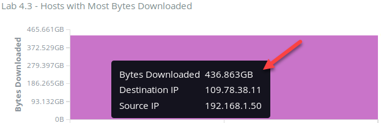  

    Clearly, this system downloaded much more than it uploaded. With this being port **22** traffic, the assumption is this is **SSH** or **SFTP** traffic. Given there was a decent amount of upload activity and a lot of download activity, all of which spanned **5** hours, this is likely not SFTP. This <span class="underline">could be</span> command and control activity. It is odd, however, that it is using port **22** and that there is so much download activity. Even if exploits and other tools were being downloaded, they typically are not so large. For now, write it down as a possibly compromised host.  

    Next, remove the search filter for **destination\_port:"22"** by
    hovering over it and clicking on the garbage can icon.  

    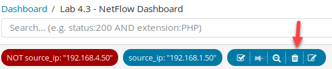  

    Then hover over **source\_ip:"192.168.1.50"** and click on the magnifying glass with the **-** sign.  

    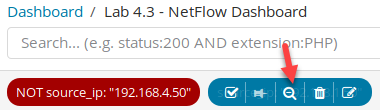  

    Looking at what is left shows there are still multiple systems with long duration times. The one with the next longest connection is **10.5.55.21**.  

    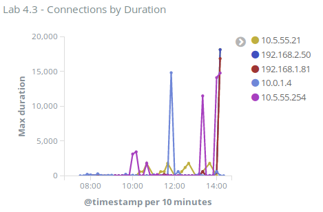

    Within the **Lab 4.3 - Connections by Duration visualization**, click on it and then click on the magnifying glass with the **+** sign.  

    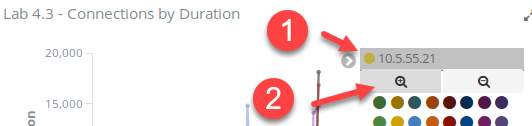  

    Looking at the logs in **Lab 4.3 - Flow Data** shows that this long-lasting connection for **10.5.55.21** is to **10.5.55.2** and is for port **123** which is NTP. Since you are looking for command and control activity to an external system, change the search filter to **tags:external\_destination.**  

    ```bash
    tags:external_destination
    ```

      

    After doing this, the longest outbound connection shown in **Lab 4.3 - Connections by Duration** from **10.5.55.21** is only **1,801** seconds or approximately **30** minutes.  

    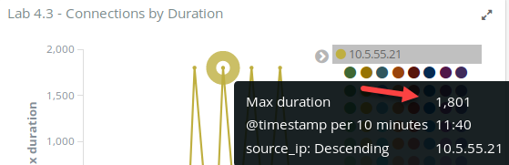  

    Thus, **10.5.55.21** is no longer interesting. Hover over **source\_ip:"10.5.55.21"** and click on the magnifying glass with the **-** sign.  

    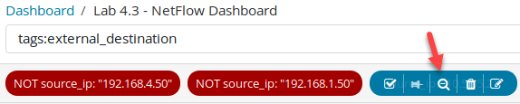

    Now with the search filter of **tags:external\_destination**, there are only two IP addresses with long-running connections. They are **192.168.2.50** and **192.168.1.81**. Start by clicking on **192.168.2.50** in **Lab 4.3 - Connections by Duration** and then click on the magnifying glass with the **+** sign.  

    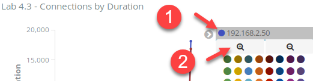  

    Looking at the logs in **Lab 4.3 - Flow Data** shows the long-running connection is an outbound port **443** connection to **72.99.4.33**. This connection lasted **18,133** seconds or a little over **5** hours.  

      

    Yet, only **1.156 MB** of data was downloaded, and **1.49 MB** was uploaded in **5** hours. The log shows that 56% of this traffic was upload traffic. Long-lasting command and control activity commonly has more upload than download. This is because the client is constantly checking in with the command and control server.  

      

    Given this, there is a good chance **192.168.2.50** is compromised. This leaves **192.168.1.81**, which was the last remaining system with long outbound session times. Hover over **source\_ip:"192.168.2.50"** and click on the magnifying glass with the **-** sign.  

    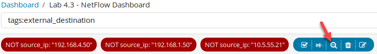

    Then on the **Lab 4.3 - Connections by Duration**, click on **192.168.1.81** and then click on the magnifying glass with the **+** sign.  

    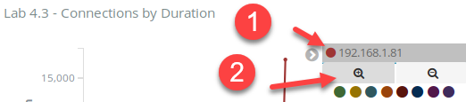  

    Looking at the log in **Lab 4.3 - Flow Data** shows the long-lasting session was from **192.168.1.81** to **24.17.92.107** over port **31337**.  

    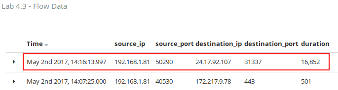  

    This session lasted **16,852** seconds, which is roughly a little more than **4.5** hours. The port **31337** is hacker jargon for the word elite. Given the port number and how long the session lasted, **192.168.1.81** is highly likely a compromised system.  

    **4** suspect IP addresses have been identified. The question for **step 1** states to find **3** systems that are likely being controlled by a command and control server. The DNS traffic from **192.168.4.50** looks like C2 over DNS tunneling. This often uses IPsec for encryption. **192.168.1.81** has a long-lasting connection to port **31337**. This also is highly likely to be C2. This leaves **192.168.2.50**, which had a long-running connection over **443**, and **192.168.1.50**, which had a long-running connection over port **22**. Of these, 192.168.2.50 more closely resembles traditional C2 traffic behavior.  

    **Answer**: There are three systems that were compromised and controlled over encrypted command and control channels. They are **192.168.4.50** over many connections (varying source ports) to **188.105.201.144** on destination port **53**.   **192.168.1.81** with a source port of **50290** to **24.17.92.107** on destination port **31337**   **192.168.2.50** with a source port of **49749** to **72.99.4.33** on destination port **443**

An internal user is using encryption to bypass corporate web filters.

<ol type="a"><li>Which system is he or she using?</li>
<li>What application is likely being used?</li></ol>

??? tip "Solution"
    The remaining system of interest from **step 1** is **192.168.1.50** on source port **49411** going to destination **109.78.38.11** on destination port **22**. Port **22** can be used as an SSH tunnel to bypass security controls. Given that **step 2** is about a system bypassing corporate web filters and this system downloaded roughly **4 GB** of data, **192.168.1.50** is the device bypassing corporate security controls.  

    **Answer**: **192.168.1.50** is most likely using the **SSH** on source port **49411** to the standard destination port of **22** to **109.78.38.11** to bypass corporate security controls.

<h2 id="video"> Step-by-Step Video Instructions </h2>

<iframe class="tscplayer_inline" id="embeddedSmartPlayerInstance" src="../../../../Videos/555_4/3/lab4.3_player.html?embedIFrameId=embeddedSmartPlayerInstance" scrolling="no" frameborder="0" webkitAllowFullScreen mozallowfullscreen allowFullScreen></iframe>

## Lab Conclusion

In this lab, you investigated NetFlow events. This included:

- Looking for long-lasting connections

- Identifying abnormal upload to download ratios

- Finding systems with abnormally high connection rates

- Finding applications with abnormally high connection rates

- Identifying systems with too much upload or download activity

**Lab 4.3 is now complete**\!

<link href="../../../../Videos/555_4/3/skins/remix/techsmith-smart-player.min.css" rel="stylesheet" type="text/css" />
<link href="../../../../Videos/555_4/3/lab4.3_embed.css" rel="stylesheet" type="text/css">