# Lab 5.1 - Alert Context

## Objectives

- Understand the limited context provided by alerts

- Understand the importance of correlation (and having data to correlate with)

- Identify attacker movement on the internal network

- Discover other compromised assets that had no alerts of compromise

- Build a more holistic report of what happened

## Exercise Preparation

Log into the Sec-555 VM

- Username: student

- Password: sec555

Open **Firefox** by **clicking** on the **Firefox** **icon** in the top-left corner of your student VM.  
  
  
  
Then **click** on the **Kibana** bookmark in **Firefox**.

  

A dashboard called **Lab 5.1 - Alert Dashboard** has been created for this lab. Loading this dashboard will also set the proper time range for this lab. Access the dashboard by switching to the **Dashboard** section.  

  

If a dashboard that was previously selected appears, **click** on the **Dashboard** link in the top-left corner.  

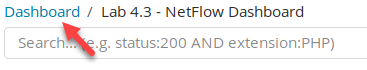  

Then type in **5.1** in the **Search** filter, and **click** on **Lab 5.1 - Alert Dashboard**.  

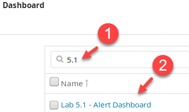  

This lab uses the same network structure and systems from previous labs. Some asset information is provided below:  

- 10.5.55.0/24, 172.16.0.0/24, and 10.0.0.0/24 are **server** subnets  
- 10.5.55.20 is the **SIEM**  
- 10.5.55.2 and 10.5.55.3 are the **domain controllers** for **sec555.com**  
- 172.16.0.2 is the corporate **vulnerability** **scanner**  
- All other private IP addresses are **client** subnets

## Exercise

Using the **Lab 5.1 - Alert Dashboard**, filter out the noise and identify any alerts dealing with a system(s) that are compromised. Using this information, build a detailed report. This should include things such as:

Move backward or forward to find your answers. For this lab, you will need to use both the **Lab 5.1 - Alert Dashboard** and any logs of your choosing in the **Discover** tab for index pattern **lab5.1-complete-\***.

- Was this system used to attack other systems?

- Was pivoting involved? 

- How many total systems are likely compromised?

??? tip "Solutions"
    This lab is intentionally open-ended. The goal is to find any credible alerts and then track down what happened. Start by opening the **Lab 5.1 - Alert Dashboard**.  

    Open **Firefox** by **clicking** on the **Firefox** **icon** in the top-left corner of your student VM.  

      

    Then **click** on the **Kibana** bookmark in **Firefox**.

      
      
    A dashboard called **Lab 5.1 - Alert Dashboard** has been created for this lab. Loading this dashboard will also set the proper time range for this lab. Access the dashboard by switching to the **Dashboard** section.  

      

    If a dashboard that was previously selected appears, **click** on the **Dashboard** link in the top-left corner.  

    

    Then type in **5.1** in the **Search** filter, and **click** on **Lab 5.1 - Alert Dashboard**.  

      

    Looking at both **Lab 5.1 - Alerts over Time by Destination** and **Lab 5.1 - Alerts over Time by Source** shows large spikes of activity from **172.16.0.2**.  

    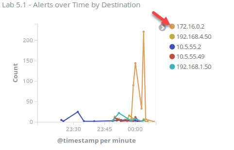  

    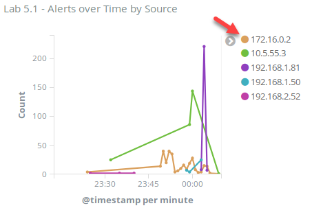  

    However, the asset information provided states that **172.16.0.2** is the corporate vulnerability scanner. Vulnerability scanners typically are excluded from monitoring as they generate tremendous amounts of false positives. Filter out this system completely by applying a search filter of **-source\_ip:172.16.0.2 AND -destination\_ip:172.16.0.2**.  

    ```bash
    -source_ip:172.16.0.2 AND -destination_ip:172.16.0.2
    ```

      

    This greatly reduces the number of alerts. While there are still many remaining alerts, they consist of only three signatures as seen in **Lab 5.1 - Signatures by Count**.  

    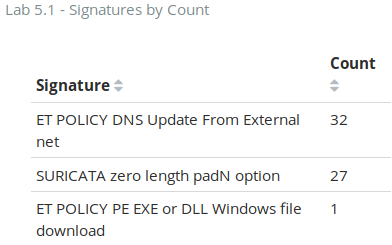

    None of these overtly specify something malicious has happened. However, looking at **Lab 5.1 - Signatures by Source Port** shows a single alert regarding an **EXE** or **DLL** being downloaded. It is normal for these kinds of files to be downloaded. What is odd is that it occurred over port 4444 as shown in **Lab 5.1 - Signatures by Source Port**.  

    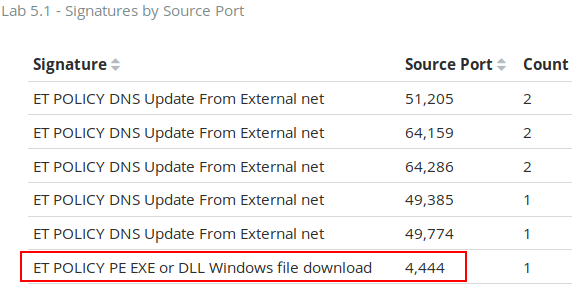  

    Port **4444** is the default port for **Metasploit Meterpreter** and should not be in use. Looking at **Lab 5.1 - Signatures by Source and Dest** shows a source of **72.99.4.33** and a destination of **192.168.2.50**.  

    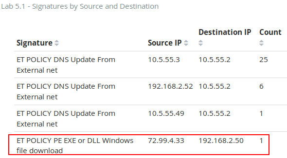

    This makes it look like **72.99.4.33** directly exploited and compromised **192.168.2.50**. However, without the table showing ports, this cannot be confirmed. To verify the direction of the connection, switch to the **Discover** tab.  

      

    Then select the index called **lab5.1-complete-\***.  

    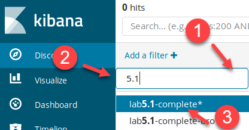  

    First, look at the alert. Do this by searching for **event\_type:alert AND (source\_port:4444 OR destination\_port:4444)**.  

    ```bash
    event_type:alert AND (source_port:4444 OR destination_port:4444)
    ```

    

    Looking at the raw log shows it has a **source\_ip** of **72.99.4.33**, a **source\_port** of **4444**, a **destination\_ip** of **192.168.2.50**, and a **destination\_port** of **49959**. While the alert states the **source\_ip** is **72.99.4.33**, the actual source is **192.168.2.50**. You can infer this by **192.168.2.50** using an ephemeral (high port) while **72.99.4.33** has a low port. This alert was recorded at **2:03 AM**.  

      
      
      

    !!! note
        IDS signatures report source and destination IP addresses per how the packet is being analyzed. This regularly causes source and destination to be switched, causing confusion to analysts.  

    At this point, it is likely that **192.168.2.50** is compromised and possibly being controlled by **72.99.4.33**. Next, search for flow data relating to connections to or from **72.99.4.33** by changing the search to **event\_type.keyword:flow AND (source\_ip:72.99.4.33 OR destination\_ip:72.99.4.33)**.  

    ```bash
    event_type.keyword:flow AND (source_ip:72.99.4.33 OR destination_ip:72.99.4.33)
    ```

      

    The default view of **Time** and **\_source** is not helpful for manual analysis.  

    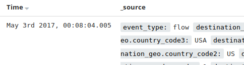  

    Fix this by adding columns for **source\_ip**, **source\_port**, **destination\_ip**, and **destination\_port**. You can do this by hovering over the field in the **Available Fields** column on the left and then clicking on **Add**.  

    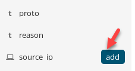

    The results are interesting. There are **19** logs all from **192.168.2.52** to **72.99.4.33** over port **443**. These occur between **May 2<sup>nd</sup>, 2017** at **11:52 PM** and **May 3<sup>rd</sup>, 2017** at **12:09 AM Pacific Time**.  

    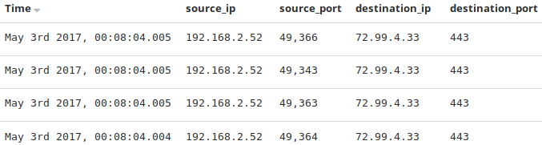  

    This is a little alarming though. What happened to the port **4444** connection? It is possible that **Suricata** did not have enough resources to keep up with checking packets for alerts and creating flow data. If you are lucky, you may have more than one data source for correlation such as firewall logs. Fortunately, we have flow data in **Suricata** and connection logging with **Zeek**. Change your search filter to **log\_event\_type.keyword:bro\_conn AND (source\_ip:72.99.4.33 OR destination\_ip:72.99.4.33)**.  

    ```bash
    log_event_type.keyword:bro_conn AND (source_ip:72.99.4.33 OR destination_ip:72.99.4.33)
    ```

    

    This shows **30** logs. Within these are connections from **192.168.2.52** to **72.99.4.33** over **443** ranging from **11:49 PM** to **12:06 AM Pacific Time**. These correlate and are close to the previous **Suricata** logs. However, this search also shows a single connection from **192.168.2.50** to **72.99.4.33** over port **4444** at **12:03 AM**. This coincides with the original **Suricata** alert.  

    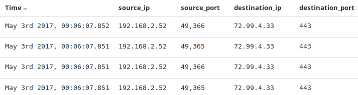  

    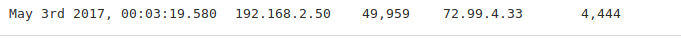

    At this point, there is enough evidence to suggest both **192.168.2.50** and **192.168.2.52** are compromised. Now that connections to and from **72.99.4.33** have been looked at, look for any internal connections made from these compromised systems to other internal systems. To do this change, search to **log\_event\_type.keyword:bro\_conn AND (source\_ip:192.168.2.50 OR source\_ip:192.168.2.52) AND tags:internal\_destination**.

    ```bash
    log_event_type.keyword:bro_conn AND (source_ip:192.168.2.50 OR source_ip:192.168.2.52) AND tags:internal_destination
    ```

      

    There are **815** results. This is a lot to analyze manually. However, looking at the first four logs shows this is returning records of logs from these systems going to the SIEM on port **6052**.  

    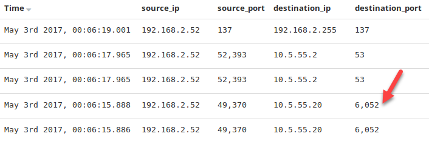  

    Filter out the SIEM by expanding one of these logs and clicking on the magnifying glass with the **-** sign for on the **destination\_ip** of **10.5.55.20**.  

    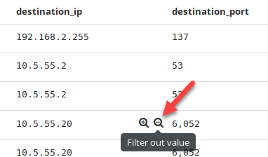

    This narrowed the search down from **815** results to **625**. However, that is still a lot to analyze manually. Looking at the events, there are a decent number of logs related to connections to the internal domain controllers. Since there are not enough connections as to be alarming, go ahead and filter out the domain controllers. Do this by expanding the **2<sup>nd</sup>** log and clicking on the magnifying glass with the **-** sign next to **destination\_ip 10.5.55.2**.  

    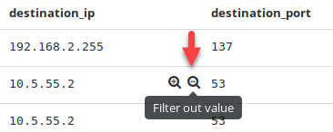  

    Once again, expand the **2<sup>nd</sup>** log and clicking on the magnifying glass with the **-** sign next to **destination\_ip 10.5.55.3**.  

    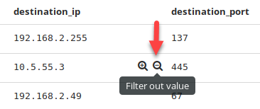  

    This narrows the results from the original **815** down to **41**.  

      

    This is a much more manageable number. Scanning through these shows the following:  

    - Connections from both compromised systems to **192.168.2.49** on port **67**, which is **DHCP** (Dynamic Host Configuration Protocol which is likely benign)  

    - Connections from both compromised systems to **10.5.55.79** on port **8530**, which is **WSUS** (Windows Server Update Services which is likely benign)  

    - Connections from both compromised systems to **192.168.2.255** on port **137**, which is **NetBIOS broadcasts** (likely benign)

    Outside of these, there are connections from **192.168.2.52** to **192.168.2.50** on port **445**. This began at **11:53 PM** up until **12:03 AM Pacific Time**. **12:03 AM** corresponds to the initial alert about **192.168.2.50** being compromised.  

    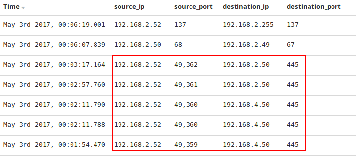  

    Also, workstations typically do not and should not talk to one another. Combine these together and it is likely that **192.168.2.52** was initially compromised and then used to turn around and compromise **192.168.2.50**.  

    At this point, go ahead and remove the columns specific to flow data by hovering next to them and clicking on Remove column. Do this for the **source\_ip**, **source\_port**, **destination\_ip**, and **destination\_port** columns.  

    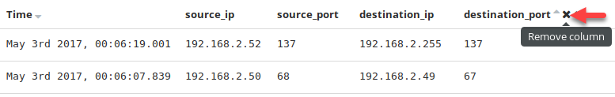  

    Remove all additional search filters by clicking on **Actions** and then click on **Remove**.  

    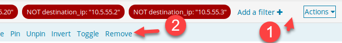

    This is commonly the stopping point for most analysts due to not having access to other correlating information. However, this lab just happens to include Windows event logs. Start by seeing if **192.168.2.52** compromised **192.168.2.50**. Do this by searching for **log\_event\_type.keyword:windows AND host.keyword:192.168.2.50**.  

    ```bash
    log_event_type.keyword:windows AND host.keyword:192.168.2.50
    ```

      

    There are **83** results. However, you know the connection from **192.168.2.52** to **192.168.2.50** occurred around **12:03 AM**, so scroll down to that time frame and analyze the logs. Around this time, you will discover multiple PowerShell logs and a new service is installed.  

    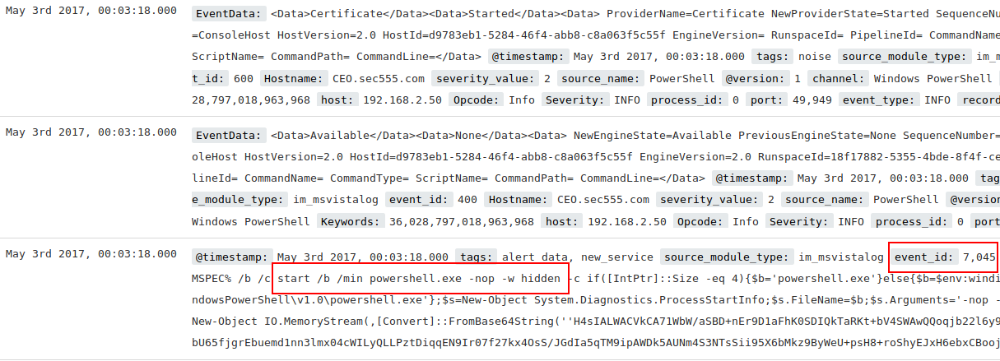  

    Looking into the service name shows it has a randomly generated name and is using obfuscated PowerShell commands. This is likely the command and control being launched.  

    

    Looking around more, you will find that at **12:03:17 AM**, a login event was generated.  

    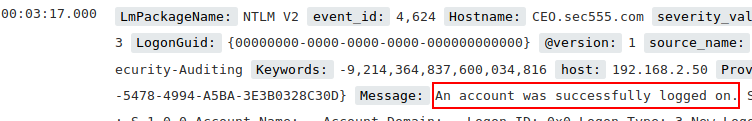  

    This log message shows that the logon came from **192.168.2.52** and was used to successfully log in as **Administrator** with a domain of **CEO**. This means that **192.168.2.50** is the **CEO's** machine. Also, the workstation name is randomly generated. More than likely, this was a pass-the-hash attack from **192.168.2.52** to **192.168.2.50**.  

      

    This confirms suspicions about how **192.168.2.50** was compromised. Now, consider **192.168.2.52**. Change the search filter to **log\_event\_type:windows AND host.keyword:192.168.2.52**.  

    ```bash
    log_event_type:windows AND host.keyword:192.168.2.52
    ```

      

    This shows **725** results. This is a lot to analyze manually. One thing you can try is to search for the command and control server within the message field of a Windows log by changing the search filter to **log\_event\_type.keyword:windows AND host.keyword:192.168.2.52 AND 72.99.4.33**.  

    ```bash
    log_event_type.keyword:windows AND host.keyword:192.168.2.52 AND 72.99.4.33
    ```

    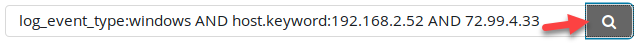  

    This yields **1** result, which is a PowerShell ScriptBlock log showing the execution and download of code from **72.99.4.33**. This means PowerShell was used against **192.168.2.52** and is likely the mechanism for command and control.  

      

    Remove the **AND 72.99.4.33** from the search filter by searching for **log_event_type:windows AND host:192.168.2.52**.  

    ```bash
    log_event_type:windows AND host:192.168.2.52
    ```

      

    This yields the **725** events from earlier. Click on the **channel** in the left field pane to see which channels these events are from.  

    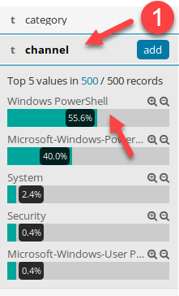

    Looking at this shows that most of the **725** events are from PowerShell. Since the initial call out to **72.99.4.33** was already discovered in a PowerShell log, click on the magnifying glass with a **-** sign next to Windows PowerShell to filter it out.  

    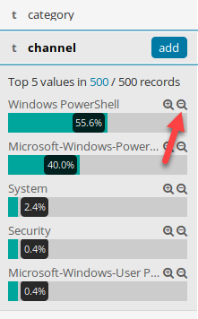  

    !!! note
        Expanding any of these logs shows the hostname for **192.168.2.52** is **Accounting01**.  

    This limits the results down to **33** events. Within these, you can find another service installation event. This occurs at **11:49:48 PM PDT**.  

    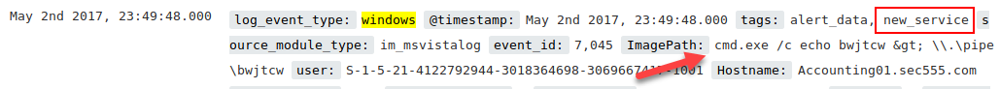

    This shows the service **bwjtcw**, which is a randomly generated name, being used for named pipe privilege escalation.  

      

    **Answer**: **192.168.2.52 (Accounting01)** was compromised around **11:49 PM PDT** by unknown means. It was being controlled by **72.99.4.33** over port **443**. **Accounting01** was later used at **11:53 PM PDT** to compromise **192.168.2.50 (CEO)**. This compromise led to the **CEO** computer also being controlled by **72.99.4.33**, but this time over port **4444**. This subsequent compromise was what started this incident as it generated an alert by the IDS system.

<h2 id="video"> Step-by-Step Video Instructions </h2>

<iframe class="tscplayer_inline" id="embeddedSmartPlayerInstance" src="../../../../Videos/555_5/1/lab5.1_player.html?embedIFrameId=embeddedSmartPlayerInstance" scrolling="no" frameborder="0" webkitAllowFullScreen mozallowfullscreen allowFullScreen></iframe>

## Lab Conclusion

In this lab, you investigated alerts. This included:

- Finding false positives within alerts generated

- Recommendations for tuning alerts

- Investigating alerts to find additional context

- Putting together a timeline of what occurred and when

- Pivoting and correlating between multiple data sources

**Lab 5.1 is now complete**\!

<link href="../../../../Videos/555_5/1/skins/remix/techsmith-smart-player.min.css" rel="stylesheet" type="text/css" />
<link href="../../../../Videos/555_5/1/lab5.1_embed.css" rel="stylesheet" type="text/css">