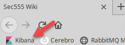
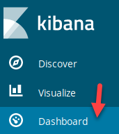
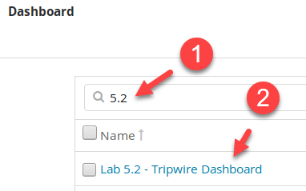
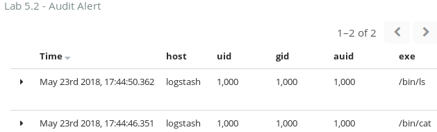
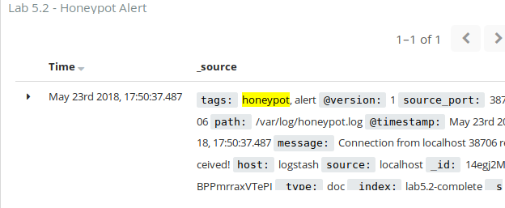

# Lab 5.2 - Virtual Tripwires

## Objectives

- Implement tripwire logs to catch adversary and malware

- Understand and apply multiple techniques to identify abnormal endpoint use

- Identify internal attacker reconnaissance behavior

- Implement high fidelity alerts for early detection

## Exercise Preparation

Log into the Sec-555 VM

- Username: student

- Password: sec555

Open a **terminal** by clicking on the terminal icon at the top of your student desktop.  


## Exercises

This lab focuses on using Linux auditing to implement log tripwires. For this lab, you will need to use the command **auditctl** or save audit rules to **/etc/audit/rules.d**. The recommendation is to use **auditctl**.

### Monitor /etc/group

Create an audit rule to monitor for read attempts against **/etc/group**

??? tip "Solution"
    The command **auditctl** can be used to implement auditing rules. To audit read attempts against **/etc/group,** run the below command.  

    ```bash
    sudo auditctl -w /etc/group -p war -k group-file
    ```

    !!! note
        This command implements a watch (**-w**) against **/etc/group** and monitor for any read (**-r**), write (**-w**), or attribute modifications (**-a**) against **/etc/group**. It also classifies any logs as **group-file** using **-k**. **auditctl** is the command line utility for managing **Auditd**.  

    Verify this is working by performing the below steps. First, run this command:  

    ```bash
    sudo tail -f /var/log/audit/audit.log
    ```

    !!! note
        tail -f is used to monitor data added to a file continuously.

    You should see output similar to below.  

    ```bash
    type=CRED_REFR msg=audit(1527120517.489:50): pid=53084 uid=0 auid=1000 ses=14 msg='op=PAM:setcred acct="root" exe="/usr/bin/sudo" hostname=? addr=? terminal=/dev/pts/0 res=success'
    type=USER_START msg=audit(1527120517.489:51): pid=53084 uid=0 auid=1000 ses=14 msg='op=PAM:session_open acct="root" exe="/usr/bin/sudo" hostname=? addr=? terminal=/dev/pts/0 res=success'
    type=USER_START msg=audit(1527120534.346:52): pid=53099 uid=1000 auid=4294967295 ses=4294967295 msg='op=PAM:session_open acct="root" exe="/usr/bin/pkexec" hostname=? addr=? terminal=? res=success'
    type=SYSCALL msg=audit(1527120534.346:53): arch=c000003e syscall=257 success=yes exit=8 a0=ffffff9c a1=7fb53d6aa215 a2=80000 a3=0 items=1 ppid=3460 pid=53099 auid=4294967295 uid=1000 gid=1000 euid=0 suid=0 fsuid=0 egid=1000 sgid=1000 fsgid=1000 tty=(none) ses=4294967295 comm="pkexec" exe="/usr/bin/pkexec" key="group-file"
    type=CWD msg=audit(1527120534.346:53): cwd="/home/student"
    type=PATH msg=audit(1527120534.346:53): item=0 name="/etc/group" inode=2110910 dev=08:01 mode=0100644 ouid=0 ogid=0 rdev=00:00 nametype=NORMAL cap_fp=0000000000000000 cap_fi=0000000000000000 cap_fe=0 cap_fver=0
    type=PROCTITLE msg=audit(1527120534.346:53): proctitle=706B65786563002F7573722F6C69622F7570646174652D6E6F7469666965722F7061636B6167652D73797374656D2D6C6F636B6564
    ```

    Now open another terminal. For visual effect, open a **purple terminal**.  

      

    While in the **purple terminal**, run this command:  

    ```bash
    cat /etc/group
    ```

    Back in the **black terminal**, you should see something like this:  

    ```bash
    type=SYSCALL msg=audit(1527120700.856:70): arch=c000003e syscall=257 success=yes exit=15 a0=ffffff9c a1=7f8788b65215 a2=80000 a3=0 items=1 ppid=3598 pid=53348 auid=1000 uid=1000 gid=1000 euid=1000 suid=1000 fsuid=1000 egid=1000 sgid=1000 fsgid=1000 tty=(none) ses=14 comm="pool" exe="/usr/lib/gnome-terminal/gnome-terminal-server" key="group-file"
    type=CWD msg=audit(1527120700.856:70): cwd="/labs"
    type=PATH msg=audit(1527120700.856:70): item=0 name="/etc/group" inode=2110910 dev=08:01 mode=0100644 ouid=0 ogid=0 rdev=00:00 nametype=NORMAL cap_fp=0000000000000000 cap_fi=0000000000000000 cap_fe=0 cap_fver=0
    type=PROCTITLE msg=audit(1527120700.856:70): proctitle="/usr/lib/gnome-terminal/gnome-terminal-server"
    type=SYSCALL msg=audit(1527120703.846:71): arch=c000003e syscall=257 success=yes exit=3 a0=ffffff9c a1=7fffa47723cd a2=0 a3=0 items=1 ppid=53348 pid=53357 auid=1000 uid=1000 gid=1000 euid=1000 suid=1000 fsuid=1000 egid=1000 sgid=1000 fsgid=1000 tty=pts1 ses=14 comm="cat" exe="/bin/cat" key="group-file"
    type=CWD msg=audit(1527120703.846:71): cwd="/labs"
    type=PATH msg=audit(1527120703.846:71): item=0 name="/etc/group" inode=2110910 dev=08:01 mode=0100644 ouid=0 ogid=0 rdev=00:00 nametype=NORMAL cap_fp=0000000000000000 cap_fi=0000000000000000 cap_fe=0 cap_fver=0
    type=PROCTITLE msg=audit(1527120703.846:71): proctitle=636174002F6574632F67726F7570
    ```

    In the **black terminal**, press **CTRL + C** to stop tailing the **/var/log/audit/audit.log** file.  

    Keep both terminals open for the remainder of this lab.  

    !!! note
        Monitoring **/etc/group** is being used to simulate an attacker looking for privileged group members. It is like monitoring Windows groups. The main difference is attempts to read any group will be recorded where in Windows you can monitor read attempts against specific groups.

### Monitor /opt/confidential

Create a folder called **confidential** in **/opt**. Then create an audit rule to monitor for read attempts against this folder

??? tip "Solution"
    First, create the **/opt/confidential** directory by running these commands in the **black terminal**:  

    ```bash
    sudo mkdir /opt/confidential
    ```

    ```bash
    sudo chmod 744 /opt/confidential
    ```

    Then create another audit rule using this command in the **black terminal**:  

    ```bash
    sudo auditctl -w /opt/confidential -p r -k confidential-file
    ```

    Once more, verify this is working. In the **black terminal**, run this command:  

    ```bash
    sudo tail -f /var/log/audit/audit.log
    ```
    
    Switch to the **purple terminal** and attempt to list files in the **/opt/confidential** directory using:  

    ```bash
    ls /opt/confidential
    ```

    The **black terminal** should show a log being generated for the access attempt against **/opt/confidential**.  

    ```bash
    type=SYSCALL msg=audit(1527120759.200:133): arch=c000003e syscall=257 success=yes exit=3 a0=ffffff9c a1=55ff8bb6f4e0 a2=90800 a3=0 items=1 ppid=53348 pid=53444 auid=1000 uid=1000 gid=1000 euid=1000 suid=1000 fsuid=1000 egid=1000 sgid=1000 fsgid=1000 tty=pts1 ses=14 comm="ls" exe="/bin/ls" key="confidential-file" type=CWD msg=audit(1527120759.200:133): cwd="/labs" type=PATH msg=audit(1527120759.200:133): item=0 name="/opt/confidential" inode=1837675 dev=08:01 mode=040744 ouid=0 ogid=0 rdev=00:00 nametype=NORMAL cap_fp=0000000000000000 cap_fi=0000000000000000 cap_fe=0 cap_fver=0 type=PROCTITLE msg=audit(1527120759.200:133): proctitle=6C73002D2D636F6C6F723D6175746F002F6F70742F636F6E666964656E7469616C
    ``` 

    In the **black terminal**, press **CTRL + C** to stop tailing the **/var/log/audit/audit.log** file.

### Create netcat honeypot

Create a **netcat** listener that listens on port **8081** and logs to **/var/log/honeypot.log**

??? tip "Solution"
    !!! note
        Netcat** is a tool built into almost every Linux operating system. In this lab, it is being used to emulate a virtual honeypot by listening on port **8081**. In this case, port **8081** should never be accessed on this machine.  
    To run **netcat** and have it output to **/var/log/honeypot.log**, run these commands in the **black terminal**:

    ```bash
    sudo touch /var/log/honeypot.log
    ```

    ```bash
    sudo chmod 777 /var/log/honeypot.log
    ```
    
    ```bash
    nc -lvkp 8081 > /var/log/honeypot.log 2>&1
    ```
    
    !!! note
        The command **touch** is used to create an empty file. To allow a standard user to write to **/var/log/honeypot.log,** the command **chmod 777 /var/log/honeypot.log** is used. **777** allows any user to write to **honeypot.log**. You would want to lock this down and use a service account in production. Netcat is used with the following switches:  

        - **-l** is used to listen on a port  
        - **-v** makes the output verbose  
        - **-k** means to listen continuously  
        - **-p** specifies the port to listen on  

        Also, the reason **2\>&1** is required is **nc** output will not save to the file without it. In this case, the number **2** means **STDERR** output and the number **1** means **STDOUT** output. **2\>&1** tells the output to include both in one output.  

    Switch to the **purple terminal** and perform a port scan of port **8081**.  

    ```bash
    nmap -p 8081 127.0.0.1
    ```

    Verify this was logged by **netcat**. In the **purple terminal**, run the below command.

    ```bash
    cat /var/log/honeypot.log
    ```
    
    You should see output like this:  

    ```bash
    Listening on [0.0.0.0] (family 0, port 8081)
    Connection from localhost 38250 received!
    ```

    In the **black terminal**, press **CTRL + C** to stop **netcat**.

### Collect tactical logs

Ingest the log files at **/var/log/audit/audit.log** and **/var/log/honeypot.log**

- Parse the logs

- Tag unauthorized access as alert

??? tip "Solution"
    Now that logs are properly being generated, it is time to simulate central collection of the logs. To do this, create a **Logstash** configuration file at **/labs/5.2/student/ingest.conf.** To do this, run the below command in the **black terminal**.  

    ```bash
    code /labs/5.2/student/ingest.conf
    ```
    
    Enter the below **Logstash** configuration. (You can also copy this from **/labs/5.2/files/step4.conf**)

    ```javascript
    input {
      file {
        path => "/var/log/audit/audit.log"
        tags => "audit"
      }
      file {
        path => "/var/log/honeypot.log"
        tags => "honeypot"
      }
    }
    filter {
      if "audit" in [tags] {
        mutate {
          gsub => [ "message", "type=", "audit_type=" ]
        }
        kv { source => "message" }
        mutate {
          convert => [ "auid", "integer" ]
          convert => [ "egid", "integer" ]
          convert => [ "euid", "integer" ]
          convert => [ "gid", "integer" ]
          convert => [ "pid", "integer" ]
          convert => [ "ppid", "integer" ]
          convert => [ "sgid", "integer" ]
          convert => [ "suid", "integer" ]
          convert => [ "uid", "integer" ]
          rename => [ "comm", "command" ]
          add_tag => [ "alert" ]
        }
        if [uid] == 0 { drop { } }
        if [exe] == "/usr/bin/sudo" or [exe] == "/bin/su" { drop { } }
        if [audit_type] != "SYSCALL" { drop { } }
      }
      if "honeypot" in [tags] {
        if [message] =~ "^Listening on " or [message] =~ "^Connection closed" {
          drop {}
        } else {
          grok { match => { "message" => "^Connection from (%{IP:source_ip})?(%{WORD:source})? %{INT:source_port} received!" } }
          mutate { add_tag => [ "alert" ] }
        }
      }
    }
    output {
      elasticsearch {
        hosts => "elasticsearch" 
        index => "lab5.2-complete" 
      }
    }
    ```

    !!! note
        **gsub** is used to replace **type=** with **audit\_type=.** If you did not do this, then logs with a type of **audit** would get their type value changed. The reason for dropping certain audit logs is because built-in functionality regularly queries **/etc/group** as **uid 0**. Plus, using **sudo** or **su** requires checking **/etc/group**.  

    **Save the file** and close out of **Visual Studio Code**. Now run **Logstash** in the **black terminal** with the following parameters:  

    ```bash
    logstash -f /labs/5.2/student/ingest.conf
    ```

    The above command is a one-line command. Wait for Logstash to state, "**Pipelines running**." Leave **Logstash** running in the **black terminal** and move on to **step 5**.

    !!! warning
        Do not continue until Logstash is fully running and you see "**Pipelines running**." Failure to do so will cause Logstash to ignore previously written logs if you run commands in the next step before it was up and running.

### Verify tactical logging works

Verify that alerts are being generated for attempts to access **/etc/group**, **/opt/confidential**, and port **8081**

??? tip "Solution"
    Open a **third terminal**.

    

    In this **third terminal**, run the below commands:

    ```bash
    sudo rm /var/log/honeypot.log
    ```
    
    ```bash
    sudo touch /var/log/honeypot.log
    ```
    
    ```bash
    sudo chmod 777 /var/log/honeypot.log
    ```
    
    ```
    nc -lvkp 8081 > /var/log/honeypot.log 2>&1
    ```
    
    In the **purple terminal**, run the following commands:  

    ```bash
    cat /etc/group
    ```
    
    ```bash
    nmap -p 8081 127.0.0.1
    ```
    
    ```bash
    ls /opt/confidential
    ```
    
    Now open **Firefox** to access **Kibana**.

     

    When **Firefox** loads, **click** on the **Kibana** bookmark to load **Kibana**.  

    

    Within **Kibana**, click on **Dashboard**.  

    

    If a previous dashboard is displayed, **click** on **Dashboard** in the top left corner.  

    

    Type in **5.2** in the dashboard Search filter section and then **click** on **Lab 5.2 - Tripwire Dashboard**.  

    

    You should now see alerts related to accessing **/etc/group**, **/opt/confidential**, and **port** **8081**.  

      

    !!! note
        **Lab 5.2 - Audit Alert** is a table showing all the alerts related to targeted **audit** events.  

      

    !!! note
        **Lab 5.2 - Honeypot Alert** is a table showing all the alerts related to honeypot access. It is a simple table showing what IP addresses have attempted to access the honeypot.

<h2 id="video"> Step-by-Step Video Instructions </h2>

<iframe class="tscplayer_inline" id="embeddedSmartPlayerInstance" src="../../../../Videos/555_5/2/lab5.2_player.html?embedIFrameId=embeddedSmartPlayerInstance" scrolling="no" frameborder="0" webkitAllowFullScreen mozallowfullscreen allowFullScreen></iframe>

## Lab Conclusion

In this lab, you have implemented tripwires for high fidelity detection and alerting. This included:

- Using **Auditd** to monitor key files

- Using **netcat** as a honeypot

- Implementing log collection of tripwire logs

- Manually testing tripwire techniques

- Viewing tripwire logs

**Lab 5.2 is now complete**\!

<link href="../../../../Videos/555_5/2/skins/remix/techsmith-smart-player.min.css" rel="stylesheet" type="text/css" />
<link href="../../../../Videos/555_5/2/lab5.2_embed.css" rel="stylesheet" type="text/css">
