# Lab 5.3 - Beacon Detection

## Objectives

- Learn how to use historical logs to catch post compromise activity

- Learn what command and control beaconing is

- Apply visual detection methods to identify beaconing

- Use advanced tools for automatic beacon detection

- Configure and use **Flare**

## Exercise Preparation

Log into the Sec-555 VM

- Username: student

- Password: sec555

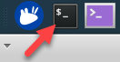  

**Flare** is installed and can be run using the **flare\_beacon** command. You can find the command line options by running the command below.  

```bash
$ flare_beacon -h
```

You will need it for this lab. This lab uses data from the **lab5.1-complete-suricata** index.

## Exercises

Use **Flare** to identify command and control beaconing.

### Configure flare

Configure **Flare** to use the index **lab5.1-complete-suricata** (Data captured from the previous lab will be used to demonstrate how automated tools can help find certain attack patterns such as beaconing)

??? tip "Solution"
    Identify beaconing can seem overly complicated. This lab is designed to show you how to do it for free as well as show you how easy it is to set up. This lab uses data captured in lab 5.1. First, make a copy of the default **Flare** configuration file.

    ```bash
    $ mkdir /labs/5.3/student
    $ cp /labs/5.3/files/elasticsearch.ini /labs/5.3/student/flare.ini
    ```
    
    Next, open it with the **Visual Studio Code Editor**.  

    ```bash
    $ code /labs/5.3/student/flare.ini
    ```
    
    The values displayed are the default settings. These assume **Suricata** logs are being stored in an index called **logstash-flow-\*** and follow the traditional **Suricata** field names.  

    ```bash
    [beacon]
    es_host=localhost
    es_index=logstash-flow-*
    es_port=9200
    es_timeout=480
    min_occur=10
    min_interval=30
    min_percent=5
    window=2
    threads=8
    period=24
    kibana_version=5
    verbose=true

    #Elasticsearch fields for beaconing
    field_source_ip=src_ip
    field_destination_ip=dest_ip
    field_destination_port=dest_port
    field_timestamp=@timestamp
    field_flow_bytes_toserver=bytes_toserver
    field_flow_id=flow_id

    #Authentication
    username=''
    password=''

    #set to false if using suricata defaults if you have custom fields
    suricata_defaults = false
    ```

    However, **lab5.1-complete-suricata** is a different index and uses different field names. Also, the data in **lab5.1-complete-suricata** is older than 24 hours. This means **index** and **period** need changing as well as the **Elasticsearch field names**. To update this, change the configuration file to look like this:  

    ```bash
    [beacon]
    es_host=elasticsearch
    es_index=lab5.1-complete-suricata
    es_port=9200
    es_timeout=480
    min_occur=10
    min_interval=30
    min_percent=50
    window=2
    threads=8
    period=99999
    kibana_version=5
    verbose=true

    #Elasticsearch fields for beaconing
    field_source_ip=source_ip
    field_destination_ip=destination_ip
    field_destination_port=destination_port
    field_timestamp=@timestamp
    field_flow_bytes_toserver=bytes_to_server
    field_flow_id=flow_id

    #Authentication
    username=""
    password=""

    #set to false if using suricata defaults if you have custom fields
    suricata_defaults = false
    ```
    
    !!! note
        The following fields have changes made to them in **flare.ini**:  

        - **es\_host**
        - **es\_index**
        - **period** (This was changed to 26280 so that flare searching data up to 3 years old.)
        - **min\_percent** (This was changed to 50, so it will only show systems that 50% of their traffic is beacons)  
        - **field\_source\_ip**
        - **field\_destination\_ip**
        - **field\_destination\_port**  
        - **field\_flow\_bytes\_toserver** (there is an extra underscore added between **to** and **server**)

    Save the file by either using **CTRL + S** or clicking **File -\> Save**. Then **close** out of **Visual Studio Code** by clicking the **X** in the top-right corner.  

      

    At this point, you are done configuring **Flare**.

### Identify beacons with flare

Use **Flare** to identify the IP addresses that are beaconing with a high percentage of beacon traffic

??? tip "Solution"
    **Flare** has many options and extra capabilities to help analysts analyze beacons. To see all these options, run **Flare** with -h as follows:  

    ```bash
    $ flare_beacon -h
    ```
    
    Specifically, the following options are of interest:  

    -gr or --group This switch will group results together for easier handling by an analyst  
    -who or --whois This will provide whois information about beacons in question  
    -fo or --focus\_outbound This will remove private IP and multicast IP addresses from analysis  
    -csv or --csv\_out This outputs the results to CSV (can be used to import data into a SIEM)  
    -html or --html\_out This outputs the results to an HTML file for easy analyst viewing  

    Now run **Flare** with the configuration file you previously created.  

    ```bash
    $ flare_beacon -c /labs/5.3/student/flare.ini --focus_outbound --whois --group --html=/labs/5.3/student/beacons.html
    ```
    
    !!! note
        This command should be running all as one line.  

    Now use **Firefox** to open the output file **Flare** created.  

    ```bash
    $ firefox /labs/5.3/student/beacons.html
    ```
    
    The output should show the following:  

    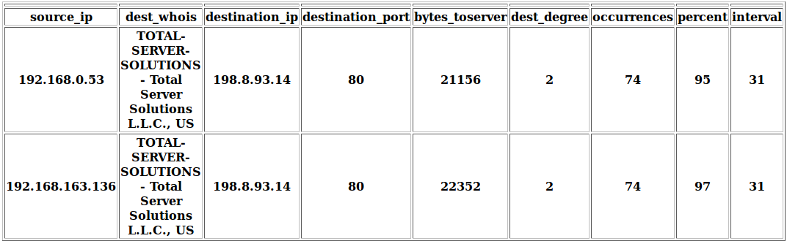  

    This output is stating that **192.168.0.53** and **192.168.163.136** are regularly communicating with **198.8.93.14** in **31**-second intervals.  

    **Note**: Here is a breakdown of the right most columns:  

    - **dest\_degree**: This is how many systems are talking to the same **destination\_ip**  
    - **occurences** This is how many times the source ip connected to the destination ip   
    - **percent**: This is how much of the overall traffic between the **source\_ip** and **destination\_ip** is beaconing in accordance with the interval detected  
    - **interval**: This is how many seconds occurs between each beacon  

    **Answer**: Given such a high percent score, **192.168.0.53** and **192.168.163.136** are beaconing to **198.8.93.14**.  

    Do not close **Firefox**. If you have, reopen for the next step.  

    

### Identify beacons manually

Use **Kibana** to identify the beaconing activity visually

??? tip "Solution"
    **Trust but verify is always a good idea. In **Firefox**, click on
    the **Kibana** bookmark to load **Kibana**.  

    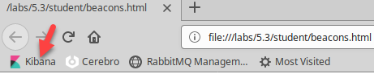  

    Switch to the **Discover** section.  

    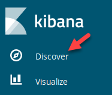  

    Select the **lab5.1-complete-\*** index by clicking on the drop-down and then typing **5.1** and then clicking on **lab5.1-complete-\***.  

    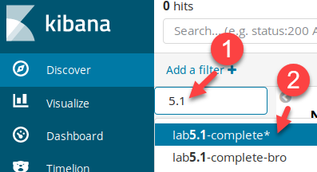  

    Make sure to change your time field before moving on. Do this by clicking on the **date picker** in the top-right corner.  

    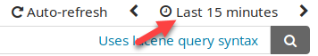

    Then click on **Absolute** and set **From** to **2017-05-02 23:00:00** and **To** to **2017-05-03 01:00:00**. Then click on **Go**.  

    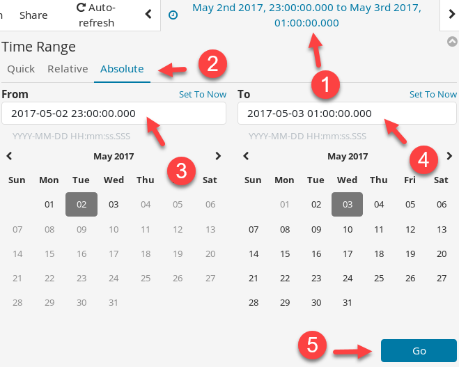  

    Now search for traffic sourcing from **192.168.0.53** going to **198.8.93.14** over port **80**. **198.8.93.14** is one of the results from **Flare**. Do this by specifying a search filter of **event\_type.keyword:flow AND source\_ip:192.168.0.53 AND destination\_ip:198.8.93.14 AND destination\_port:80**  

    ```bash
    event_type.keyword:flow AND source_ip:192.168.0.53 AND destination_ip:198.8.93.14 AND destination_port:80
    ```
    
      

    The results should look like this:  

    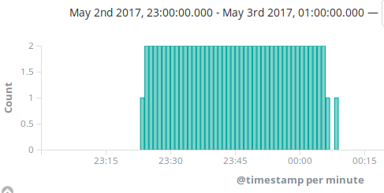  

    This somewhat looks like beaconing. However, it does not exactly represent beaconing. This is because the current view is breaking logs out in increments of **15** **minutes**. Carefully drag your mouse from the beginning of the vertical bars to the end. It should highlight the area you want to drill down into like the picture below.  

    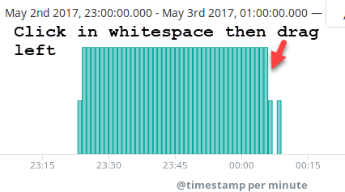  

    When you let go of your mouse, you should see something like this:  

    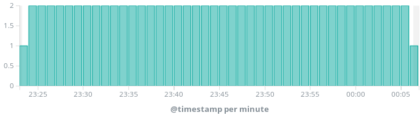

    This does look like beaconing. However, **Flare** identified the beacons as every **30** **seconds,** and this still breaks logs down **every minute or every couple of minutes**. Highlight a midsection of the logs again until the **@timestamp** is broken down by **30 seconds**.  

    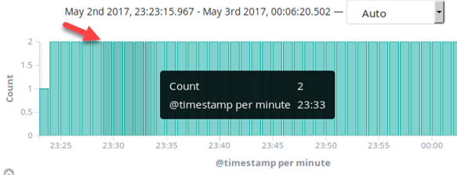  

    Once the **@timestamp reflects per 30 seconds,** you should see something like below.

    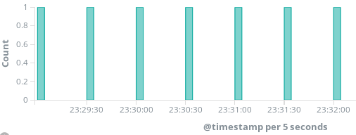  

    This reflects that a connection is being made every **30 seconds** just as flare calculated. This is what a beacon looks like on a graph. However, since logs are typically looked at over larger time spans, analysts do not see this type of repetition. Change your search filter so that the **source\_ip** is **192.168.163.136** instead of **192.168.0.53.**  

    ```bash
    event_type.keyword:flow AND source_ip:192.168.163.136 AND destination_ip:198.8.93.14 AND destination_port:80
    ```
    
      

    Upon hitting search, you once again should see a perfect repetition
    proving **Flare** was also right about **192.168.163.136**.  

    **Answer**: Both **192.168.163.136** and **192.168.0.53** are beaconing to **198.8.93.14** over port **80**. When looked at with **Kibana**, the beaconing can be discovered due to its repetition and near perfect timing. This type of beaconing activity looks like this:  

    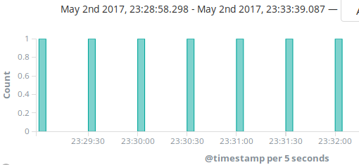

<h2 id="video"> Step-by-Step Video Instructions </h2>

<iframe class="tscplayer_inline" id="embeddedSmartPlayerInstance" src="../../../../Videos/555_5/3/lab5.3_player.html?embedIFrameId=embeddedSmartPlayerInstance" scrolling="no" frameborder="0" webkitAllowFullScreen mozallowfullscreen allowFullScreen></iframe>

## Lab Conclusion

In this lab, you investigated command and control beaconing events. This included:

- Identifying what beaconing looks like

- Configuring **Flare** to point to a custom index

- Running **Flare** and processing the results

- Visualizing beaconing to prove **Flare** correctly identified beaconing behavior

**Lab 5.3 is now complete**\!

<link href="../../../../Videos/555_5/3/skins/remix/techsmith-smart-player.min.css" rel="stylesheet" type="text/css" />
<link href="../../../../Videos/555_5/3/lab5.3_embed.css" rel="stylesheet" type="text/css">
