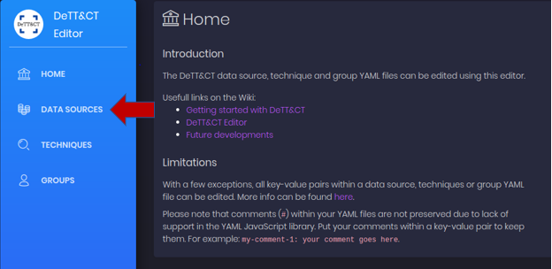
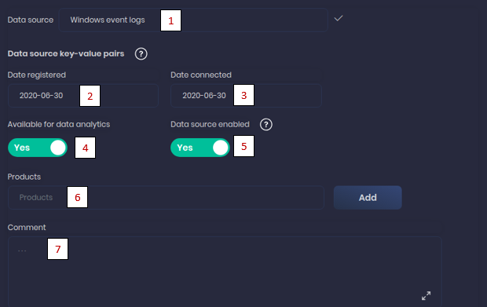
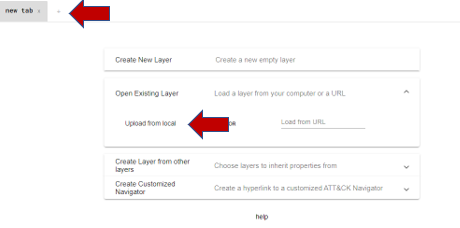
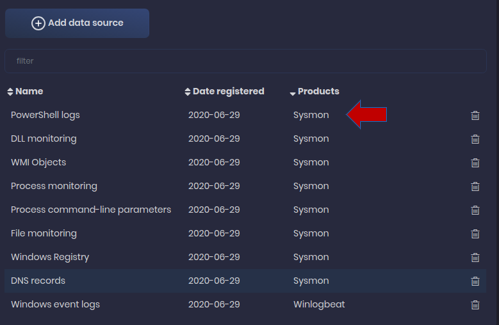
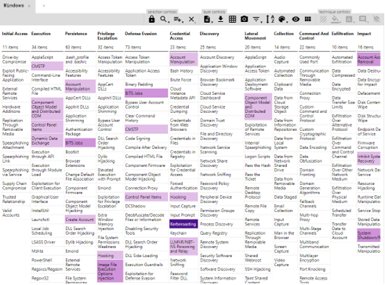
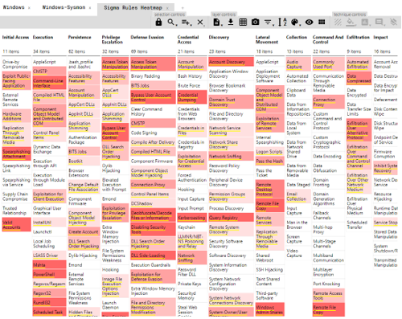

# Lab SIGMA Rules - Security Engineer

## Objectives

- Review SIGMA rule structure

- Convert rules to different alerting platforms

- Learn how to add context to rules

- Establish a process for mass rule management


## Exercise Preparation

Log into the Sec-555 VM

- Username: student

- Password: sec555


## Exercises

### Review SIGMA rule structure

SIGMA provides a structure by which detection rules can be written in a generic form. The example below shows the core structure of a SIGMA rule. 

```yaml
title: Suspicious Scripting in a WMI Consumer
id: fe21810c-2a8c-478f-8dd3-5a287fb2a0e0
status: experimental
description: Detects suspicious scripting in WMI Event Consumers
references:
    - https://in.security/an-intro-into-abusing-and-identifying-wmi-event-subscriptions-for-persistence/
    - https://github.com/Neo23x0/signature-base/blob/master/yara/gen_susp_lnk_files.yar#L19
date: 2019/04/15
tags:
    - attack.t1086
    - attack.execution
logsource:
   product: windows
   service: sysmon
detection:
    selection:
        EventID: 20
        Destination:
            - '*new-object system.net.webclient).downloadstring(*'
            - '*new-object system.net.webclient).downloadfile(*'
            - '*new-object net.webclient).downloadstring(*'
            - '*new-object net.webclient).downloadfile(*'
            - '* iex(*'
            - '*WScript.shell*'
            - '* -nop *'
            - '* -noprofile *'
            - '* -decode *'
            - '* -enc *'
    condition: selection
fields:
    - CommandLine
    - ParentCommandLine
falsepositives:
    - Administrative scripts
level: high
```

**Key Components**

- Tags - Includes the MITRE Attack mappings
- Log Source - Defines the type of log data this rule is written for
- Detection - Provides the core of the rule by including the syntax that the rule will alert on
- Fields - Lists the field names that will be queried in the detection syntax 
- Level - Sets a user-defined rating on the severity if this rule is triggered

Below is the rule after it has been converted to ElastAlert format.

```yaml
alert:
- debug
description: Detects suspicious scripting in WMI Event Consumers
filter:
- query:
    query_string:
      query: (winlog.channel:"Microsoft\-Windows\-Sysmon\/Operational" AND winlog.event_id:"20" AND Destination.keyword:(*new\-object\ system.net.webclient\).downloadstring\(* OR *new\-object\ system.net.webclient\).downloadfile\(* OR *new\-object\ net.webclient\).downloadstring\(* OR *new\-object\ net.webclient\).downloadfile\(* OR *\ iex\(* OR *WScript.shell* OR *\ \-nop\ * OR *\ \-noprofile\ * OR *\ \-decode\ * OR *\ \-enc\ *))
index: winlogbeat-*
name: fe21810c-2a8c-478f-8dd3-5a287fb2a0e0_0
priority: 2
realert:
  minutes: 0
type: any
```

As you can see, this rule still contains the core information provided by the SIGMA rule above, but the format has changed drastically.

**Key Components**

- Filter - Contains the necessary Lucene syntax to match the information provided in the Detection section of the SIGMA rule
- Index - Points at the index the rule should run the filter query against
- Priority - Sets the user-defined rating on the severity of the rule

Key change during the conversion is that the MITRE Attack tags were not carried over to the ElastAlert rule.

### Convert rules to different alerting platforms

While SIGMA provides a standardized structure for detection rules to be written, it requires that rules to be converted to be leveraged by your SIEM. Choose one of the following formats and manually convert the rule. 

**Elasticsearch**

```yaml
cd /lab/sigma/tools

sigmac -I -t es-rule -c /labs/sigma/tools/config/winlogbeat.yml /labs/sigma/rules/windows/sysmon/sysmon_wmi_susp_scripting.yml
```
*Output
```yaml
{"description": "Detects suspicious scripting in WMI Event Consumers", "enabled": true, "false_positives": ["Administrative scripts"], "filters": [], "from": "now-360s", "immutable": false, "index": ["winlogbeat-*"], "interval": "5m", "rule_id": "suspicious_scripting_in_a_wmi_consumer", "language": "lucene", "output_index": ".siem-signals-default", "max_signals": 100, "risk_score": 73, "name": "Suspicious Scripting in a WMI Consumer", "query": "(winlog.channel:\"Microsoft\\-Windows\\-Sysmon\\/Operational\" AND winlog.event_id:\"20\" AND Destination.keyword:(*new\\-object\\ system.net.webclient\\).downloadstring\\(* OR *new\\-object\\ system.net.webclient\\).downloadfile\\(* OR *new\\-object\\ net.webclient\\).downloadstring\\(* OR *new\\-object\\ net.webclient\\).downloadfile\\(* OR *\\ iex\\(* OR *WScript.shell* OR *\\ \\-nop\\ * OR *\\ \\-noprofile\\ * OR *\\ \\-decode\\ * OR *\\ \\-enc\\ *))", "references": ["https://in.security/an-intro-into-abusing-and-identifying-wmi-event-subscriptions-for-persistence/", "https://github.com/Neo23x0/signature-base/blob/master/yara/gen_susp_lnk_files.yar#L19"], "meta": {"from": "1m"}, "severity": "high", "tags": ["attack.t1086", "attack.execution"], "to": "now", "type": "query", "threat": [{"tactic": {"id": "TA0002", "reference": "https://attack.mitre.org/tactics/TA0002", "name": "Execution"}, "framework": "MITRE ATT&CK", "technique": [{"id": "T1086", "name": "PowerShell", "reference": "https://attack.mitre.org/techniques/T1086"}]}], "version": 1}

```
**ElastAlert** 

```yaml
cd /lab/sigma/tools

sigmac -I -t elastalert -c /labs/sigma/tools/config/winlogbeat.yml /labs/sigma/rules/windows/sysmon/sysmon_wmi_susp_scripting.yml
```
*Output
```yaml
alert:
- debug
description: Detects suspicious scripting in WMI Event Consumers
filter:
- query:
    query_string:
      query: (winlog.channel:"Microsoft\-Windows\-Sysmon\/Operational" AND winlog.event_id:"20" AND Destination.keyword:(*new\-object\ system.net.webclient\).downloadstring\(* OR *new\-object\ system.net.webclient\).downloadfile\(* OR *new\-object\ net.webclient\).downloadstring\(* OR *new\-object\ net.webclient\).downloadfile\(* OR *\ iex\(* OR *WScript.shell* OR *\ \-nop\ * OR *\ \-noprofile\ * OR *\ \-decode\ * OR *\ \-enc\ *))
index: winlogbeat-*
name: fe21810c-2a8c-478f-8dd3-5a287fb2a0e0_0
priority: 2
realert:
  minutes: 0
type: any
```
**Splunk**

```yaml
cd /lab/sigma/tools

sigmac -I -t splunk -c /labs/sigma/tools/config/splunk-windows.yml /labs/sigma/rules/windows/sysmon/sysmon_wmi_susp_scripting.yml
```
*Output
```yaml
(source="WinEventLog:Microsoft-Windows-Sysmon/Operational" EventCode="20" (Destination="*new-object system.net.webclient).downloadstring(*" OR Destination="*new-object system.net.webclient).downloadfile(*" OR Destination="*new-object net.webclient).downloadstring(*" OR Destination="*new-object net.webclient).downloadfile(*" OR Destination="* iex(*" OR Destination="*WScript.shell*" OR Destination="* -nop *" OR Destination="* -noprofile *" OR Destination="* -decode *" OR Destination="* -enc *")) | table CommandLine,ParentCommandLine
```

As you can see as you run the command you receive the converted rule as a text output to the screen. Depending on the solution you chose, you would be able to create the rule in SIEM solution. 

### Learn how to add context to rules

In the first section of this lab, we reviewed a SIGMA rule and compared it to an ElastAlert rule after it had been converted. One of the core differences was that the ElastAlert rule no longer contained the MITRE Attack tags. This is a valuable piece of information. Now let us fix Sigmac to bring over the MITRE tag enrichment. 

```bash
code /lab/sigma/tools/sigma/backends/elasticsearch.py
```

Press CTRL + g and then type in 965. Press Enter

Add the following below the line that starts with "realert":

```bash
"mitre": rule_tag,
```
!!! note The comma behind rule_tag is required

Save the File

Now that we have modified this file lets go back and rerun the conversion tool for the rule.

**ElastAlert** 

```
cd /lab/sigma/tools
sigmac -I -t elastalert -c /labs/sigma/tools/config/winlogbeat.yml /labs/sigma/rules/windows/sysmon/sysmon_wmi_susp_scripting.yml
```
*Output
```yaml
alert:
- debug
description: Detects suspicious scripting in WMI Event Consumers
filter:
- query:
    query_string:
      query: (winlog.channel:"Microsoft\-Windows\-Sysmon\/Operational" AND winlog.event_id:"20" AND Destination.keyword:(*new\-object\ system.net.webclient\).downloadstring\(* OR *new\-object\ system.net.webclient\).downloadfile\(* OR *new\-object\ net.webclient\).downloadstring\(* OR *new\-object\ net.webclient\).downloadfile\(* OR *\ iex\(* OR *WScript.shell* OR *\ \-nop\ * OR *\ \-noprofile\ * OR *\ \-decode\ * OR *\ \-enc\ *))
index: winlogbeat-*
mitre:
- attack.t1086
- attack.execution
name: fe21810c-2a8c-478f-8dd3-5a287fb2a0e0_0
priority: 2
realert:
  minutes: 0
type: any
```
Your rule should now contain the MITRE Attack tagging which will enrich this alert during threat hunting.

### Establish a process for mass rule management

Now with the ability to not only convert a SIGMA rule to the correct platform but also enrich it via the MITRE attack framework, we are ready to mass convert the rules and start alerting. The challenge we face is that the Sigmac commands will only covert the rules to a single file so we will need to leverage a little scripting to pull this off. 

Below we will walk through the script to point out a few of the functions. The first is the basic setup where you can define the location of the footer file, which contains alerting information that will be appended to the rules as well as where the rules should be placed once converted. 

```python
#!/bin/bash
ALERTENGINE="elastalert"
TEMPLATE="winlogbeat"
FOOTERFILE="/lab/sigma/elastalert/footer.yml"
SIGMAFOLDER="/lab/sigma"
FOLDER="/lab/sigma/rules/windows"
OUTPUTFOLDER="/lab/sigma/elastalert/testing"
MITRECONVERTTOOL="/lab/sigma/elastalert/elastalert2attack"

PRODUCTIONRULEFOLDER="/lab/sigma/elastalert/rules/sigma"
MANUALREVIEWFOLDER="/lab/sigma/elastalert/review/manual"
SLOWRULEFOLDER="/lab/sigma/elastalert/review/slow"

# Enable or disable which steps you want performed
PREREQ=1
CONVERT=1
REMOVEOLDRULES=1
TESTRULES=1
MITREMAP=1
```

This next section does a quick precheck to ensure all the correct files and programs are in place for the script to work.

```python
# Do not change variables below this line unless you know what you are doing
SIGMAC="${SIGMAFOLDER}/tools/sigmac"

# Prerequisite check
if [[ "$PREREQ" == 1 ]]; then
  if [ $(dpkg-query -W -f='${Status}' git 2>/dev/null | grep -c "ok installed") -eq 0 ];
  then
    echo "Installing git"
    apt install -y git
  else
    echo "Git is already installed"
  fi
  if [ $(snap info jq 2>/dev/null | grep -c "installed") -eq 0 ];
  then
    echo "Installing jq"
    snap install jq
  else
    echo "jq is already installed"
  fi
  if [ $(snap info yq 2>/dev/null | grep -c "installed") -eq 0 ];
  then
    echo "Installing yq"
    snap install yq
  else
    echo "yq is already installed"
  fi

  # First, make sure sigma is downloaded
  if [ -d $SIGMAFOLDER ]
  then
    echo "Sigma folder $SIGMAFOLDER exists. Performing git pull..."
    cd $SIGMAFOLDER
    git pull
  else
    echo "Sigma folder does not exists. Performing git clone..."
    mkdir -p $SIGMAFOLDER
    cd $SIGMAFOLDER
    git clone https://github.com/Neo23x0/sigma.git .
  fi
fi
```

Finally, here comes the magic. The script begins to grab each of the SIGMA rules and converts them to a separate ElastAlert rule file. 

```python
if [[ "$CONVERT" == 1 ]]; then
  if [[ "$REMOVEOLDRULES" == 1 ]]; then
    rm -rf $OUTPUTFOLDER/*
  fi
  FILES=$(find $FOLDER -type f)
  for FILE in $FILES
  do
    FILENAME=$(basename $FILE | cut -d"." -f1)
    ID=$(grep "^id:" $FILE | cut -d":" -f2 | cut -d" " -f2)
    OUTPUTFILE="${FILENAME}_${ID}"
    echo "Processing $FILENAME"
    RULEFILE=$(grep -r $ID /lab/sigma/rules/windows | cut -d":" -f1)
    RULEDESCRIPTION=$(cat $RULEFILE | yq r - description)
    RULEREFERENCES=($(cat $RULEFILE | yq r - references))
    APPENDSTRING=""
    for i in "${RULEREFERENCES[@]}"
    do
      if [[ "$i" != "-" ]]; then
        if [[ "$APPENDSTRING" == "" ]]; then
          APPENDSTRING="$i"
        else
          APPENDSTRING="${APPENDSTRING}<br/>$i"
        fi
      fi
    done
    if [ "${#RULEREFERENCES[@]}" -ge 1 ]; then
      DESCRIPTION="${RULEDESCRIPTION}<br/><br/>${APPENDSTRING}"
    fi
    RULETAGS=$(cat $RULEFILE | yq r - tags | cut -d"." -f2)
    SIGMACOUTPUT=""
    SIGMACOUTPUT=$(python3 $SIGMAC -t $ALERTENGINE -c $TEMPLATE $FILE --output $OUTPUTFOLDER/$OUTPUTFILE.yml 2>&1 > /dev/null)
    if [[ "$SIGMACOUTPUT" != "" ]]; then
      echo "Error encountered: $SIGMACOUTPUT"
      rm -f $OUTPUTFOLDER/$OUTPUTFILE.yml
    else
      cat $FOOTERFILE >> $OUTPUTFOLDER/$OUTPUTFILE.yml
      DESCRIPTION=$(echo $DESCRIPTION | tr "'" '"')
      DESCRIPTION=$(sed -e 's/[\\/"]/\\&/g; s/$/\\/' -e '$s/\\$//' <<<"$DESCRIPTION")
      sed -i -e "s|DESCRIPTIONREPLACEME|$DESCRIPTION|" "$OUTPUTFOLDER/$OUTPUTFILE.yml"
      echo " "
    fi
  done
fi
```

With that completed, the script now goes through the process of launching a docker container of ElastAlert. This container will test each rule to ensure that it runs successfully, quickly, and does not return to many false positives. If a rule fails any of these checks, it is moved to a Manual Review Folder or the Slow Rule Folder. Otherwise, the rule is moved directly to the Production Rule Folder.

```python
if [[ "$TESTRULES" == 1 ]]; then
  if [[ "$REMOVEOLDRULES" == 1 ]]; then
    rm -rf $MANUALREVIEWFOLDER/*
    rm -rf $SLOWRULEFOLDER/*
    rm -rf $PRODUCTIONRULEFOLDER/*
  fi
  TESTINGFILES=$(find $OUTPUTFOLDER -type f)
  for FILE in $TESTINGFILES
  do
    FILENAME=$(basename $FILE | cut -d"." -f1)
    echo "Processing $FILENAME"
    TESTOUTPUT=$(docker run -it --rm --network=lab -v /lab/sigma/elastalert/config/elastalert.yaml:/opt/elastalert/elastalert.yaml -v /lab/sigma/elastalert/testing:/opt/elastalert/rules --entrypoint elastalert-test-rule hasecuritysolutions/elastalert:0.2.2 --config /opt/elastalert/elastalert.yaml --formatted-output /opt/elastalert/rules/${FILENAME}.yml | grep writeback)
    echo "File is ${FILENAME}.yml"
    OUTPUT=$(echo $TESTOUTPUT | jq .)
    TIMETAKEN=$(echo $OUTPUT | jq .writeback.elastalert_status.time_taken)
    MATCHES=$(echo $OUTPUT | jq .writeback.elastalert_status.matches)
    HITS=$(echo $OUTPUT | jq .writeback.elastalert_status.hits)
    echo $OUTPUT
    echo "Time taken is $TIMETAKEN"
    if (( $(echo "$TIMETAKEN > 0" | bc -l) )); then
      GO=1
    else
      GO=0
    fi
```

# Lab 1.1 - SIGMA Rules - Security Manager

## Objectives

- Learn how to map out your visability in your environment

- Compare and contrast the difference Sysmon can make

- Evaluate visibility against the MITRE Attack framework

- Review alert capabilities based on your SIGMA rules

## Exercise Preparation

Log into the Sec-555 VM

- Username: student

- Password: sec555


## Exercises

### Learn how to map out your visability in your environment
One of the most important exercises that often gets overlooked, is evaluating your organization's visiability. To often security appliances are purchased to fill niche gaps for visibility but rarely is there a cohesive evaluation of all data sources. An amazing tool that can help us perform this task is DeTT&CT. You can find more information about this tool as well as guides for installing it in your environment by following the link below. 

`https://github.com/rabobank-cdc/DeTTECT`

Lets walkthrough how you can leverage this tool to provide a true visibility mapping against the MITRE Attack framework. The first step is to click on `Data Sources`.



Select `New file`


Click on `Add Data Source`


You will now have several fields to define what type of data is being collected and to what level logging is being used. 



1. This field contains a wide variety of data sources. You can start typing and it will autocomplete. For this lab we are focusing on Windows logs so we selected Windows Event Logs. 
2. You have the option to define when you registered the data in DeTT&CT
3. You also have the option to define when you started collecting the logs for this data source. 
4. This option defaults to `No` but you can change it to `Yes` if you are actively monitoring the logs. 
5. This allows you to indeicate if you are collecting the logs.
6. This field is optional but it makes it nice to define what sources you are receiving the logs from.  
7. The comments field is for internal notes or additional information you would like to include during this exercise. 

The final section allows us to define the quality of the data that we are collectin. Please note these are qualitative fields so use your best judgement.


1. Device Completeness - Are all Windows devices sending their logs to the SIEM?
2. Data Field Completeness - Are all Windows logs fields being parsed?
3. Timeliness - How quickly are the logs received and ingested into the SIEM?
4. Consistency - Are logs ingested on a regular basis or are their large delays or outages?
5. Retention - How long are the logs retained? 

Please note that every organization will vary in the answers to these questions and your answers will vary between you data sources. When finished modifying these fields `click Add`. 

Now that we have the Windows logs defined as a data source we will generate the YAML file by clicking `Save YamL File`. This will save the file to the input directory that you wil have setup when installing DeTT&ct. 


You will then run the following command to create the .json file we will use to map this data source agianst the MITRE Attack framework. 

```python
NEED SYNTAX FROM 530 LAB TO CONVERT FILE
```

If you browse to the output folder that you specified when setting up DeTT&ct, you will now have a .json file that we can use to visualize the Windows data source against the MITRE Attack framework. Browse to the following URL with this file. 

`https://mitre-attack.github.io/attack-navigator/enterprise/`

At this site you can `click the plus sign` at the top of the website to add a new layer. Then `click Open Existing Layer`. This will give you the option to Upload from a local file. You will need to browse to the location of the .json file you created and select it and click open. 



When you open this file it will now take the data source information that you provided for the data source and map it to the MITRE Attack framework. So for our example we have followed these steps and here is what we see. 


As you can see the darker the purple the more visibility we have for detecting the specific attack. 

### Review logging capabilities and visibility

Windows Event logs are a common data source most organizations have. While they do provide visibility it begs the question if there is more that can be done to increase the detection capabilities. 
 
System Monitor (Sysmon) is a Windows system service and device driver that, once installed on a system, remains resident across system reboots to monitor and log system activity to the Windows event log. Below is an updated DeTTect data source list now that we have Sysmon running on our Windows systems. 



As you can see Sysmon gives us eight additional data sources. When we began to add in the additional data sources, we leveraged the Products field to differentiate where we were gainng the visibility. Let us compare the difference now. 

Here is our initial Windows Event logs.



Now here is Windows Event logs with the additional Sysmon data sources. 


Clearly, adding in the Sysmon data sources for our Windows logs add a major jump in visibility. This simple process is a great way to show the value of making changes to the logging levels or capabilities of the data sources. When walking through this exercise it would be a great time to evaluate the logging capabilities of each data source to see if there were opportunities to gain additional visibility in the logs that you are collecting. 


### Review alert capabilities based on your rules

The final step is to evaluate the alert rules in place for your data sources. To often organizations will excel in having the needed visibility to detect threats but do not have the appropriate rules to actually alert when a threat is present. Thankfully, we can leverage a tool called `Sigmac` to create heatmap of our rules mapped to the Mitre Attack framework. 

Open a terminal window in the student VM and run the following commands to generate the heatmap. 

```yaml
cd /lab/sigma/elastalert

sudo bash convert.sh
```

The script ran through all of the Sigma rules provided by Sigmac and converted them to ElastAlert rules. It then takes the rules and tests them before putting them into a Production Rules folder. The final step of the script creates a heatmap of the rules against the Mitre Attach framework. 

You should now have a heatmap.json file located in `/lab/sigma/elastalert`. You can now take this file and open it in the Att&ck Navigator that we have been using to show our data source visibility. Below is the alert coverage the SIGMAC tool provided us based on the SIGMA rules we had. 



This is very helpful when trying to evaluate what alert rules you have in place and you can quickly flip back and forth between your data source visibility layers to determine if you have the data to be able to create detection rules agianst. 

In the end these exercises will take some effort to complete in your own environment but it is one of the best ways to map your actual detection capbailities against a security framework. It also provides a road map for you to show gaps in your armor and provide justification for changes in logging and visibility. 

## Lab Conclusion

In the lab you were able to learn how to map out your data source visibility to the Mitre Attack framework. From this you were able to see the value in evaluating the logging capabilities of your data sources to see if they could be enhanced similar to the Windows logs with Sysmon. Finally, you were able to create a heatmap of your alert rules to determine where you lacked alerting or needed additional visibility to detect the evil. 

**Lab 1.1 is now complete**\!
