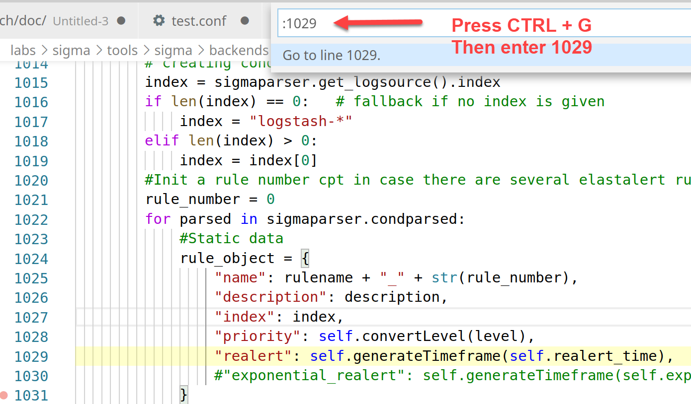
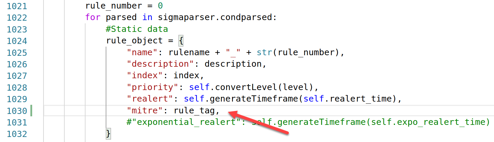
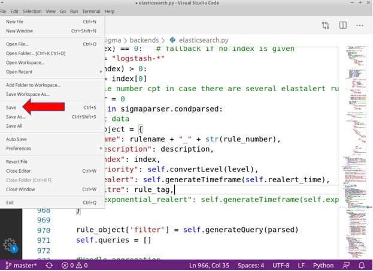

# Lab SIGMA Rules - Security Engineer

## Objectives

- Review SIGMA rule structure

- Convert rules to different alerting platforms

- Learn how to add context to rules

- Establish a process for mass rule management


## Exercise Preparation

Log into the Sec-555 VM

- Username: student

- Password: sec555


## Exercises

### Review SIGMA rule structure

SIGMA provides a structure by which detection rules can be written in a generic form. The example below shows the core structure of a SIGMA rule. 

```yaml
title: Suspicious Scripting in a WMI Consumer
id: fe21810c-2a8c-478f-8dd3-5a287fb2a0e0
status: experimental
description: Detects suspicious scripting in WMI Event Consumers
references:
    - https://in.security/an-intro-into-abusing-and-identifying-wmi-event-subscriptions-for-persistence/
    - https://github.com/Neo23x0/signature-base/blob/master/yara/gen_susp_lnk_files.yar#L19
date: 2019/04/15
tags:
    - attack.t1086
    - attack.execution
logsource:
   product: windows
   service: sysmon
detection:
    selection:
        EventID: 20
        Destination:
            - '*new-object system.net.webclient).downloadstring(*'
            - '*new-object system.net.webclient).downloadfile(*'
            - '*new-object net.webclient).downloadstring(*'
            - '*new-object net.webclient).downloadfile(*'
            - '* iex(*'
            - '*WScript.shell*'
            - '* -nop *'
            - '* -noprofile *'
            - '* -decode *'
            - '* -enc *'
    condition: selection
fields:
    - CommandLine
    - ParentCommandLine
falsepositives:
    - Administrative scripts
level: high
```

**Key Components**

- **Tags** - Includes the MITRE Attack mappings
- **Log Source** - Defines the type of log data this rule is written for
- **Detection** - Provides the core of the rule by including the syntax that the rule will alert on
- **Fields** - Lists the field names that will be queried in the detection syntax 
- **Level** - Sets a user-defined rating on the severity if this rule is triggered

The major benefit of a generic signature format is that the signature is designed to convert into a tool specific format. For example, below is the above rule after it has been converted to ElastAlert format.

```yaml
alert:
- debug
description: Detects suspicious scripting in WMI Event Consumers
filter:
- query:
    query_string:
      query: (winlog.channel:"Microsoft\-Windows\-Sysmon\/Operational" AND winlog.event_id:"20" AND Destination.keyword:(*new\-object\ system.net.webclient\).downloadstring\(* OR *new\-object\ system.net.webclient\).downloadfile\(* OR *new\-object\ net.webclient\).downloadstring\(* OR *new\-object\ net.webclient\).downloadfile\(* OR *\ iex\(* OR *WScript.shell* OR *\ \-nop\ * OR *\ \-noprofile\ * OR *\ \-decode\ * OR *\ \-enc\ *))
index: winlogbeat-*
name: fe21810c-2a8c-478f-8dd3-5a287fb2a0e0_0
priority: 2
realert:
  minutes: 0
type: any
```

As you can see, this rule still contains the core information provided by the SIGMA rule above, but the format has changed drastically. Instead of being generic, the rule now is specific to ElastAlert and functions as an automated alert.

**Key Components**

- **Filter** - Contains the necessary Lucene syntax to match the information provided in the Detection section of the SIGMA rule
- **Index** - Points at the index the rule should run the filter query against
- **Priority** - Sets the user-defined rating on the severity of the rule

The key change during the conversion is that the MITRE Attack tags were not carried over to the ElastAlert rule. Unfortunately, not all information or context converts into tool-specific language. The conversion process can be updated to change this behaviour as you will find later in the lab.

### Convert rules to different alerting platforms

While SIGMA provides a standardized structure for detection rules to be written, it requires that rules be converted to be leveraged by your SIEM. Fortunately, this is a simple process. Try the below commands. Each takes a Sigma rule and converts it to a specific SIEM format.

**Elasticsearch**

```yaml
cd /labs/sigma/tools

./sigmac -I -t es-rule -c /labs/sigma/tools/config/winlogbeat.yml /labs/sigma/rules/windows/sysmon/sysmon_wmi_susp_scripting.yml
```

The output of the command above will look like below.

```yaml
{"description": "Detects suspicious scripting in WMI Event Consumers", "enabled": true, "false_positives": ["Administrative scripts"], "filters": [], "from": "now-360s", "immutable": false, "index": ["winlogbeat-*"], "interval": "5m", "rule_id": "suspicious_scripting_in_a_wmi_consumer", "language": "lucene", "output_index": ".siem-signals-default", "max_signals": 100, "risk_score": 73, "name": "Suspicious Scripting in a WMI Consumer", "query": "(winlog.channel:\"Microsoft\\-Windows\\-Sysmon\\/Operational\" AND winlog.event_id:\"20\" AND Destination.keyword:(*new\\-object\\ system.net.webclient\\).downloadstring\\(* OR *new\\-object\\ system.net.webclient\\).downloadfile\\(* OR *new\\-object\\ net.webclient\\).downloadstring\\(* OR *new\\-object\\ net.webclient\\).downloadfile\\(* OR *\\ iex\\(* OR *WScript.shell* OR *\\ \\-nop\\ * OR *\\ \\-noprofile\\ * OR *\\ \\-decode\\ * OR *\\ \\-enc\\ *))", "references": ["https://in.security/an-intro-into-abusing-and-identifying-wmi-event-subscriptions-for-persistence/", "https://github.com/Neo23x0/signature-base/blob/master/yara/gen_susp_lnk_files.yar#L19"], "meta": {"from": "1m"}, "severity": "high", "tags": ["attack.t1086", "attack.execution"], "to": "now", "type": "query", "threat": [{"tactic": {"id": "TA0002", "reference": "https://attack.mitre.org/tactics/TA0002", "name": "Execution"}, "framework": "MITRE ATT&CK", "technique": [{"id": "T1086", "name": "PowerShell", "reference": "https://attack.mitre.org/techniques/T1086"}]}], "version": 1}
```

**ElastAlert** 

```yaml
cd /labs/sigma/tools

./sigmac -I -t elastalert -c /labs/sigma/tools/config/winlogbeat.yml /labs/sigma/rules/windows/sysmon/sysmon_wmi_susp_scripting.yml
```

The output of the command above will look like below.

```yaml
alert:
- debug
description: Detects suspicious scripting in WMI Event Consumers
filter:
- query:
    query_string:
      query: (winlog.channel:"Microsoft\-Windows\-Sysmon\/Operational" AND winlog.event_id:"20" AND Destination.keyword:(*new\-object\ system.net.webclient\).downloadstring\(* OR *new\-object\ system.net.webclient\).downloadfile\(* OR *new\-object\ net.webclient\).downloadstring\(* OR *new\-object\ net.webclient\).downloadfile\(* OR *\ iex\(* OR *WScript.shell* OR *\ \-nop\ * OR *\ \-noprofile\ * OR *\ \-decode\ * OR *\ \-enc\ *))
index: winlogbeat-*
name: fe21810c-2a8c-478f-8dd3-5a287fb2a0e0_0
priority: 2
realert:
  minutes: 0
type: any
```

**Splunk**

```yaml
cd /labs/sigma/tools

./sigmac -I -t splunk -c /labs/sigma/tools/config/splunk-windows.yml /labs/sigma/rules/windows/sysmon/sysmon_wmi_susp_scripting.yml
```

The output of the command above will look like below.

```yaml
(source="WinEventLog:Microsoft-Windows-Sysmon/Operational" EventCode="20" (Destination="*new-object system.net.webclient).downloadstring(*" OR Destination="*new-object system.net.webclient).downloadfile(*" OR Destination="*new-object net.webclient).downloadstring(*" OR Destination="*new-object net.webclient).downloadfile(*" OR Destination="* iex(*" OR Destination="*WScript.shell*" OR Destination="* -nop *" OR Destination="* -noprofile *" OR Destination="* -decode *" OR Destination="* -enc *")) | table CommandLine,ParentCommandLine
```

As you can see as you run the command you receive the converted rule as a text output to the screen. The output can be copy and pasted into your SIEM engine. Alternatively, you can use **sigmac** with the **-o** parameter to output the converted rule to a file.

!!! note
    **sigmac** can be fully automated with scripts. Scripting allows for automatically pulling down new rules and converting them to work with your SIEM. New rules can come from the **Sigma** github project or from other sources such as the Malware Information Sharing Platform (MISP).

### Learn how to add context to rules

In the first section of this lab, we reviewed a SIGMA rule and compared it to an ElastAlert rule after it had been converted. One of the core differences was that the ElastAlert rule no longer contained the MITRE Attack tags. This is a valuable piece of information. Now let us fix **sigmac** to bring over the MITRE tag enrichment. 

```bash
code /labs/sigma/tools/sigma/backends/elasticsearch.py
```

Press **CTRL + g** and then type in **1029**. Press **Enter**



Add the following below the line that starts with "realert":

```bash
"mitre": rule_tag,
```



!!! note
    The comma behind **rule_tag** is required.

Click on File and then click Save to save the file.



Now that we have modified this file lets go back and rerun the conversion tool for the rule.

**ElastAlert** 

```bash
cd /labs/sigma/tools
./sigmac -I -t elastalert -c /labs/sigma/tools/config/winlogbeat.yml /labs/sigma/rules/windows/sysmon/sysmon_wmi_susp_scripting.yml
```

The output of the command above will look like below.

```yaml
alert:
- debug
description: Detects suspicious scripting in WMI Event Consumers
filter:
- query:
    query_string:
      query: (winlog.channel:"Microsoft\-Windows\-Sysmon\/Operational" AND winlog.event_id:"20" AND Destination.keyword:(*new\-object\ system.net.webclient\).downloadstring\(* OR *new\-object\ system.net.webclient\).downloadfile\(* OR *new\-object\ net.webclient\).downloadstring\(* OR *new\-object\ net.webclient\).downloadfile\(* OR *\ iex\(* OR *WScript.shell* OR *\ \-nop\ * OR *\ \-noprofile\ * OR *\ \-decode\ * OR *\ \-enc\ *))
index: winlogbeat-*
mitre:
- attack.t1086
- attack.execution
- attack.t1059.005
name: fe21810c-2a8c-478f-8dd3-5a287fb2a0e0_0
priority: 2
realert:
  minutes: 0
type: any
```

Your rule should now contain the MITRE Attack tagging which can be useful when threat hunting.

### Establish a process for mass rule management

Now with the ability to not only convert a SIGMA rule to the correct platform but also enrich it via the MITRE attack framework, we are ready to mass convert the rules and start alerting. The challenge we face is that the **sigmac** commands will only covert the rules to a single file so we will need to leverage a little scripting to create multiple alerts.

In your student VM there is a script located at **/labs/sigma/convert_rules.sh**. The script is a wrapper for **sigmac** that also provides the ability to test rules before moving them into production. First, run the script with the command below. The script will take a few minutes to run. While the script executes move on to the next set of instructions.

```bash
bash /labs/sigma/convert_rules.sh
```

Because tOpen the script to view it using the command below.

```bash
code /labs/sigma/convert_rules.sh
```

!!! warning
	Do not make any changes to the script. The below guide will walkthrough what the script does and then have you run it. You should not modify it at all unless you are copying it into a production environment and turning on some of the extra capabilities.

```bash
#!/bin/bash
ALERTENGINE="elastalert"
TEMPLATE="winlogbeat"
SIGMAFOLDER="/labs/sigma"
FOLDER="/labs/sigma/rules/windows"
OUTPUTFOLDER="/labs/sigma/elastalert/testing"
MITRECONVERTTOOL="/labs/sigma/elastalert/elastalert2attack"

PRODUCTIONRULEFOLDER="/labs/sigma/elastalert/rules/sigma"
MANUALREVIEWFOLDER="/labs/sigma/elastalert/review/manual"
SLOWRULEFOLDER="/labs/sigma/elastalert/review/slow"

# Enable or disable which steps you want performed
CONVERT=1
REMOVEOLDRULES=1
TESTRULES=1
MITREMAP=1
```

The core of the script is found below. The script begins to grab each of the SIGMA rules and converts them to a separate ElastAlert rule file.

```bash
if [[ "$CONVERT" == 1 ]]; then
  if [[ "$REMOVEOLDRULES" == 1 ]]; then
    rm -rf $OUTPUTFOLDER/*
	mkdir -p $OUTPUTFOLDER
  fi
  FILES=$(find $FOLDER -type f)
  for FILE in $FILES
  do
    FILENAME=$(basename $FILE | cut -d"." -f1)
    ID=$(grep "^id:" $FILE | cut -d":" -f2 | cut -d" " -f2)
    OUTPUTFILE="${FILENAME}_${ID}"
    echo "Processing $FILENAME"
    RULEFILE=$(grep -r $ID $FOLDER | cut -d":" -f1)
    python3 $SIGMAC -t $ALERTENGINE -c $TEMPLATE $FILE --output $OUTPUTFOLDER/$OUTPUTFILE.yml &>/dev/null & disown
	# Clean up empty rule files - Normally means a function is not supported by your SIEM or Tool's Rule Engine
    find $OUTPUTFOLDER -size 0 -delete
  done
fi
```

!!! note
	Not all Sigma rules are supported by a given tool or SIEM. For example, Elastalert does not support specific aggregation rules. As a result, a little over ten rules do not convert. The result is empty files. The **find** command in the script finds the empty files and deletes them. 

With that completed, the script now goes through the process of launching a docker container of ElastAlert. This container will test each rule to ensure that it runs successfully, quickly, and does not return to many false positives. If a rule fails any of these checks, it is moved to a Manual Review Folder or the Slow Rule Folder. Otherwise, the rule is moved directly to the Production Rule Folder.

```bash
if [[ "$TESTRULES" == 1 ]]; then
  if [[ "$REMOVEOLDRULES" == 1 ]]; then
    rm -rf $MANUALREVIEWFOLDER/*
    rm -rf $SLOWRULEFOLDER/*
    rm -rf $PRODUCTIONRULEFOLDER/*
  fi
  TESTINGFILES=$(find $OUTPUTFOLDER -type f)
  for FILE in $TESTINGFILES
  do
    FILENAME=$(basename $FILE | cut -d"." -f1)
    echo "Processing $FILENAME"
    TESTOUTPUT=$(docker run -it --rm --network=lab -v /lab/sigma/elastalert/config/elastalert.yaml:/opt/elastalert/elastalert.yaml -v /lab/sigma/elastalert/testing:/opt/elastalert/rules --entrypoint elastalert-test-rule hasecuritysolutions/elastalert:0.2.2 --config /opt/elastalert/elastalert.yaml --formatted-output /opt/elastalert/rules/${FILENAME}.yml | grep writeback)
    echo "File is ${FILENAME}.yml"
    OUTPUT=$(echo $TESTOUTPUT | jq .)
    TIMETAKEN=$(echo $OUTPUT | jq .writeback.elastalert_status.time_taken)
    MATCHES=$(echo $OUTPUT | jq .writeback.elastalert_status.matches)
    HITS=$(echo $OUTPUT | jq .writeback.elastalert_status.hits)
    echo $OUTPUT
    echo "Time taken is $TIMETAKEN"
    if (( $(echo "$TIMETAKEN > 0" | bc -l) )); then
      GO=1
    else
      GO=0
    fi
```

The final step of the script is the creation of the MITRE Attack Heat Map based on the rules that were successfully added to the Production Rule Folder. This is a great resources to provide upper management as you try to show your organization's detection capabilities as well as gaps in your alerting. 

``` python
python3 /labs/sigma/elastalert2attack --rules-directory /labs/sigma/elastalert/testing --out-file /tmp/heatmap.json
```

Below is an example of this Heat Map. The more rules you have for a specific MITRE attack, it will gradually change from white to red. 


## Lab Conclusion

In this lab, you reviewed the structure of a SIGMA rule and learned how to convert them to usable formats for your SIEM. In addition, to converting the rules, you were able to enrich them with MITRE tagging as well as mass convert the rules using a script. 
