# Lab 1.1 - SIGMA Rules - Leadership

## Objectives

- Explore logging capabilities and visibility against the MITRE Attack framework
- Review alert capabilities based on active rules
- Determine gaps in visibilities
- Evaluate gaps in alert rules
- Review areas where there is no visibility or rules

## Exercise Preparation

Log into the Sec-555 VM

- Username: student

- Password: sec555

## Exercises

### Explore logging capabilities and visibility against the MITRE Attack framework

One of the most important exercises that often gets overlooked, is evaluating your organization's visiability. To often security appliances are purchased to fill niche gaps for visibility but rarely is there a cohesive evaluation of all data sources. Lets look at a key data source in almost every organization - **Windows Logs**. 

To begin **click** the link below to open MITRE ATT&CK Navigator.

<a href="https://mitre-attack.github.io/attack-navigator/enterprise/" target="_blank">MITRE ATT&CK Navigator</a>

Next, click on the **+** sign next to the layer tab.

Next, click on **Open Existing Layer**.

Now, click on **Upload from Local**.

Then navigate to /labs/sigma and select windows.json.

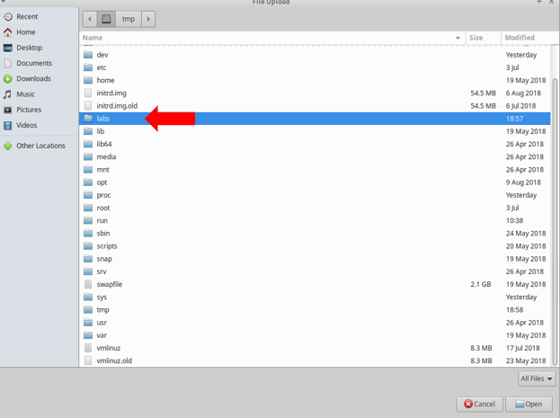

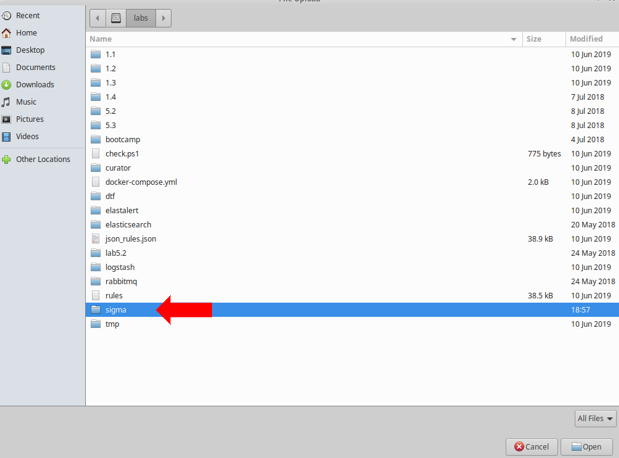

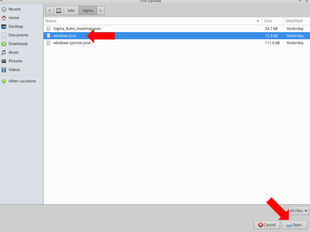

The result will be MITRE Navigator showing a map of the visibility Windows logs provides against the MITRE framework.

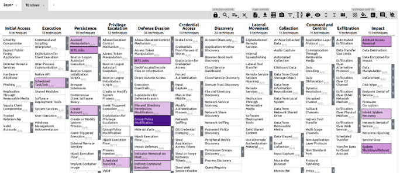

Windows Event logs are a common data source most organizations have. While they do provide some visibility it begs the question if there is more that can be done to increase the detection capabilities. 
 
System Monitor (Sysmon) is a Windows system service and device driver that, once installed on a system, remains resident across system reboots to monitor and log system activity to the Windows event log. By simply adding this to our Windows systems it will increase our visibility within this data source and does not require that much effort to accomplish. 

Lets see what difference adding Sysmon to our Windows logs will make. 

Click on the **+** sign next to the Windows tab.

Next, click on **Open Existing Layer**.

Now, click on **Upload from Local**.

Then navigate to /labs/sigma and select windows-sysmon.json.

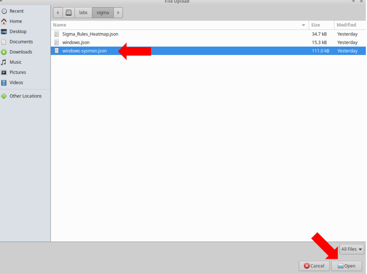

The result will be MITRE Navigator showing a map of the visibility Windows logs with Sysmon against the MITRE framework.

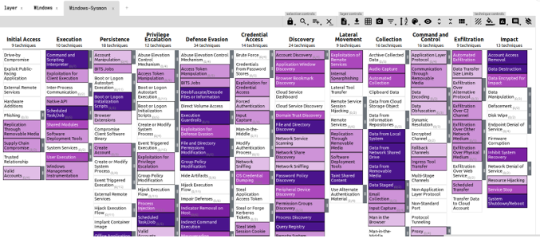

Let us compare the difference now. Click back and forth between the **Windows** and **Windows-Sysmon** tabs in MITRE Navigator. Clearly, adding in the Sysmon data sources for our Windows logs added a major jump in visibility. This simple process is a great way to show the value of making changes to the logging levels or capabilities of your data sources. When walking through this exercise it would be a great time to evaluate the logging capabilities of each data source to see if there were opportunities to gain additional visibility in the logs that you are collecting. 

### Review alert capabilities based on active rules

To often organizations will excel in having the needed visibility to detect threats but do not have the appropriate rules to actually alert when a threat is present. Lets review what type of detection capabilities we can gain from adding in Windows SIGMA rules for alerting. 

Click on the **+** sign next to the Windows-Sysmon tab.

Next, click on **Open Existing Layer**.

Now, click on **Upload from Local**.

Then navigate to /labs/sigma and select heatmap.json.

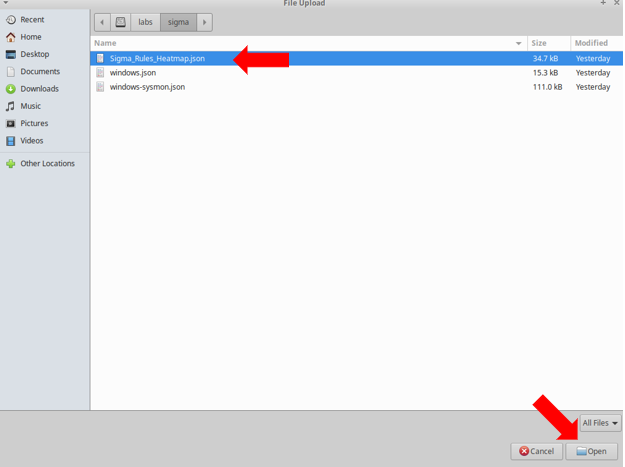

The result will be MITRE Navigator showing a map of the Sigma rule coverage for Windows logs.

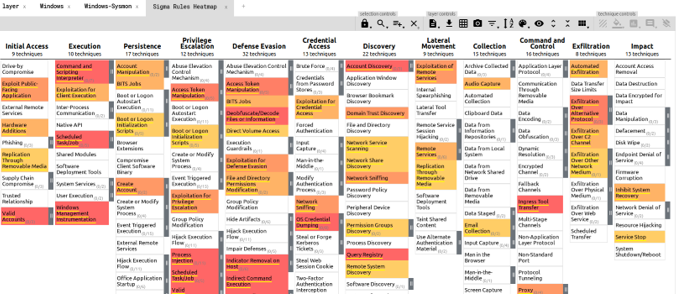

If you quickly compare the Sigma rules heatmap to the Windows and Windows-Sysmon tabs in the MITRE Navigator you can see that we now have alerts for several of the techniques but we need to take this a step further to identify gaps in our visibility or alert rules. 

### Determine gaps in visibilities

While engaging with a wide range of organizations and their security products, it has been the author's professional opinion that there is often this false sense of security when it comes to the alerting capabilities of these security products. To many times these security products come with a large set of default alert rules but the organizations lack the visibility in their logs for the rules to alert on. How can an orgainization actually validate that they have the needed visibility in their data sources for their alerts to actually provide detection?

This is actually very easy to do with the help of the MITRE Navigator. Since we already have the Windows and Windows-Sysmon data sources loaded lets compare them to the Sigma rules and see where we lack visibility. 

#### Add Scores to Existing Techniques

Before we are able to move forward we first need to add a value to each of the existing techniques currently visible in both the Windows and Windows-Sysmon layers.

##### Windows

First, click on the **Windows Tab** in the MITRE Navigator

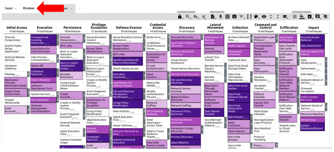

Next, right-click on **"Account Manipulation"** and click "select annotated"

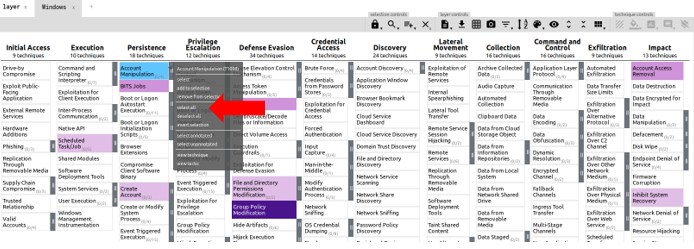

Next, click on the **"Scoring Icon"** and enter **"1"**

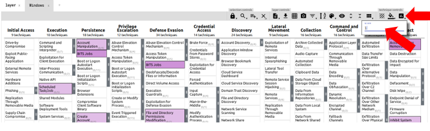

Finally, Click on the **Grey Menu Bar** to save the score setting.

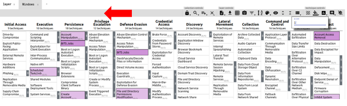

!!! info
    These steps have added a score of 1 to each of the annotated techniques for the Windows logs. 

##### Windows-Sysmon

First, click on the **Windows-Sysmon Tab** in the MITRE Navigator

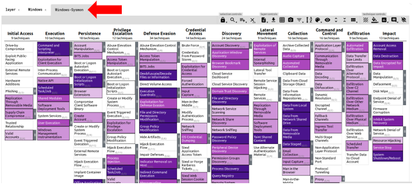

Next, right-click on **"Account Manipulation"** and click "select annotated"

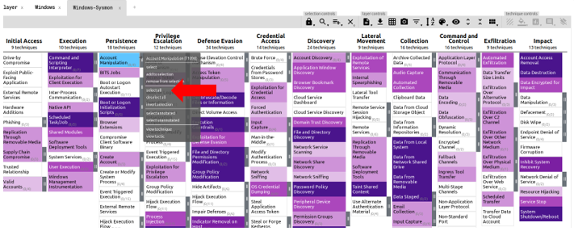

Next, click on the **"Scoring Icon"** and enter **"1"**

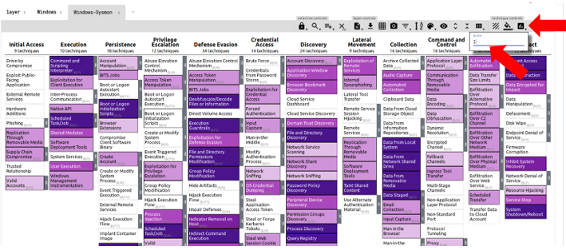

Finally, Click on the **Grey Menu Bar** to save the score setting.

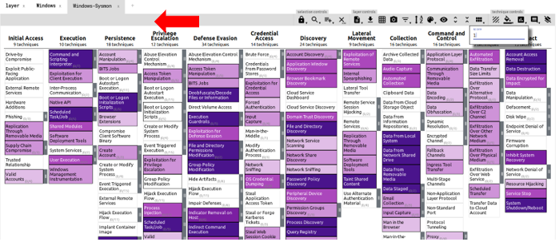

!!! info
    These steps have added a score of 1 to each of the annotated techniques for the Windows-Sysmon logs. 
    
#### Windows Missing Visibility

We are now ready to assess our current visibility for Windows Logs. 

Click on the **+** sign next to the Sigma Rules Heatmap tab.

Next, click on **Create Layer from other layers**.

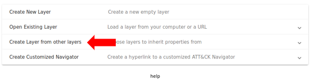

Type **d and not b** in the score expression and press **Create**

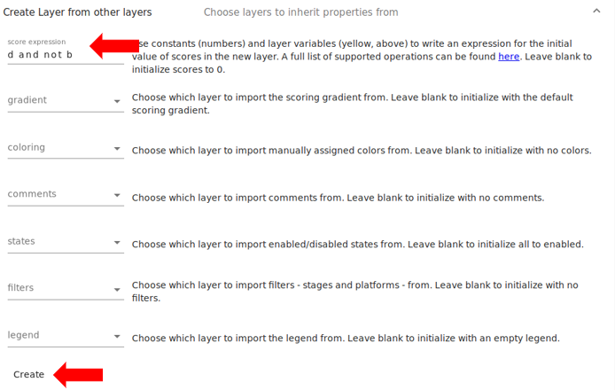

!!! note
    You can do several different operations when creating a layer from another layer. When you **clicked** on Create Layer from other layers you will see that MITRE Navigator assigns a letter to each tab at the top that can be used for these operations. You will also see that there is a clickable link in the description of **score expression** that will provide a full list of the operations. 
    Specifically, for the purpose of this step we are wanting to show the techniques that exist in **d** (Sigma Rules Heatmap) but not in **b** (Windows).

The layer that is created now shows us where we lack visibility in our Windows data source but have Sigma rules. This is a great way to show our visibility gaps and provide our Security team direction for where additional visibility is needed. 

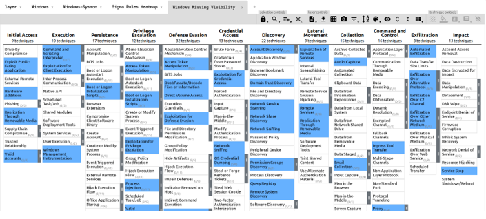

Double click on the name of the new tab **layer by operation** and rename it to **Windows Missing Visibility**. Click anywhere on the screen to save the new name. 

#### Windows-Sysmon Missing Visibility

Lets go ahead and perform the same exercise for the Windows-Sysmon data source and see where we lack visibility in comparision to our Sigma rules. 

Click on the **+** sign next to the Windows Missing Visibility tab.

Next, click on **Create Layer from other layers**.

Type **d and not c** in the score expression and press **Create**

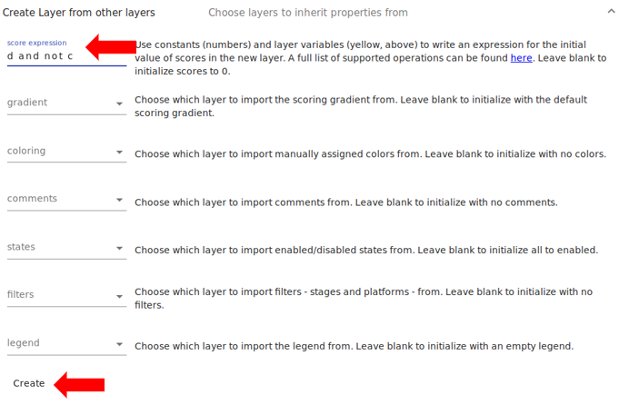

!!! note
    In this step we are wanting to show the techniques that exist in **d** (Sigma Rules Heatmap) but not in **c** (Windows-Sysmon).

We now can see that the Windows-Sysmon provides us a majority of the visibility we needed for our Sigma rules. There still are a few techniques where we lack visibility but this is a great comparison when you are attempting to justify if it is worth implementing changes to logging levels or capabilities such as adding Sysmon to your Windows systems. 

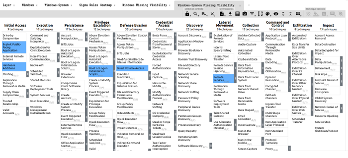

Double click on the name of the new tab **layer by operation** and rename it to **Windows-Sysmon Missing Visibility**. Click anywhere on the screen to save the new name. 

### Evaluate gaps in alert rules

Now that we know where we are lacking visibility we should also check to see where we have gaps in our alert rules. 

#### Windows Missing Alert Rules

Click on the **+** sign next to the Windows-Sysmon Missing Visibility tab.

Next, click on **Create Layer from other layers**.

Type **b and not d** in the score expression and press **Create**

!!! note
    For the purpose of this step we are wanting to show and techniques that exist in **b** (Windows) but not in **d** (Sigma Rules Heatmap).
   
The layer created now shows us the techniques we have visibility for but do not have any rules created. 

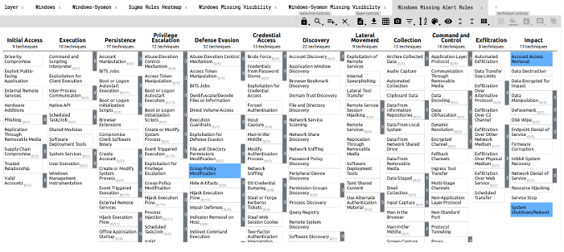

Double click on the name of the new tab **layer by operation** and rename it to **Windows Missing Alert Rules**. Click anywhere on the screen to save the new name. 

#### Windows-Sysmon Missing Alert Rules

Lets proceed and check where we are missing alert rules for Windows-Sysmon. 

Click on the **+** sign next to the Windows Missing Alert Rules tab.

Click on **Create Layer from other layers**.

Type **c and not d** in the score expression and press **Create**

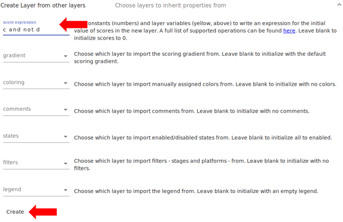

!!! note
    For the purpose of this step we are wanting to show and techniques that exist in **c** (Windows-Sysmon) but not in **d** (Sigma Rules Heatmap).
    
The layer created now shows us the techniques we have visibility for but do not have any rules created. 

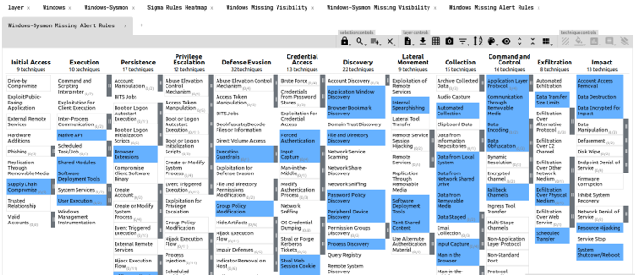

Double click on the name of the new tab **layer by operation** and rename it to **Windows-Sysmon Missing Alert Rules**. Click anywhere on the screen to save the new name. 

We find that with the Windows-Sysmon logs we have even more visibility where we are lacking alert rules. 

### Review areas where there is no visibility or rules

The final step in this evaluation of your data sources against the MITRE Framework is to determine areas that you lack both visibility and alert rules. 

#### Windows No Visibility and No Rules

Click on the **+** sign next to the Windows-Sysmon Missing Alert Rules tab.

Click on **Create Layer from other layers**.

Type **not b and not d** in the score expression and press **Create**

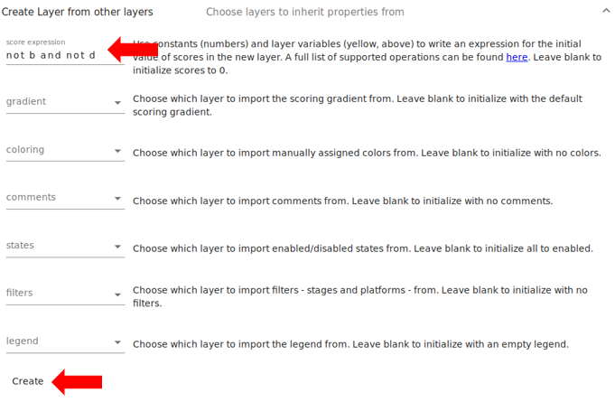

!!! note
    For the purpose of this step we are wanting to show the techniques that do not exist in **b** (Windows) and do not exist in **d** (Sigma Rules Heatmap).
    
This layer shows us where we have no visibility or rules for this data source. 

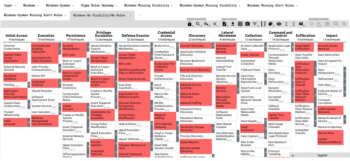

Double click on the name of the new tab **layer by operation** and rename it to **Windows No Visibility/No Rules**. Click anywhere on the screen to save the new name. 

Now review the techniques we are lacking visibility and rules.  

#### Windows-Sysmon No Visibility and No Rules

Click on the **+** sign next to the Windows Missing Alert Rules tab.

Click on **Create Layer from other layers**.

Type **not c and not d** in the score expression and press **Create**

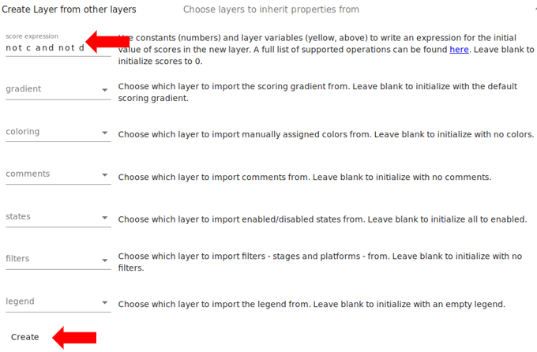

!!! note
    For the purpose of this step we are wanting to show and techniques that do not exist in **c** (Windows-Sysmon) and do not exist in **d** (Sigma Rules Heatmap).

This layer shows us where we have no visibility or rules for this data source. 

Double click on the name of the new tab **layer by operation** and rename it to **Windows-Sysmon No Visibility/No Rules**. Click anywhere on the screen to save the new name. 

Now review the techniques we are lacking visibility and rules.

While this final step in the process of evaluating visibility and detection capabilities for your data sources is important, please understand that your mission is not to have 100% coverage for visibility and alert rules for each data source. You mission is to understand where you stand as an organization when it comes to your detection capabilities and ensure that you have defensive measures in place for techniques that are used as common attack vectors against your organization. This may sound cliche but there will never be a one size fits all approach to this process and it will take effort on your part to understand your organization and tailor the detection capabilities to provide the best defense for you. 

**DEFEND THE THINGS!!!**

## Lab Conclusion

In the lab you were able to review the visibility and detection capabilities for the Windows data sources. You were able to see that enhancing a data source often will reap better visibility in your environment. However, even with the visibility and detection you found that you still need to review and evaluate gaps in each of your data sources and well as alert rules to ensure you have the proper measures in place to protect your organization.

**Lab 1.1 is now complete**\!
