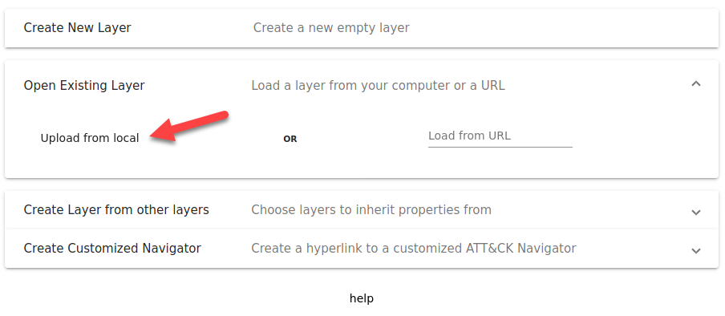
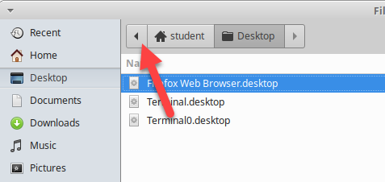
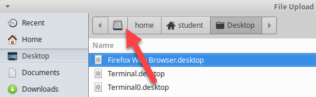
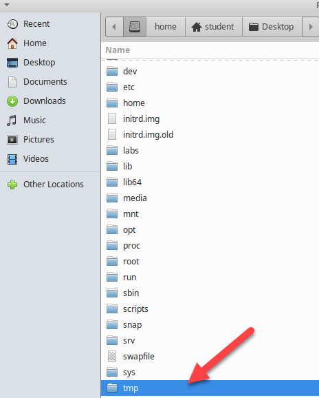
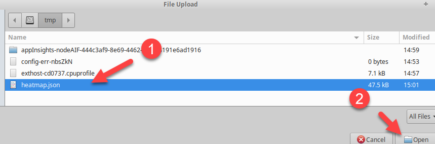
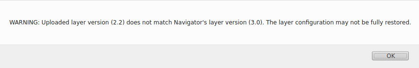
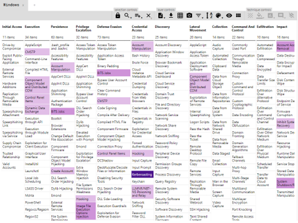
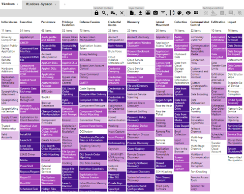
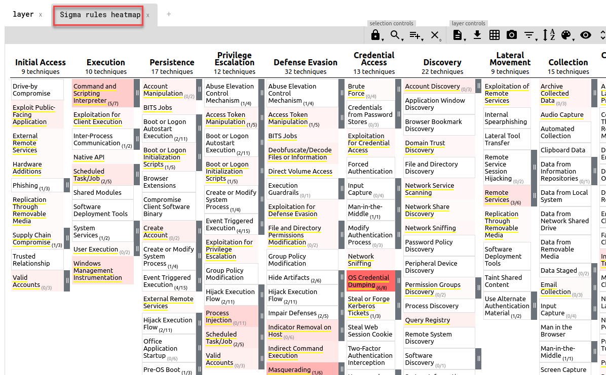

# Lab 1.1 - SIGMA Rules - Leadership

## Objectives

- Explore logging capabilities and visibility against the MITRE Attack framework
- Review alert capabilities based on active rules
- Determine gaps in visibilities
- Evaluate gaps in rules

## Exercise Preparation

Log into the Sec-555 VM

- Username: student

- Password: sec555

## Exercises

### Review logging capabilities and visibility against the MITRE Attack framework

One of the most important exercises that often gets overlooked, is evaluating your organization's visiability. To often security appliances are purchased to fill niche gaps for visibility but rarely is there a cohesive evaluation of all data sources. Lets look at a key data source in almost every organization - **Windows Logs**. 

<a href="https://mitre-attack.github.io/attack-navigator/enterprise/" target="_blank">MITRE ATT&CK Navigator</a>

Next, click on the **+** sign next to the Layer tab.

Next, click on **Open Existing Layer**.

Now, click on **Upload from Local**.

Then navigate to /tmp and select windows.json.

If you get the warning shown below, click on Okay.

The result will be MITRE Navigator showing a map of the visibility Windows logs provides against the MITRE framework.

Windows Event logs are a common data source most organizations have. While they do provide some visibility it begs the question if there is more that can be done to increase the detection capabilities. 
 
System Monitor (Sysmon) is a Windows system service and device driver that, once installed on a system, remains resident across system reboots to monitor and log system activity to the Windows event log.

Click on the **+** sign next to the Windows tab.

Next, click on **Open Existing Layer**.

Now, click on **Upload from Local**.

Then navigate to /tmp and select windows-sysmon.json.

If you get the warning shown below, click on Okay.

The result will be MITRE Navigator showing a map of the visibility Windows logs with Sysmon against the MITRE framework.

Let us compare the difference now. Click back and forth between the **Windows** and **Windows-Sysmon** tabs in MITRE Navigator. Clearly, adding in the Sysmon data sources for our Windows logs add a major jump in visibility. This simple process is a great way to show the value of making changes to the logging levels or capabilities of the data sources. When walking through this exercise it would be a great time to evaluate the logging capabilities of each data source to see if there were opportunities to gain additional visibility in the logs that you are collecting. 

### Review alert capabilities based on active rules

To often organizations will excel in having the needed visibility to detect threats but do not have the appropriate rules to actually alert when a threat is present. Lets review what type of detection capabilities we can gain from adding in Windows SIGMA rules for alerting. 

Click on the **+** sign next to the Windows-Sysmon tab.

Next, click on **Open Existing Layer**.

Now, click on **Upload from Local**.

Then navigate to /tmp and select heatmap.json.

If you get the warning shown below, click on Okay.

The result will be MITRE Navigator showing a map of the Sigma rule coverage for Windows logs.

If you quickly compare the Sigma rules heatmap to the Windows and Windows-Sysmon tabs in the MITRE Navigator you can see that we now have alerts for several of the techniques but we need to take this a step further to identify gaps in our visibility or alert rules. 

### Review gaps in visibilities

While engaging with a wide range of organizations and their security products, it has been the author's professional opinion that there is often this false sense of security when it comes to the alerting capabilities of these security products. To many times these security products come with a large set of default alert rules but the organizations lack the visibility in their logs for the rules to alert on. How can an orgainization actually validate that they have the needed visibility in their data sources for their alerts to actually provide detection.

This is actually very easy to do with the help of the MITRE Navigator. Since we already have the Windows and Windows-Sysmon data sources loaded lets compare them to the Sigma rules and see where we lack visibility. 

Click on the **+** sign next to the Sigma Rules Heatmap tab.

Next, click on **Create Layer from other layers**.

Type **d and not b** in the score expression and press **Create**

!!! note
    You can do several different operations when creating a layer from another layer. When you **clicked** on Create Layer from other layers you will see that MITRE Navigator assigns a letter to each tab at the top that can be used for these operations. You will also see that there is a clickable link in the description of **score expression** that will provide a full list of the operations. Specifically, for the purpose of this step we are wanting to show and techniques that exist in **d** (Sigma Rules Heatmap) but not in **b** (Windows).

The layer that is created now shows us where we lack visibility in our Windows data source but have Sigma rules. This is a great way to show our visibility gaps and provide our Security team direction for where additional visibility is needed. 

Double click on the name of the new tab **layer by operation** and rename it to **Windows Missing Visibility**. Click anywhere on the screen to save the new name. 

Lets go ahead and perform the same exercise for the Windows-Sysmon data source and see where we lack visibility in comparision to our Sigma rules. 

Click on the **+** sign next to the Windows Missing Visibility tab.

Next, click on **Create Layer from other layers**.

Type **d and not c** in the score expression and press **Create**

!!! note
    You can do several different operations when creating a layer from another layer. When you **clicked** on Create Layer from other layers you will see that MITRE Navigator assigns a letter to each tab at the top that can be used for these operations. You will also see that there is a clickable link in the description of **score expression** that will provide a full list of the operations. Specifically, for the purpose of this step we are wanting to show and techniques that exist in **d** (Sigma Rules Heatmap) but not in **c** (Windows-Sysmon).

We now can see that the Windows-Sysmon provides us a majority of the visibility we needed for our Sigma rules. There still are a few techniques where we lack visibility but this is a great comparison when you are attempting to justify if it is worth implementing changes to logging levels or capabilities such as Sysmon for Windows logs. 

Double click on the name of the new tab **layer by operation** and rename it to **Windows-Sysmon Missing Visibility**. Click anywhere on the screen to save the new name. 

### Review gaps in alert rules

Now that we know where we are lacking visibility we should also check to see where we have gaps in our alert rules. 

Click on the **+** sign next to the Windows-Sysmon Missing Visibility tab.

Next, click on **Create Layer from other layers**.

Type **d and not c** in the score expression and press **Create**

!!! note
    You can do several different operations when creating a layer from another layer. When you **clicked** on Create Layer from other layers you will see that MITRE Navigator assigns a letter to each tab at the top that can be used for these operations. You will also see that there is a clickable link in the description of **score expression** that will provide a full list of the operations. Specifically, for the purpose of this step we are wanting to show and techniques that exist in **d** (Sigma Rules Heatmap) but not in **c** (Windows-Sysmon).

We now can see that the Windows-Sysmon provides us a majority of the visibility we needed for our Sigma rules. There still are a few techniques where we lack visibility but this is a great comparison when you are attempting to justify if it is worth implementing changes to logging levels or capabilities such as Sysmon for Windows logs. 

Double click on the name of the new tab **layer by operation** and rename it to **Windows-Sysmon Missing Visibility**. Click anywhere on the screen to save the new name. 

## Lab Conclusion

In the lab you were able to learn how to map out your data source visibility to the Mitre Attack framework. From this you were able to see the value in evaluating the logging capabilities of your data sources to see if they could be enhanced similar to the Windows logs with Sysmon. Finally, you were able to create a heatmap of your alert rules to determine where you lacked alerting or needed additional visibility to detect the evil. 

**Lab 1.1 is now complete**\!
